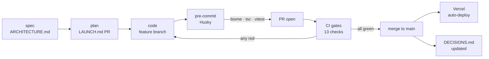
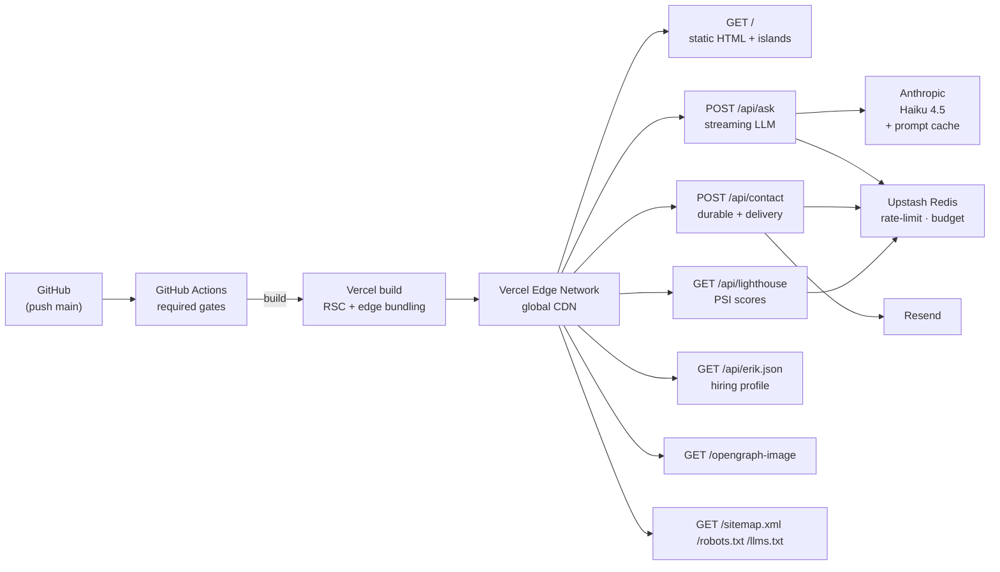
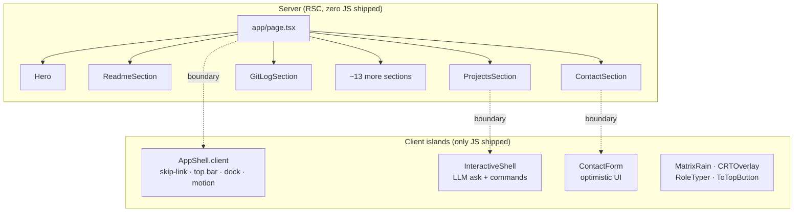
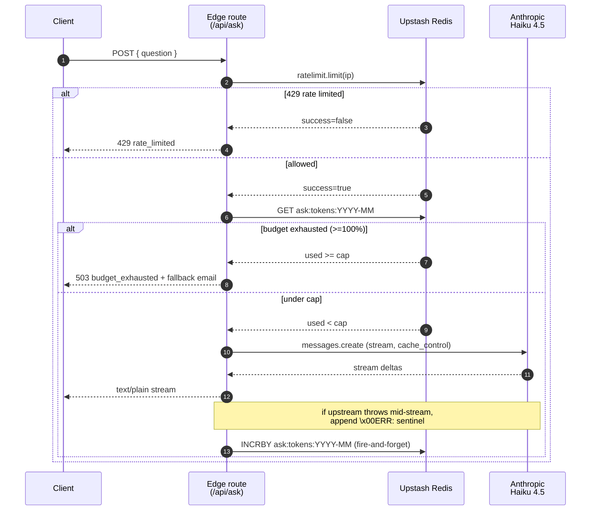
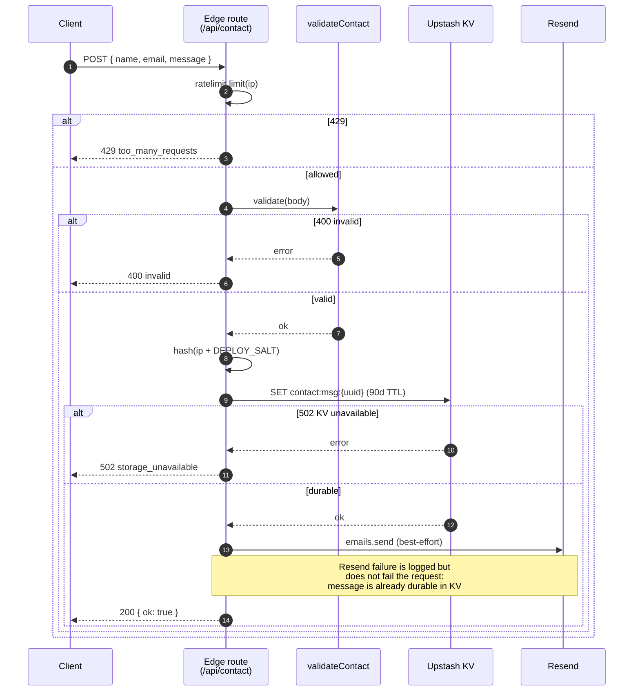
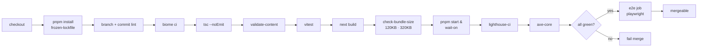

# erikunha.dev

Single-page Next.js 15 portfolio deployed to Vercel Edge. RSC-first composition of ~18 sections with four client islands, a streaming LLM endpoint, a durable contact form, and a CI pipeline that treats performance, accessibility, and bundle size as hard contracts rather than suggestions.

**Live:** [erikunha.dev](https://erikunha.dev)

<p>
  
  
  
  
  
  
  
  
  
  
  
  
</p>

---

## Table of contents

1. [Stack](#stack)
2. [Stack rationale](#stack-rationale)
3. [Development process](#development-process)
   - [Specifications come first](#specifications-come-first)
   - [AI-assisted development under explicit guardrails](#ai-assisted-development-under-explicit-guardrails)
   - [Constraints enforced by tooling, not discipline](#constraints-enforced-by-tooling-not-discipline)
   - [Test-driven where it matters](#test-driven-where-it-matters)
   - [Definition of done](#definition-of-done)
4. [Architecture](#architecture)
5. [Rendering model](#rendering-model)
6. [Content layer](#content-layer)
7. [API endpoints](#api-endpoints)
   - [`POST /api/ask`](#post-apiask)
   - [`POST /api/contact`](#post-apicontact)
   - [`GET /api/lighthouse`](#get-apilighthouse)
   - [`GET /api/erik.json`](#get-apierikjson)
8. [Performance budgets](#performance-budgets)
9. [Accessibility](#accessibility)
10. [Security](#security)
11. [Observability](#observability)
12. [CI pipeline](#ci-pipeline)
13. [Quickstart](#quickstart)
14. [Commands](#commands)
15. [Environment variables](#environment-variables)
16. [Project structure](#project-structure)
17. [Companion docs](#companion-docs)
18. [License](#license)
19. [Contact](#contact)

---

## Stack

| Layer | Choice |
|---|---|
| Framework | Next.js 15 (App Router) · React 19 |
| Language | TypeScript strict (`noUncheckedIndexedAccess`, `exactOptionalPropertyTypes`) |
| Styles | Hand-written global CSS, 10 files under `app/css/`, BEM-ish naming, design tokens in `_tokens.css`. No CSS framework. No PostCSS config — Next 16 + Turbopack handle nesting + autoprefix natively via Lightning CSS. |
| Runtime | Vercel Edge end-to-end |
| Cache / rate-limit / KV | Upstash Redis |
| LLM | Anthropic SDK · `claude-haiku-4-5-20251001` with prompt caching |
| Email | Resend |
| Lint / format | Biome 2.x |
| Tests | Vitest (unit) · Playwright (E2E + a11y axe-core) |
| Perf gates | Lighthouse CI |
| Package manager | pnpm 10+ |
| Node | 22+ |

---

## Stack rationale

Each choice below is one of two or three viable options. The rationale is the discriminator, not a hagiography.

**Next.js 15 over Remix / SvelteKit.** The App Router's React Server Components story is the most production-mature option as of 2026. SvelteKit has no comparable RSC layer; Remix v2 merged into React Router 7 and converged on a similar primitive. Picking Next.js minimizes future migration cost and gets the deepest Vercel integration (Server Actions, OG image generation, route handlers) without runtime adapters.

**Vercel Edge over Cloudflare Workers.** Both are competitive on price and cold-start. Vercel wins on Next.js integration depth: every Next feature ships there first. Cloudflare's `@cloudflare/next-on-pages` adapter is several months behind. If LLM cost ever dominates, Cloudflare Workers AI with a self-served Llama 3.x is the documented escape hatch (see `ARCHITECTURE.md` §16).

**Anthropic Haiku 4.5 over GPT-4o-mini or self-hosted Llama.** At the CV-Q&A workload, Haiku 4.5 is cheaper per call and lower-latency than GPT-4o-mini at comparable quality. More importantly, the Anthropic SDK supports explicit `cache_control` on prompt segments. OpenAI's prompt cache is automatic and opaque, so the steady-state cost on a ~2,200-token constant system prompt is ~10x higher than Haiku with caching enabled.

**Upstash Redis over Vercel KV or self-hosted Redis.** Upstash's REST API works inside the Edge runtime, which Vercel KV also does (Vercel KV is in fact Upstash under the hood, rebranded). The choice came down to vendor independence: Upstash gives the same primitives at the same price without locking into Vercel's billing surface. Self-hosted Redis would require either a VPC bridge or a long-lived connection from Edge functions, neither of which is free.

**Resend over SES / Postmark.** Smallest possible integration for transactional email. The SDK is ~5 KB, the domain verification flow is one DNS record, and the free tier covers ~3,000 sends per month. SES is cheaper at high volume but requires AWS account setup; Postmark is comparable but more expensive at the bottom tier.

**pnpm over npm / yarn.** Disk-efficient content-addressed store, strict dependency resolution by default (no phantom hoisting), and the fastest installer on cold cache. The lockfile format is human-readable. Yarn Berry's plug'n'play mode breaks too many adjacent tools; npm's install is 2x slower and the lockfile churns more on no-op installs.

**Biome 2 over ESLint + Prettier.** A single Rust binary that does both linting and formatting in milliseconds. The rule surface is a strict subset of ESLint's, but the subset covers what actually catches bugs. Speed matters here for the Husky pre-commit hook to stay below the 200 ms threshold where developers stop committing.

**Hand-written global CSS over Tailwind, CSS modules, or styled-components.** Tailwind v4 was the scaffold default; it survived two months without a single utility class being used in components (zero `@apply`, zero utilities in any JSX), so 2026-05-18 it was removed. The 10 files under `app/css/` are now the entire styling surface — tokens centralized in `_tokens.css`, BEM-ish per-section files, one entry point via `globals.css`. The architectural property that made this trim safe (one grep finds every reference to a class; one script audits orphans in <60 seconds) is the same property that makes CSS Modules a worse choice here: per-component scoping would scatter 31 KB of section styles across 18+ component files and break that audit surface. Styled-components would add ~30 KB of runtime JS on a budget that allocates 43 KB total for client islands. See `DECISIONS.md` 2026-05-18 for the full removal rationale and reversibility note.

**Vitest over Jest.** Same test API, native ESM, no Babel pipeline, and runs ~3x faster on this repo's surface. Vitest's coverage uses V8 directly instead of Istanbul, which removes another step from CI.

**Playwright over Cypress.** Multi-browser support out of the box, no in-browser test runner overhead, native parallelization, and an a11y assertion library (`@axe-core/playwright`) that integrates without a separate harness. Cypress's free tier metering on the dashboard pushed the decision early.

---

## Development process

The repo is structured around a spec-driven workflow: write the spec before the code, track the decisions while making them, enforce the constraints with tooling, and treat the gates as the definition of done. The four documents in the repo root and the [`CLAUDE.md`](./CLAUDE.md) operating contract are not retrospective; they are the inputs to every change.

### Specifications come first

Every non-trivial change starts as a written document, not a commit.

- [`ARCHITECTURE.md`](./ARCHITECTURE.md) was written before any production code. It defines the rendering model, the budgets, the API contracts, the failure modes, the cost model, and the rejected alternatives across 19 numbered sections. Every section component, every route handler, and every CI gate traces back to a numbered section in this doc.
- [`LAUNCH.md`](./LAUNCH.md) is the executable implementation plan: an 8-PR sequence from foundation through final polish, each PR scoped to ~1-2 days of focused work with explicit handoff criteria. The order is not arbitrary; cheap reversible decisions land first (PR 1: scaffold, PR 2: content schemas), expensive irreversible ones land later (PR 6: `/api/ask`).
- [`DECISIONS.md`](./DECISIONS.md) is a running ADR log. Every architectural choice gets one bullet: date, decision, reversibility note. The reversibility note is the most important field; it determines how much scrutiny the decision needs before merging.
- [`HANDOFF.md`](./HANDOFF.md) is the context-transfer document for resuming work in a fresh session (a new machine, a new Claude Code session, a new collaborator). It assumes nothing about prior state.

The pattern is the inverse of "code first, document later." By the time a PR opens, the design is already on paper; the PR is the executable form of a decision that has already been made.

### AI-assisted development under explicit guardrails

This site is built collaboratively with Claude Code under a written contract: [`CLAUDE.md`](./CLAUDE.md). The file is auto-loaded on every session and defines:

- **Operating role.** Staff/Principal-equivalent rigor on every change: cross-cutting concerns over local optimization, mechanism-level reasoning (cause to effect, not pattern-matching), trade-offs surfaced explicitly with one recommendation per decision. Perf, a11y (WCAG 2.1 AA), and security are implicit requirements on every change, not separate phases.
- **Agent dispatch matrix.** Which specialized agent runs at which phase. For example: `architect-reviewer` before `writing-plans` on any spec; `code-reviewer` before any commit on a PR branch; `security-auditor` after touching `app/api/` or `lib/rate-limit.ts`; `accessibility-tester` after editing anything interactive; `nextjs-developer` + `performance-engineer` after touching `next.config.ts` or routing.
- **Skill dispatch.** Which inline skills run on which file paths. `react-best-practices` after editing `components/` or `app/`; `vercel:nextjs` after editing `next.config.ts`; `superpowers:test-driven-development` when writing tests in `__tests__/` or `tests/`; `web-design-guidelines` before any UI code review.
- **Aesthetic and content constraints.** The two-token palette, the JS budget, the RSC-default rule, the "no inline copy in JSX" rule, the `useRef.textContent` requirement for the Matrix loop.
- **Things considered and rejected.** A checked-in negative list (GraphQL, Cloudflare Workers, multi-region, Sentry-by-default, CAPTCHA, per-section routes, state management library, design system extraction, MDX, separate CMS) so the same conversation is not reopened twice.

The point is not that AI wrote the code. The point is that the AI agent operates under the same constraints a senior engineer would, with the constraints written down and machine-readable. When a constraint changes, it changes in `CLAUDE.md` first, then propagates to behavior. When a constraint is violated, the same CI gates that would catch a human catch the agent.

### Constraints enforced by tooling, not discipline

The development process treats "engineer remembers to do X" as a failure mode. Every quality property has a mechanical enforcer.



| Phase | Tool | Enforces |
|---|---|---|
| Branch creation | regex in `ci.yml` | branch name matches `feat\|fix\|chore\|docs\|refactor\|perf\|test\|build\|ci\|style\|revert/...` |
| Commit | Husky + commitlint | Conventional Commits format, no `--no-verify` |
| Pre-commit | Husky hooks | Biome check, type check, touched-file tests |
| PR open | `commitlint --from base --to head` | every commit in the PR conforms |
| PR CI | `ci.yml` | the full 13-step pipeline (see [CI pipeline](#ci-pipeline)) |
| Merge | required status checks | every gate green; no admin override path |
| Post-merge | Vercel auto-deploy | production deploy, Lighthouse tripwire on production URL |
| Post-merge | manual | `DECISIONS.md` updated for any architectural choice |

There is no `--no-verify` escape, no admin merge bypass, no "I'll fix it in a follow-up." If a gate fails, the gate does not move; the underlying issue does.

### Test-driven where it matters

Not every line is TDD. The rule is: any property that is expensive to discover at runtime gets a test that asserts it at build time.

- The Matrix dialog loop has a Vitest test ([`__tests__/matrix-rain.test.ts`](./__tests__/matrix-rain.test.ts)) that asserts the component does not re-render after mount. The implementation pattern (`useRef.textContent` mutation, never `useState`) is enforced by test, not by convention.
- The skip-to-content link has a test ([`__tests__/skip-to-content.test.ts`](./__tests__/skip-to-content.test.ts)) asserting it is the first focusable element on the page. Refactoring the AppShell cannot accidentally drop it.
- The Lighthouse score fallback has a test ([`__tests__/lighthouse-fallback.test.ts`](./__tests__/lighthouse-fallback.test.ts)) asserting the fallback values are zeros, never fabricated. The "never show fake live scores" invariant is enforced in code.
- The contact validation logic has tests ([`__tests__/contact-validation.test.ts`](./__tests__/contact-validation.test.ts)) for every boundary: name length, email regex, message length, honeypot field. The same `validateContact` function runs client-side and server-side, so a single passing test covers both surfaces.
- The monthly token budget has a test ([`__tests__/budget-cap.test.ts`](./__tests__/budget-cap.test.ts)) asserting fail-open on Redis errors, fail-closed at 100% usage, and warning behavior at 80%. The cost-safety invariant is tested explicitly.
- The Redis singleton has a test ([`__tests__/redis-singleton.test.ts`](./__tests__/redis-singleton.test.ts)) asserting that repeated `getRedis()` calls return the same instance. This catches the connection-leak failure mode where every request creates a new connection and exhausts the Upstash REST quota.

The Vitest suite is small (15 specs, ~450 lines) but each test targets a high-leverage property. The Playwright suite covers the two flows that cannot be unit-tested cleanly: contact end-to-end and ask streaming.

### Definition of done

A change is "done" when:

1. It conforms to a spec in `ARCHITECTURE.md`, or has an entry in `DECISIONS.md` explaining why it deviates.
2. Every CI gate is green on the PR.
3. If it introduces a new architectural choice, `DECISIONS.md` has a new bullet with a reversibility note dated the same day.
4. If it changes a budget or contract, the corresponding doc is updated in the same PR.

"It works on my machine" is not on the list.

---

## Architecture



ASCII fallback (renders in terminals where Mermaid does not):

```
GitHub (main) → GitHub Actions ─┬─ biome · tsc · vitest
                                ├─ build
                                ├─ bundle-size gate
                                ├─ lighthouse-ci
                                ├─ axe-core
                                └─ playwright
                                       │
                                       ▼
                                Vercel build ───► Vercel Edge (global CDN)
                                                       │
                  ┌────────────────────────────────────┼───────────────┐
                  │                                    │               │
              /  +  islands             /api/ask    /api/contact   /api/erik.json
                                            │            │
                                ┌───────────┴───────┐    │
                                ▼                   ▼    ▼
                          Anthropic Haiku 4.5   Upstash Redis (rate · budget · KV log · PSI cache)
                                                     ▲
                                                     │
                                                  Resend (contact delivery)
```

### Request lifecycle

A first-time visitor's request resolves like this. The page is statically generated at build, so the initial GET hits the Vercel CDN edge cache and returns precompressed HTML with a TTFB of ~40 ms from most regions. The HTML contains an inline script that reads `localStorage["erik.motion"]` and writes `body[data-motion]` before paint, so CRT effects start in the user's chosen state without a flash. JetBrains Mono is preloaded via `next/font/local` and served from the same origin; no third-party font CDN is contacted. The five client islands hydrate on-demand: `AppShell` and the contact form hydrate eagerly because they own user interaction; the others (`MatrixRain`, `RoleTyper`, the typewriters) hydrate lazily on first viewport intersection.

A return visitor on a warm cache hits the same edge with `If-None-Match`, gets a 304, and paints from the local cache in under 100 ms. The CWV instrumentation is Vercel Speed Insights, which posts a beacon after first input.

A `POST /api/ask` request from the InteractiveShell goes through the rate limit, budget check, Anthropic call, and streams back as `text/plain`. A `POST /api/contact` goes through the rate limit, Zod validation, KV write, and best-effort Resend delivery. Both flows are walked through in detail under [API endpoints](#api-endpoints).

Full design rationale, trade-offs, and the "what would change at 100x scale" matrix live in [`ARCHITECTURE.md`](./ARCHITECTURE.md).

---

## Rendering model

The 18 sections of the page are imported into a single `app/page.tsx` server component. None of them import client React, none use hooks, and none ship JavaScript. Their static markup is generated at build time, served as gzipped HTML, and rehydrated only where a `*.client.tsx` boundary is crossed.



### What "RSC by default" actually buys

The static sections render at build time into HTML. The dynamic decisions that affect first paint (UA-based mobile detection for `BreakpointProvider`, motion preference read from cookie or localStorage) happen on the server during the request and are reflected as DOM attributes on the rendered tree, not as client-side hydration toggles. The result is that the first paint already shows the correct layout and effect state. There is no "loading shell, then real content" flicker because there is no loading shell.

### Why client files are explicitly named `*.client.tsx`

Next.js infers the client boundary from `"use client"`, which is invisible until you open the file. Naming the file `*.client.tsx` makes the boundary visible in the directory listing and in PR diffs. If a section component drifts from server to client (someone adds a `useState`, the compiler bumps the file to client, the file extension stays plain), the bundle-size gate is the safety net, but the filename convention is the early warning.

### The Matrix dialog loop: why `useRef.textContent`, not `useState`

The loop types "Wake up, Neo..." character by character, holds for two seconds, deletes, and repeats. The naive React pattern is `useState` for the displayed string. That breaks under the perf budget for a specific mechanism:

A `setState` per keystroke schedules a reconciliation per keystroke. Reconciliation is not free: React must diff the previous and next virtual trees, commit the changes to the DOM, and run effects. At a typing speed of 80 ms per character, the component re-renders ~12 times per second forever. Each re-render is a long task on the main thread, and Interaction to Next Paint (INP) measures the worst long task triggered by user input. On a budget Android device, the cumulative scheduler pressure pushes INP past 200 ms and Lighthouse Performance falls below 95.

The fix is to skip React for the inner loop. The component mounts, captures a ref to the span, and mutates `ref.current.textContent` directly inside a `setTimeout` cycle. React's reconciler never sees the mid-loop updates because they happen outside its reactive graph. The DOM is updated directly; the browser paints; React stays asleep. A Vitest test in `__tests__/matrix-rain.test.ts` asserts this by spying on the renderer and failing if the component re-renders after mount.

### Client JS budget

Application code targets ~43 KB gzipped across all islands combined. Riding on top of Next 15 + React 19's framework runtime (~185 KB gzipped), the total cap enforced in CI is 320 KB across all client chunks. The framework number is fixed; what we control is the 43 KB. The bundle-size script enumerates every chunk and asserts both the per-route cap (120 KB) and the all-chunks cap (320 KB).

---

## Content layer

All user-facing copy lives in `content/*.ts` as typed const objects, validated by Zod at build time. The pattern delivers three properties simultaneously.

**Diff-friendliness.** Changing a project description is a single-character edit against a TS literal. Reviewers see exactly what ships. There is no opaque CMS payload, no "preview vs published" state, no eventual consistency between authoring and rendering.

**Compile-time and runtime contract.** The schemas in `content/schemas.ts` are imported by both the section components (for type inference via `z.infer`) and the validator script (for runtime parsing). A typo'd field name fails `tsc --noEmit`, then fails the validator, then fails the build. Three independent checks, one source of truth.

**Build-time validation.** `scripts/validate-content.mjs` runs `safeParse` against every content module and exits non-zero on the first violation. CI runs it immediately before `next build`. A malformed entry is caught two minutes before it would have been deployed.

The trade-off versus a CMS is the same trade-off: a CMS gives authoring access to non-engineers and trades it for runtime-validated content (a bad payload is a runtime 500, not a build failure). For a single-author site, the inverse pattern (content as code, validated at compile) is strictly better. The migration cost to a CMS later is one adapter file that reads the Zod schemas and returns the same shape from the CMS API; the section components don't change.

---

## API endpoints

### `POST /api/ask`

Streaming LLM proxy with monthly budget enforcement. Implementation: [`app/api/ask/route.ts`](./app/api/ask/route.ts).



**Why streaming.** Anthropic's non-streaming completions return after the full message generates. For a 400-token answer at ~50 tokens per second, that's roughly an 8-second TTFB. Streaming returns the first byte in ~300 ms and the rest as it arrives. The perceived latency on the InteractiveShell drops from "wait" to "instant" without any change in actual completion time. The cost of streaming is server-side: we hold an open ReadableStream for the duration of the response, which on Edge is cheap because Edge functions are designed for that exact shape.

**Why Edge runtime.** The endpoint serves a ReadableStream, which works on both Node and Edge runtimes. Edge wins because cold-start time is ~50 ms vs ~250 ms on Node, and because the Anthropic SDK is fetch-based and has no Node-only dependencies. The only stdlib touchpoint is `crypto.subtle.digest` for hashing, which exists in the Edge runtime.

**Why a sliding-window rate limit.** Token bucket would let a user burn 8 questions in 10 seconds and then sit idle for an hour. Sliding window enforces the budget on a rolling basis, which matches the abuse pattern (curl in a loop) better than the legitimate pattern (someone asking three questions across a browsing session). The numbers (8 requests per IP per hour) were derived from "what is the maximum a legitimate visitor would ever do" plus a safety margin, not from a cost calculation.

**Why Anthropic prompt caching.** The system block is ~2,200 tokens of CV context, identical on every call. Without caching, every request pays the full 2,200 input tokens at the standard rate. With `cache_control: { type: 'ephemeral' }`, the first call writes the cache (slightly more expensive at write time), and every call within the 5-minute window reads the cache at ~10% of the standard rate. Net savings on steady-state input cost: ~93%. Anthropic stores the cache server-side, keyed by the exact content; if the system prompt changes by even one character, the cache misses and the next call pays the write cost again.

**The math behind the 400,000-token cap.** Haiku 4.5 is priced at roughly $1 per million input tokens and $5 per million output tokens. A typical call after caching is ~200 cached-input tokens plus ~300 output tokens, so ~$0.0017 per call. 400,000 tokens at that average ratio is roughly 800 calls, or ~$0.40 per month. The cap is deliberately low: a portfolio LLM endpoint that costs more than a coffee per month is either a bug or an attack. If steady-state traffic exceeds 800 calls in a month, the response is to upgrade the cap deliberately, not to silently keep spending.

**Why fail-open on Redis.** Redis is a soft dependency for budget tracking. If Upstash has a regional outage, the choices are: (a) refuse all `/api/ask` traffic until Redis recovers; (b) allow traffic and re-enforce the cap on the next successful Redis check. Option (b) is fail-open. The reasoning: a public LLM endpoint with strict Redis coupling is more fragile than the cost protection is worth, given that the cap is also enforced upstream by Anthropic's per-key spend limit in the console (configured to the same $0.50 ceiling).

**Why the NUL byte sentinel.** When Anthropic throws mid-stream (rate limit at their edge, network blip, content policy hit), the route has already sent some text deltas. The HTTP status can't be changed because the response is already in flight. JSON error chunks would work but the client is rendering raw bytes into the shell output. The fix in `lib/stream-protocol.ts` is to append `\x00ERR:<message>` and close the stream. UTF-8 prose never contains the NUL byte, so the sentinel is unambiguous regardless of what partial output was already delivered. The client strips it from the displayed text and surfaces a typed error line below.

**Why fire-and-forget on the budget increment.** Calling `redis.incrby` synchronously after the stream completes would add ~30 ms of latency to every response. Instead, the increment is dispatched in the `finally` block of the ReadableStream's `start` function, after the controller is closed. The response is already sent; the budget counter updates in the background. The cost: a small race window where two requests at the budget boundary could both pass the check and both increment. The mitigation: the cap is set at 95% of the real ceiling, so the race can't blow past the actual budget.

**Failure responses.**
- `400`: missing, non-string, or empty `question`
- `429`: rate limit hit
- `503`: monthly token budget exhausted (returns email fallback)

### `POST /api/contact`

Durable contact form: persist before delivery. Implementation: [`app/api/contact/route.ts`](./app/api/contact/route.ts).



**Why KV before Resend.** Both providers have 99.9% SLOs. The probability of simultaneous failure is low but non-zero. The asymmetry that matters: if Resend fails after we've already replied 200 to the client, the message is lost forever, and the client has no signal to retry. If KV fails before we touch Resend, we return 502 and the user retries. Durability comes first; delivery is a best-effort second pass. Resend failures after a successful KV write are logged with the message ID. A future job (not yet built) can replay un-delivered messages from KV by scanning the `contact:msg:*` keyspace.

**Why IP hashing with a rotated salt.** The raw IP is personal data under LGPD and GDPR; logging it without consent is a compliance finding. Hashing with `DEPLOY_SALT` makes the stored value a stable identifier within a deployment window without being reversible. Rotating the salt quarterly (by redeploying with a new value) bounds the de-anonymization window even against an adversary who later compromises the salt. Old hashed values become orphaned strings; new submissions are bucketed against the new salt.

The hash is truncated to 64 bits (16 hex chars) in storage because we don't need 256 bits of uniqueness for ~100 messages per month, and storing less is closer to data-minimization compliance.

**Why no CAPTCHA.** A CAPTCHA adds ~30 KB of JavaScript, a third-party network call, and a UX cost (especially for screen reader users and users on satellite latency) that does not pay for itself at portfolio-scale spam volume. The combination of (a) a honeypot field that bots fill and humans don't, (b) a sliding-window rate limit (3 per IP per 10 minutes), and (c) Zod validation rejecting short, long, or malformed messages, stops the long tail of automated submissions without any CAPTCHA UX. If spam volume rises past the threshold where this matters, Cloudflare Turnstile (invisible, ~0 UX cost) is the planned upgrade and the decision is logged in `DECISIONS.md`.

**Shared validation between client and server.** `lib/contact-validation.ts` exports a `validateContact` function used by both the client form (for immediate feedback) and the route handler (for security). The same constraints apply on both sides: name 1-100 chars, email matches a permissive RFC 5322 regex, message 10-2000 chars. The client validation exists for UX; the server validation is the security boundary. Trusting only the client validation would let a curl request bypass every constraint.

### `GET /api/lighthouse`

Reads cached PageSpeed Insights scores from Upstash KV for the `LIVE_PERF.JSON` section on the page. Cron runs daily, fetches fresh PSI scores from Google, writes them to KV. The route reads and serves them with a stale-while-revalidate header.

If KV is empty or unreachable, the route returns a placeholder object with zero scores, which the section component renders as `—`. The deliberate choice: never to fabricate scores. Showing 100/100/98/100 when the API is unavailable would be a credibility breach the rest of the site can't recover from. The decision is logged in `DECISIONS.md` as "Irreversible in spirit: never show fabricated data as live scores."

### `GET /api/erik.json`

Static machine-readable hiring profile, 24-hour edge cache. The shape is a custom `HiringProfile` (the schema.org `Engineer` type does not exist; `Person` exists but lacks the role-specific fields). The endpoint is advertised in `public/llms.txt` so AI agents performing first-pass recruiter triage can parse the profile directly without scraping the HTML page.

The 24-hour TTL is deliberately generous: the underlying data changes maybe once a month, and serving stale-for-an-hour is preferable to taking a build deploy to update one field.

---

## Performance budgets

Every number below is enforced by a specific tool at a specific point in CI. Failing any one of them blocks merge to `main`.

### Budget thresholds at a glance

```
LCP        |##############                  |  1800ms      target ≤ 1800ms
INP        |##                              |  200ms       target ≤ 200ms
CLS        |#                               |  0.05        target ≤ 0.05
JS / route |############                    |  120KB gz    target ≤ 120KB
JS total   |################################|  320KB gz    target ≤ 320KB
Perf       |##############################  |  95          target ≥ 95
A11y       |################################|  100         target = 100
SEO        |################################|  100         target = 100
```

### Enforcement mechanisms

**LCP, INP, CLS, TBT, TTI.** Lighthouse CI runs three times against a built preview started by `pnpm start`, taking the median of three runs to reduce single-run variance. The desktop preset is used (`rttMs: 40`, `throughputKbps: 10240`, `cpuSlowdownMultiplier: 1`) because the deployed audience is desktop-first; mobile audits run separately. Each metric is a hard `error` assertion in `lighthouserc.json`. If the median exceeds the threshold, the gate fails.

**JS per route (≤120 KB gzipped).** `scripts/check-bundle-size.mjs` reads `.next/build-manifest.json` to enumerate the files referenced by each route, gzip-compresses each in-process via `node:zlib`, and asserts the per-route total is within budget. This catches accidental client-side imports that don't show up in Lighthouse (a route that imports a 200 KB analytics SDK but doesn't use it in any visible component).

**JS total (≤320 KB gzipped).** The same script reads `.next/static/chunks` and sums every JS file. The number is framework-inclusive: Next.js 15 + React 19 + Turbopack runtime is ~185 KB, so the application-level budget is ~135 KB practical and ~43 KB realistic for the islands themselves.

**Lighthouse perf/a11y/best-practices/SEO.** Threshold scores 0.95 / 1.00 / 0.95 / 1.00. A11y and SEO are gated at 1.00 because there's no excuse for less on a single-author static site: every common a11y failure pattern is addressed in code (heading order, label association, ARIA attribute usage, contrast), and every SEO basic is addressed in `layout.tsx` (title, meta description, OG tags, canonical URL, JSON-LD) plus `sitemap.ts` and `robots.txt`.

**axe-core via Playwright.** Runs after Lighthouse against the same preview. Lighthouse's a11y scoring is a sampled subset of axe-core's full ruleset, so axe catches failures that Lighthouse rounds away. Zero violations required.

**Why three runs of Lighthouse instead of one.** Lighthouse scores have natural variance because they depend on CPU contention during the audit. A single run can hit 95.4 once and 94.6 the next on identical code. LHCI's `numberOfRuns: 3` median pattern reduces flakiness to near zero while costing only ~15 extra seconds in CI.

---

## Accessibility

WCAG 2.1 AA is the floor, enforced as a 1.00 Lighthouse a11y score plus zero axe-core violations. The hardest constraint is the green-on-black aesthetic.

### The two-token palette

Pure `#00FF41` on `#000000` is 15.3:1 contrast (huge in raw numbers), but at small body sizes (under 18 px) the visual edge anti-aliasing makes individual letters blur into the background. Effective readability is worse than the contrast ratio implies. The two-token system addresses this directly.

| Swatch | Token | Hex | Usage | Contrast on `--bg` |
|---|---|---|---|---|
|  | `--bg` | `#000000` | Page background | n/a |
|  | `--signal` | `#00FF41` | Headings, accents, large text only | 15.3:1 |
|  | `--fg` | `#E6FFE6` | Body text | 18.4:1 |
|  | `--muted` | `#5AE07B` | Muted parentheticals, ≥ 14 px only | 9.1:1 |

`--signal` is reserved for headings, ASCII art, large-text decoration, and any text at or above 18 px (or 14 px bold), which matches WCAG's large-text contrast definition. `--fg` is the default for everything below that threshold. The slight green tint of `#E6FFE6` preserves the aesthetic without sitting on the pure-green chromatic edge that blurs at small sizes.

`--muted` is permitted for de-emphasized text but only at ≥14 px. Below that, contrast falls under the threshold and the muted token must not be used.

### The motion system

`prefers-reduced-motion: reduce` is the OS-level signal. When the user has set it, every CRT effect, the Matrix dialog loop, the typewriters, and the matrix rain collapse to a still image. But OS-level preferences are coarse: many users want some motion but not all. The MOTION toggle in the top bar lets users override the OS preference at runtime, in either direction.

The state lives in `body[data-motion]` (values: `full` or `reduce`) and is persisted to `localStorage` under `erik.motion`. A synchronous inline script in `app/layout.tsx` reads the storage and sets the attribute *before* any React paint, eliminating the flash-of-animation that would otherwise happen between document load and React hydration. The script is the smallest piece of dangerously-set-inner-HTML on the site; everything it does is bounded, deterministic, and tested.

`lib/motion.ts` is the single writer of the `body[data-motion]` attribute outside that bootstrap script. Other components read the attribute (via CSS or DOM); only one module writes it. This avoids the bug pattern where two components race to set conflicting motion states.

### Skip-to-content link

First focusable element on the page. Targets `#main-content` on the `<main>` element. WCAG 2.4.1 Level A; non-negotiable. A Vitest test in `__tests__/skip-to-content.test.ts` asserts the link is present in rendered output and points at a valid target.

### Real labels under terminal-styled prompts

The terminal-styled prompts (`user@terminal:~$ enter_name`) are visual decoration. Each form input has a real `<label for="...">` that pairs with the input's `id` and announces correctly to screen readers. The prompt is presentation; the label is structure. Inline errors are paired via `aria-describedby` so they're announced when a field fails validation.

---

## Security

Defense in depth at modest cost. The site has no authentication, no user accounts, no third-party JavaScript, and no user-generated content surface beyond the contact form. The threat model is correspondingly narrow: prompt injection on `/api/ask`, spam on `/api/contact`, cost-of-goods abuse on the LLM endpoint, and the usual transport-layer concerns.

### Response headers

Set in [`next.config.ts`](./next.config.ts) for every response on the site.

- `Strict-Transport-Security: max-age=63072000; includeSubDomains; preload` forces HTTPS for two years across all subdomains and qualifies for the browser preload list. Once preloaded, the domain cannot be served over plain HTTP even to a fresh browser, closing the first-visit MITM window.
- `X-Frame-Options: DENY` closes clickjacking. The site does not need to be framed anywhere; deny is stricter than `SAMEORIGIN` and equally compatible.
- `X-Content-Type-Options: nosniff` forces browsers to honor the declared `Content-Type` rather than sniffing the body. Closes a class of MIME-confusion attacks.
- `Referrer-Policy: strict-origin-when-cross-origin` sends the full URL as referer to same-origin requests and only the origin to cross-origin requests. Prevents leaking section anchors or query strings to external resources.
- `Permissions-Policy: camera=(), microphone=(), geolocation=()` explicitly opts out of every Permissions API the site doesn't use. If a future dependency tries to grab the camera, the request fails closed.
- `Cross-Origin-Opener-Policy: same-origin` prevents cross-origin documents from accessing `window.opener`. Cheap mitigation against a class of cross-origin leakage attacks.

### API key handling

All API keys (Anthropic, Resend, Upstash, PSI) live in Vercel environment variables, scoped per-environment (production / preview / development). The build never bakes a key into a static bundle; every API call originates from server code. CI uses a separate `*_BUILD` key set with throttled limits, so a malicious PR cannot drain production quota.

### IP handling

Raw IPs are never persisted. The contact route SHA-256 hashes `ip + DEPLOY_SALT` and stores only the first 64 bits. The ask route uses the IP only as the rate-limit key (Upstash handles the key internally; no plain-IP value lands in our code path).

### What this site does not have

- **No Content Security Policy.** The Next.js 15 inline-script story (motion bootstrap, scroll restoration) makes a strict CSP without per-request nonces a fight. Adding per-request nonces requires middleware that adds latency to every request. The site has no user-generated content vectors that would make XSS meaningful, so the trade-off is acceptable. The decision is documented in `DECISIONS.md` (2026-05-15) and the planned escape hatch (Next.js middleware injecting per-request nonces) is described there.
- **No application WAF.** Vercel's edge has basic anti-abuse, but no application firewall. The rate limit and budget cap are the application-level WAF.
- **No bot detection beyond the contact honeypot.** Crawlers are welcome on the static page (the SEO score depends on them); the LLM endpoint's rate limit is sufficient for the abuse vector that matters.

---

## Observability

Minimum viable, by design. The site is single-author with no oncall.

**Vercel Web Analytics.** Anonymous pageview counts, referrer distribution, top pages. No PII, no cookies, no third-party requests.

**Vercel Speed Insights.** Real-user Core Web Vitals (LCP, INP, CLS, TTFB) sampled at the edge. The beacon posts after first input; p75 values for the rolling 28-day window are visible in the Vercel dashboard.

**Vercel Function logs.** Every `console.log`, `console.warn`, and `console.error` from `/api/*` routes lands in the project dashboard for 24 hours of retention. Useful for live debugging during deploys; not a substitute for durable logging (which lives in Upstash KV for the routes that need it).

**Upstash KV inspector.** Contact submissions and ask queries are visible in the Upstash dashboard for the duration of their TTL (90 days for contact, 24 hours for ask response cache).

**What is deliberately absent.**
- No Sentry or other third-party RUM. The value-to-overhead ratio is poor for a single-author site, and the SDK would add ~25 KB to every page.
- No custom OpenTelemetry pipeline. No second consumer of the traces would justify the maintenance cost.
- No PagerDuty, no alerting beyond Vercel's defaults. There is no oncall to page.

---

## CI pipeline

[`.github/workflows/ci.yml`](./.github/workflows/ci.yml) runs on every PR and every push to `main`. Step order matters: cheap checks fail fast, expensive checks only run after everything cheaper has passed.



**Branch + commit lint** runs first because it's the cheapest signal. Branch names must match `feat|fix|chore|docs|refactor|perf|test|build|ci|style|revert/...` (the same prefixes Conventional Commits uses). Commit messages are validated by `commitlint` against the conventional config. If you can't even name a branch correctly, the rest of CI is wasted.

**Biome ci** is the lint and format check in a single Rust binary, ~200 ms on this repo. It catches everything ESLint and Prettier would catch plus a handful of correctness rules (`noExplicitAny`, `useExhaustiveDependencies`, `noUnusedVariables`).

**`tsc --noEmit`** validates types against the strict config. The two non-default flags that matter most here are `noUncheckedIndexedAccess` (forces `T | undefined` on `arr[i]`) and `exactOptionalPropertyTypes` (distinguishes "missing key" from "key with `undefined` value"). Both catch real bugs that the default strict config misses.

**`validate-content`** runs the Zod schemas against every file in `content/`. Build-time content gate.

**`vitest`** runs all unit specs single-shot. The suite covers the things that are hard to test through the UI: rate-limit math, budget cap edge cases, contact validation, hash stability across deploys, Lighthouse fallback behavior, motion preference reconciliation, the no-fabricated-scores invariant.

**`next build`** is the longest single step at ~60 seconds. The reason it runs sixth is that everything earlier is fast enough to fail-fast.

**`check-bundle-size`** enforces the gzipped byte caps post-build. This is where most regressions are caught: an accidental client-side import, a dependency that turned out larger than expected, a section that bumped to client without thinking.

**`pnpm start` + `wait-on`** starts the production server for the audit steps. Audits run against the real build output, not against `pnpm dev`.

**Lighthouse CI** asserts the perf / a11y / best-practices / SEO scores and the LCP / CLS / TBT / TTI metric values. Three runs, median.

**axe-core via Playwright** is the final a11y check against the same preview server.

**E2E job** runs in a separate matrix job to parallelize Playwright's browser install. The job covers the contact happy path, the spam-trap (honeypot) path, and the ask streaming path.

CI runs on Node 22 + pnpm 10 with `pnpm install --frozen-lockfile`. Any drift in the lockfile fails the install step.

---

## Quickstart

```bash
git clone git@github.com:erikunha/portfolio.git
cd portfolio
pnpm install
cp .env.example .env.local
pnpm dev                     # http://localhost:3000
```

The static page renders without any environment variables; the runtime endpoints (`/api/ask`, `/api/contact`, `/api/lighthouse`) will return errors until the keys are set.

---

## Commands

| Command | Purpose |
|---|---|
| `pnpm dev` | Next.js dev server with Turbopack |
| `pnpm build` | Production build |
| `pnpm start` | Serve production build |
| `pnpm check` | Biome lint + format |
| `pnpm check:fix` | Biome auto-fix |
| `pnpm typecheck` | `tsc --noEmit` |
| `pnpm test` | Vitest single run |
| `pnpm test:watch` | Vitest watch mode |
| `pnpm test:e2e` | Playwright E2E |
| `pnpm validate-content` | Zod schema validation across `content/*.ts` |
| `pnpm bundle-check` | Gzipped bundle size assertion (post-build) |
| `pnpm lhci` | Lighthouse CI run |
| `pnpm ci` | Full CI pipeline locally |
| `pnpm ci:local` | Fast pre-push subset (no build) |
| `pnpm commit` | Commitizen-driven Conventional Commit |

---

## Environment variables

| Variable | Required by | Source |
|---|---|---|
| `ANTHROPIC_API_KEY` | `/api/ask` | [console.anthropic.com](https://console.anthropic.com) |
| `UPSTASH_REDIS_REST_URL` | rate limits, KV log, budget counter | [upstash.com](https://upstash.com) |
| `UPSTASH_REDIS_REST_TOKEN` | as above | as above |
| `RESEND_API_KEY` | `/api/contact` delivery | [resend.com](https://resend.com) |
| `PSI_API_KEY` | `/api/lighthouse` | Google Cloud Console > PageSpeed Insights API |
| `DEPLOY_SALT` | IP hashing before KV persistence — **optional, auto-generated** | see below |

Vercel projects scope each variable per-environment (production / preview / development) so preview deploys can use throttled keys without risking production quota.

**`DEPLOY_SALT` is optional — auto-generated on first request and persisted in Upstash.** Resolution order on every cold start in `lib/ip-hash.ts`: explicit `process.env.DEPLOY_SALT` → Upstash KV key `meta:deploy-salt` (auto-created via `SETNX` on the first request after a fresh Upstash) → literal `'portfolio'` for non-production. The auto-generated value is a random 32-byte base64 string. The same value is read on every subsequent cold start, so the salt is stable across deploys (preserving per-IP rate-limit accounting and Q+A audit hash correlations) until the Upstash record is wiped. Concurrent cold-starts race the `SETNX` and converge on one value. Set `DEPLOY_SALT` explicitly only when you want a specific value (sharing across environments deliberately, or recovering from accidental Upstash wipe); generate with `openssl rand -base64 32`. Rotate on suspected leak by `DEL meta:deploy-salt` in Upstash — the next request generates a fresh value.

---

## Project structure

```
app/
  page.tsx              RSC composition of all sections
  layout.tsx            self-hosted fonts, Person JSON-LD, security headers
  globals.css           imports the CSS layer files in app/css/
  css/                  _tokens · _base · _layout · _sections · _shell ·
                        _contact · _crt · _chrome · _responsive · _footer
  not-found.tsx         themed 404
  opengraph-image.tsx   dynamic OG, recruiter-safe variant
  sitemap.ts            static sitemap
  api/
    ask/route.ts        streaming LLM (rate-limited + budget-capped)
    contact/route.ts    Resend + Upstash KV durable write
    lighthouse/route.ts reads PSI cache from KV
    erik.json/route.ts  machine-readable hiring profile (24h edge cache)

components/
  AppShell.client.tsx       skip-link, top bar, dock, motion toggle, error boundary
  ErrorBoundary.client.tsx  per-section isolation
  sections/                 one server component per section
  responsive/               CRTOverlay, MatrixRain, Dock, StatusBar, Module, ...
  client/                   *.client.tsx: InteractiveShell, ContactForm,
                            RoleTyper, ToTopButton

content/                    user-facing copy, typed + Zod-validated at build
  bio · projects · employers · perf-receipts · npm-stack · hottest-takes ·
  responsibilities · guitar-rig · unknowns · visa · credentials · community ·
  man-page · social · shell-commands · sys-health · dmesg · readme · now ·
  git-log · schemas

lib/
  rate-limit.ts         Upstash sliding-window limiters + monthly budget
  contact-validation.ts shared client + server validation
  stream-protocol.ts    NUL-byte sentinel for mid-stream Anthropic errors
  motion.ts             single writer for body[data-motion]
  use-breakpoint.tsx    UA-based SSR breakpoint + client refresh
  events.ts · polyfills-noop.ts · lighthouse-scores.ts

__tests__/              Vitest unit specs (15 files)
tests/
  a11y/                 axe-core scan
  e2e/                  Playwright (contact + ask)

scripts/
  validate-content.mjs        Zod gate
  check-bundle-size.mjs       gzipped bundle gate
  strip-next-polyfills.mjs    postinstall trim of unused IE polyfills

.github/workflows/ci.yml
public/                       self-hosted fonts, CV PDF, llms.txt, robots.txt
```

---

## Companion docs

Four docs, four audiences, no overlap. If something is true in more than one, that is a bug to fix.

| Doc | Audience | When to read |
|---|---|---|
| [`README.md`](./README.md) | First-time reader of the repo | Now |
| [`ARCHITECTURE.md`](./ARCHITECTURE.md) | Future-me, anyone considering a fork | Before proposing infrastructure changes |
| [`DECISIONS.md`](./DECISIONS.md) | Code reviewers, future-me | Before reopening a "considered and rejected" topic |
| [`LAUNCH.md`](./LAUNCH.md) | Past-me, anyone replicating the playbook | Setting up from scratch on a new machine |
| [`HANDOFF.md`](./HANDOFF.md) | Claude Code, anyone resuming mid-build | First session in a fresh checkout |
| [`CLAUDE.md`](./CLAUDE.md) | Claude Code (auto-loaded) | Always; mirrors the same constraints in machine-readable form |

---

## License

Source code: MIT. Content (copy, CV data, opinions, biographical material): all rights reserved. Forking the repo to learn from the architecture is welcome; forking it and replacing my name with yours is not.

---

## Contact

- Email: [erikhenriquealvescunha@gmail.com](mailto:erikhenriquealvescunha@gmail.com)
- GitHub: [github.com/erikunha](https://github.com/erikunha)
- LinkedIn: [linkedin.com/in/erikunha](https://www.linkedin.com/in/erikunha/)
