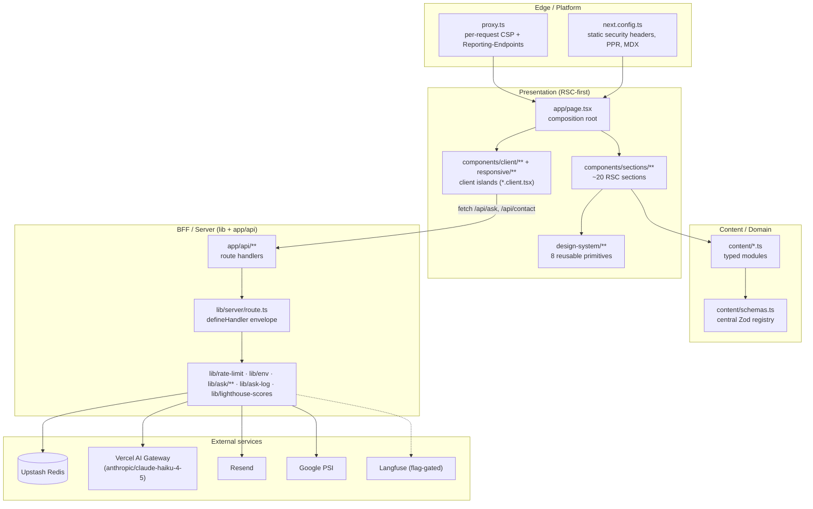
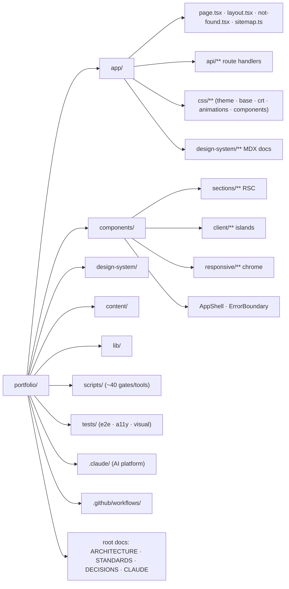
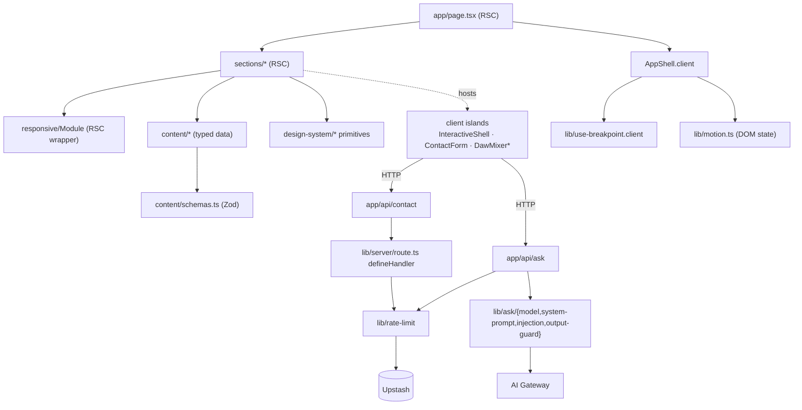

# Architecture Overview

> High-level architecture, repository structure, layers, and dependency graph. For the original design narrative and trade-off reasoning, read root `ARCHITECTURE.md`; this doc is the reverse-engineered structural map.

## The one-paragraph mental model

A request hits Vercel's edge, passes through `proxy.ts` (which stamps CSP + reporting headers), and is served by Next.js. The page `/` is **partially prerendered**: a static shell (the chrome + above-the-fold Hero) is delivered instantly, while a handful of sections that branch on viewport stream in per-request behind `<Suspense>`. Almost no application JavaScript ships - only a small set of **client islands** hydrate. All visible copy comes from **typed, build-validated `content/*.ts` modules**. A few `/api/*` handlers form a thin **BFF** over Upstash Redis, Resend, the Vercel AI Gateway, and Google PageSpeed Insights, with a uniform fail-open posture.

## Why this architecture exists

The product's thesis (root `CLAUDE.md`, `DECISIONS.md` 2026-05-23) is that **architecture is the artifact**: this is a hiring/reference system, so every layer is built to demonstrate a defensible engineering bar. That explains choices that would be over-engineering for a "normal" portfolio: a content-validation gate, a design-system with CI-enforced token boundaries, an AI endpoint held to a production eval bar, and a mechanical development platform. The guiding rules (root `CLAUDE.md`): cross-cutting concerns over local optimization; mechanism over outcome; perf/a11y/security are implicit on every change, not separate phases.

## Architectural layers

**Layer ownership boundaries (who may import whom):**

- `content/*` is a **leaf**: pure data + Zod, imported by sections (RSC) and, for the three client-safe modules, by islands. It never imports `lib` or `components`.
- `design-system/*` primitives are **leaves**: no app imports, only React + `cx`. The app depends on the design system, never the reverse.
- `lib/*` is the server/BFF core. `lib/*.client.tsx` and a few browser utilities are the exception (client-side), clearly suffixed.
- `app/api/*` handlers depend on `lib`; `lib` never depends on `app`.

## Repository structure (annotated)

## Dependency graph (module-level)

**No circular dependencies exist** in the application graph (the `fallow-audit` skill exists specifically to detect them). The clean direction is: `app → components → {content, design-system}` and `app/api → lib`, with `content` and `design-system` as terminal leaves.

## Build system

- **Bundler:** Turbopack (Next 16). MDX compiled via `@next/mdx` with `.mjs` remark/recma plugins (`remark-gfm-wrapper`, `remark-preview-source`, `rehype-pretty-code`) referenced by absolute path string-tuples (a Turbopack requirement).
- **Rendering:** `cacheComponents: true` enables PPR / dynamicIO. `typedRoutes: true` gives compile-time route safety. `trailingSlash: false` is explicit (it fixed a Vercel-layer 308 on `/api/healthz`).
- **Scripts (`tsx`-run):** content validation, ~15 `check-*` gate scripts, the review/verification/learning toolchain (doc 06), the AI eval harness, and the design-system changelog generator. See doc 07.
- **CSS:** Tailwind v4 via the single `@tailwindcss/postcss` plugin; no Style Dictionary, no CSS modules. Tokens are `@theme` custom properties (doc 04).

## Key load-bearing files (read these first)

| File | Why it matters |
|---|---|
| `app/page.tsx` | The composition root; shows the RSC/PPR posture for the whole site |
| `app/layout.tsx` | Fonts, JSON-LD, the pre-paint motion bootstrap, Vercel RUM gating |
| `next.config.ts` + `proxy.ts` | The two-place header split (static vs per-request CSP), PPR, MDX |
| `lib/server/route.ts` | The `defineHandler` envelope - the API contract |
| `lib/rate-limit.ts` | Redis access, the sliding-window + token-budget + dedup primitives |
| `lib/ask/system-prompt.ts` | How the AI persona is composed from live content (drift-proof) |
| `content/schemas.ts` | The domain schema registry |
| `components/responsive/Module/Module.tsx` | The RSC section wrapper every section uses |
