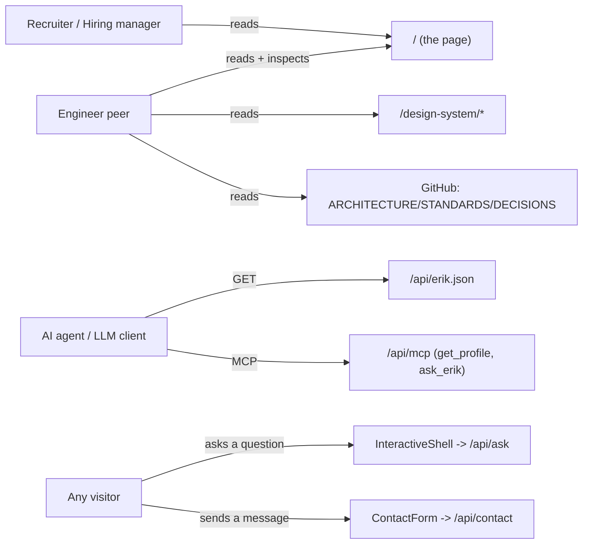
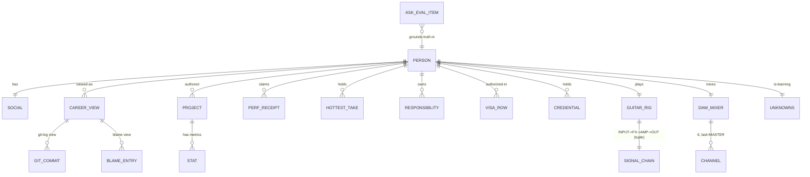

# Business Domain

> Reverse-engineered domain model. In a typical product the domain is customers/orders/etc.; here the domain is **a person's professional identity, expressed as a Unix/terminal filesystem**, plus one AI feature and its evaluation domain.

## What problem does this solve?

It is a **hiring and reference artifact** for one user (Erik Cunha, a software engineer). Two jobs-to-be-done:

1. **For human visitors (recruiters, hiring managers, engineers):** present credentials, projects, work-authorization, and opinions in a memorable, high-craft terminal aesthetic, with hard performance/accessibility guarantees that themselves signal engineering seniority.
2. **For AI agents (and curious engineers):** answer questions about Erik via `/api/ask` (an LLM grounded in the site's own content) and expose a machine-readable hiring profile via `/api/erik.json` and a read-only MCP server (`/api/mcp`).

The **secondary, explicit product** is the engineering itself: the architecture, the CI gates, the design system, and the AI-development platform are intended to be inspected as evidence of capability (see `DECISIONS.md` 2026-05-23, which rescinded "no design system / scope creep" precisely because the system *is* the demonstration).

## Users and how they move through the system

There is **no authentication, no accounts, no multi-tenancy**. The "user" is anonymous; the only per-user state is ephemeral rate-limit/budget buckets keyed by hashed IP.

## The core insight: content *is* the domain model

Every section of the page is driven by a typed module in `content/`, and those types *are* the domain entities. The terminal metaphor maps real professional data onto filesystem/Unix concepts:

| Terminal surface | Real-world meaning | Content module | Entity |
|---|---|---|---|
| `cat README.md` | Intro / positioning | `readme.ts` | `ReadmeCopy` |
| `man erik(1)` | Capabilities + "known bugs" (honest weaknesses) | `man-page.ts` | `ManPage` |
| `git log ~/career` | Career & life timeline | `git-log.ts` | `GitCommit[]` (`type: career｜life`) |
| `git blame` view | Employment history with "reason for change" | `employers.ts` | `BlameEntry[]` |
| `ls -la ./projects` | Projects | `projects.ts` | `Project[]` |
| `perf_receipts` | Quantified impact claims | `perf-receipts.ts` | `PerfReceipt[]` + `heroStats: Stat[4]` |
| `ls -l ~/responsibilities` | Scope, as Unix permission bits | `responsibilities.ts` | `Responsibility[]` (`perms` regex) |
| `cat ~/.now` | Current focus | `now.ts` | `NowRow[]` |
| `npm list --global` | Tech stack | `npm-stack.ts` | `NpmTile[]` |
| `cat ~/.credentials` | Credentials/certs | `credentials.ts` | `Credential[]` |
| `cat ~/.visa` | Work authorization by jurisdiction | `visa.ts` | `VisaRow[]` |
| `cat ~/.community` | Community/speaking | `community.ts` | `CommunityEvent` |
| `cat ~/HOTTEST_TAKES.md` | Opinions/theses | `hottest-takes.ts` | `HottestTake[]` |
| `cat ~/.guitar_rig` | Hobby (guitar signal chain) | `guitar-rig.ts` | `GuitarRig` |
| `./mix --live` | Hobby (DAW mixer, interactive) | `daw-mixer.ts` | `DawMixer` |
| `cat ~/.unknowns` | Intellectual honesty (what he's still learning) | `unknowns.ts` | `Unknowns` |
| `sys_health` | Playful self-metrics | `sys-health.ts` | `SysStat[]` |

Supporting content (not sections): `social.ts` (links), `seo.ts` (JSON-LD `Person`), `dmesg.ts` + `shell-commands.ts` + `terminal-chrome.ts` (client-imported flavor data), and the AI-eval domain below.

## Domain entity model

**Two notable invariants the schema enforces** (because they are silent-corruption risks):

- The guitar **signal chain is a Zod `tuple`**, not an array, so the renderer's positional roles (INPUT → FX → AMP → OUT) cannot be reordered or duplicated while still "validating." (`content/schemas.ts:105-108` documents why `z.array().length(4)` was rejected.)
- The DAW mixer is `.length(6)` with `.refine(last.id === 'MASTER')` - the master channel must be last.

## The AI sub-domain (`/api/ask` and its evaluation)

This is the only "live" feature, and it has its own domain:

- **`AskInteraction`** (`lib/ask-log.ts`): a question→answer event, status ∈ {`completed`, `errored`, `rate-limited`, `dedup-rejected`, `budget-exhausted`}, persisted to Redis (`ask:log:{date}:{requestId}`, 90-day TTL, IP hashed, truncated).
- **`AskEvalItem`** (`content/ask-eval-corpus.ts`): an evaluation case `{ id, question, expect, kind }`, `kind ∈ {factual, edge, jailbreak, output-validation}`. The `expect` is a natural-language criterion an LLM judge scores. Ground truth is pulled from the *live* content modules, so content/persona drift becomes a failing eval.
- **`AskEvalCalibrationItem`** (`content/ask-eval-calibration.ts`): a gold case with a `canonicalAnswer` + a human `humanVerdict`, used to **gate the judge itself** (judge-human agreement must clear 0.85 before any corpus tokens are spent).

This is the engine behind the `AiMetricsSection` ("ASK_EVAL.JSON --MEASURED"), which reads the latest eval aggregate from Redis at build time.

## The 60-second introduction

"It's a one-page terminal-themed portfolio that's secretly a reference-architecture showcase. The page is server-rendered and almost JS-free; every section is just typed data validated at build. There's one real backend feature - an 'ask Erik anything' LLM endpoint grounded in the site's own content and held to an eval bar - plus machine-readable profile endpoints for AI agents. The actual product being sold is the engineering: read `ARCHITECTURE.md` and `DECISIONS.md`, then this `/docs` folder."
