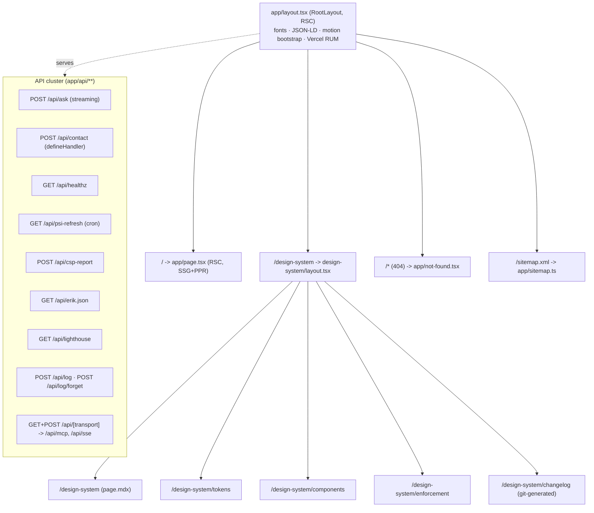
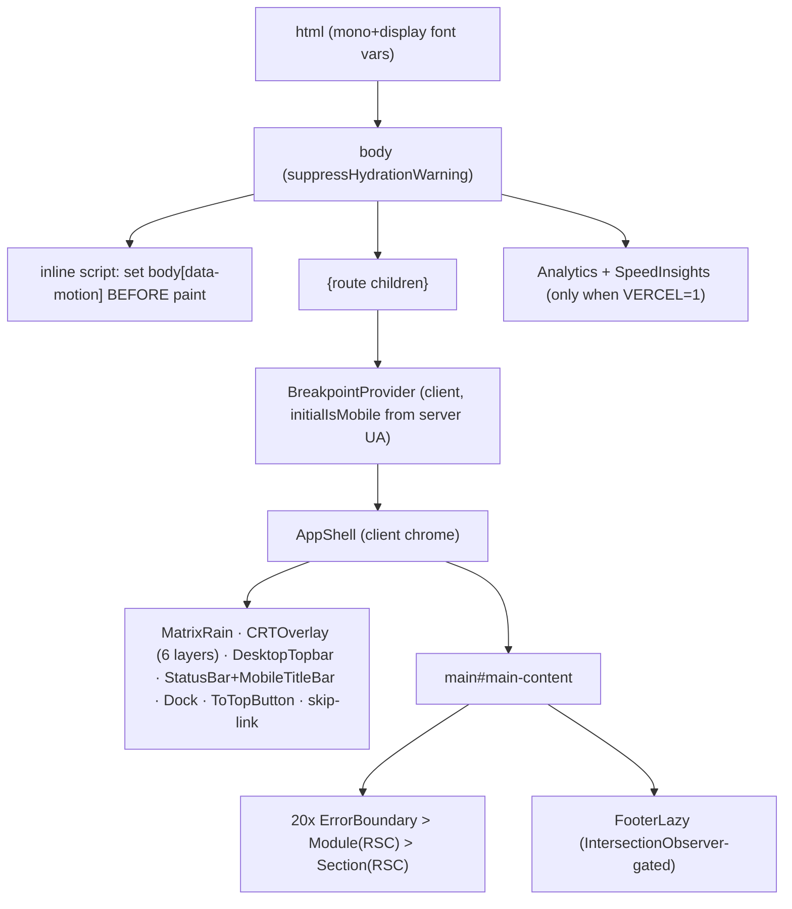
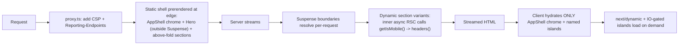
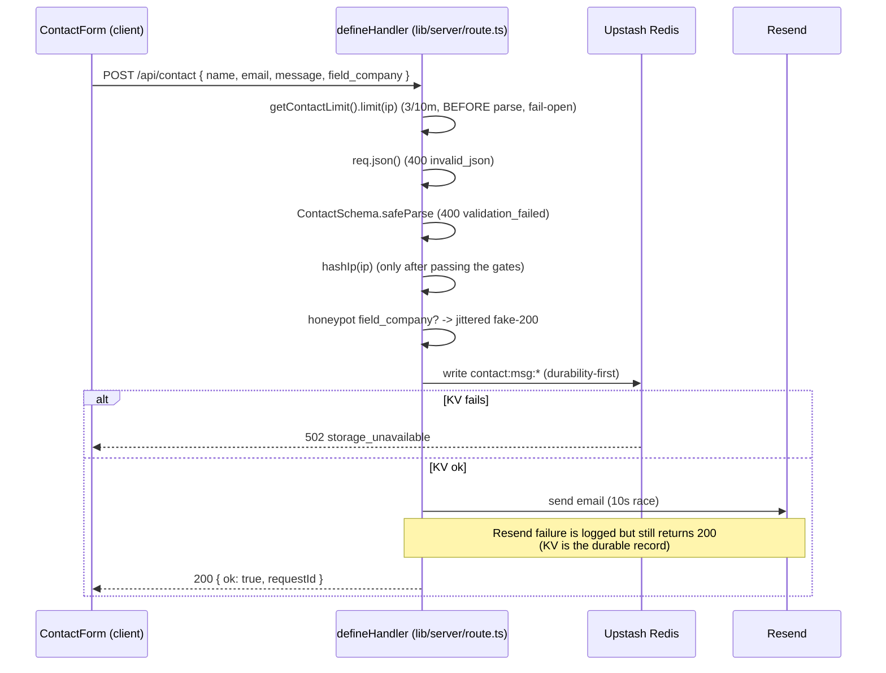
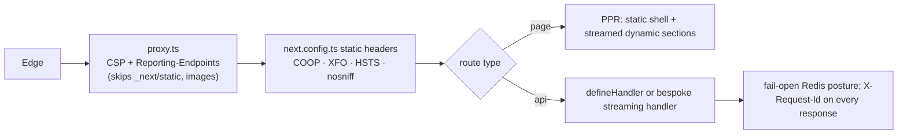

# Rendering & Data Flow

> Routing tree, the RSC/PPR rendering pipeline, and end-to-end data flows with sequence diagrams. This is the doc that explains *how a request becomes pixels* and *how a user action becomes a persisted effect*.

## Routing tree



There is **one user-facing page** (`/`). Everything else is the design-system docs, metadata routes, and the API cluster. Error UI uses the client `ErrorBoundary` component (not the App Router `error.tsx` convention); there is no `loading.tsx`/`template.tsx`.

## Layout hierarchy (what wraps what)



The motion bootstrap script is load-bearing: it reads `localStorage('erik.motion')` / OS preference and sets `body[data-motion]` **before first paint**, off the hydration path, so CRT effects and the LCP element never flash or wait on JS.

## The rendering pipeline (RSC + PPR)

`cacheComponents: true` turns on Partial Prerendering. The mechanism in this codebase:



**Static vs dynamic, concretely:**

- **Static (prerendered):** the whole `AppShell` chrome, `Hero` (deliberately *outside* any `<Suspense>` so LCP never waits), `Readme`, `Shell`, and section fallbacks.
- **Dynamic-via-`<Suspense>`:** `ManPage`, `GitLog`, `Visa`, `Projects`, `Guitar`, `LivePerf`, `DawMixer`, and `AiMetrics`. These wrap an inner async RSC that calls `getIsMobile()` (`lib/ua.ts`, which reads `headers()`), which marks the subtree dynamic. Only the Suspense fallback is prerendered; the real variant streams in.
- **The dual-variant pattern** (e.g. `ManPageSection.tsx`):
  ```
  <Module><Suspense fallback={<Desktop/>}><AsyncInner/></Suspense></Module>
  ```
  `AsyncInner` awaits `getIsMobile()` and renders `<ManPageDesktop/>` or `<ManPageMobile/>`. Fallback choice is per-section: desktop variant for most; **`null` for Guitar** (a CLS fix, `DECISIONS.md` 2026-06-13); a reserved-height stub for `AiMetrics`.
- **`defer` prop:** below-the-fold sections pass `defer` to `Module`, which applies CSS `content-visibility` (defers *render cost*, not JS).
- **`next/dynamic` lazy JS (4 sites):** `ContactFormLazy`, `InteractiveShellLazy`, `FooterLazy` (IO-gated), `DawMixerSection`.

There is **no `use cache` / `cacheLife` / `cacheTag` / `unstable_cache` / `generateStaticParams`** anywhere - the staticness comes from PPR + the absence of dynamic APIs, not explicit caching.

## End-to-end data flow #1 - page render (read path)

```
build time:  content/*.ts imported -> Zod parse (gate) -> typed data baked into RSC output
             scripts/ask-eval.ts -> Redis ask:eval:latest -> content/ask-metrics.ts reads at build
request:     proxy.ts headers -> static shell streamed -> getIsMobile() resolves per request
             -> dynamic section variants stream -> client hydrates islands
```

The content layer is **build-time**: by the time a request arrives, section data is already in the prerendered output. The only per-request server work is the `getIsMobile()` branch and any Redis read a section does (e.g. `AiMetrics`, `LivePerf`).

## End-to-end data flow #2 - `/api/ask` (the streaming AI feature)

This is the richest flow in the system. Transport is **plain `fetch` reading a raw `ReadableStream` of `text/plain`** - not SSE, and the AI SDK runs server-side only.

```mermaid
sequenceDiagram
    participant U as InteractiveShell (client island)
    participant R as app/api/ask/route.ts
    participant RL as lib/rate-limit
    participant G as lib/ask/output-guard (Layer 1)
    participant AI as Vercel AI Gateway (Haiku)
    participant KV as Upstash Redis

    U->>R: POST /api/ask { question }
    R->>R: ASK_ENABLED kill-switch (503 if off)
    R->>RL: getAskLimit().limit(ip)  (8/h, fail-open)
    R->>R: parse + validate (trim, <=500 chars)
    R->>R: INJECTION_RE reject (400)
    R->>RL: checkIdenticalQuestion (60s dedup, 429)
    R->>RL: reserveBudget(512)  (monthly token cap, 503 if exhausted)
    R->>R: mint 128-bit sentinel; wrap question as data-only
    R->>AI: streamText(model=ASK_MODEL, cacheControl: ephemeral)
    loop each delta (raced vs 15s watchdog)
        AI-->>R: text chunk
        R->>G: Layer-1 egress scan (leak markers / 4000-char runaway)
        alt leak/runaway
            G-->>R: abort -> append STREAM_ERR_SENTINEL
        else clean
            R-->>U: enqueue chunk
        end
    end
    U->>U: parseStreamChunk -> rAF-coalesced setStreamingText (renders THROUGH React)
    R->>KV: finally: settleBudget(refund) + Layer-2 audit + ask-log (fail-quiet)
    U->>U: finalize() -> commit answer (or error line) into history
```

**Client-side rendering nuance (verified in code):** the streamed text lands in an *isolated* `streamingText` state and is flushed at most once per animation frame (`requestAnimationFrame`), so a per-chunk update re-renders only one `<span>`, never the whole feed. This is the opposite of the Hero boot loop, which mutates `textContent` directly with no React state (see doc 04). Both are deliberate INP guards.

**Server timeouts (defense in depth):** 30s whole-request `AbortSignal`, 15s mid-stream watchdog, 1s usage-resolve. The token budget is held **fail-closed** if usage can't be resolved (so a metering bug can't leak spend), while Redis itself is **fail-open** (an outage never blocks an answer).

## End-to-end data flow #3 - `/api/contact` (the write path via `defineHandler`)



The **ordering is a security property**: rate-limit and validate *before* the work, hash the IP and touch storage *only* for requests that pass. Every response carries `X-Request-Id`. See doc 05 for the full `defineHandler` contract and the other routes.

## Request lifecycle summary (every request)


