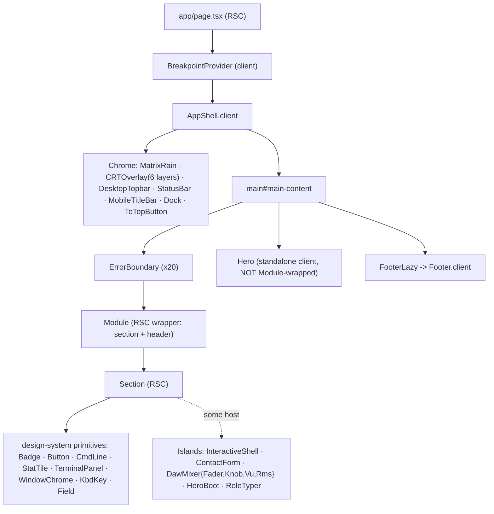
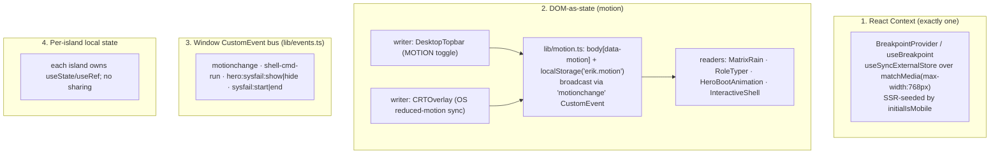

# Components & State

> Component hierarchy, the section/island/primitive taxonomy, the design system, the CSS/token architecture, and the (deliberately minimal) state model.

## Component taxonomy

Four directories, four roles. The directory tells you the layer:

| Directory | Role | Ships JS? | Example |
|---|---|---|---|
| `components/sections/**` | The ~20 page sections | No (RSC) | `ReadmeSection`, `ManPageSection` |
| `components/client/**` | Interactive islands | Yes | `InteractiveShell`, `ContactForm`, `DawMixer/*` |
| `components/responsive/**` | Viewport chrome | Yes (except `Module`) | `MatrixRain`, `Dock`, `CRTOverlay` |
| `design-system/components/**` | Reusable primitives | Mostly No (RSC) | `Badge`, `Button`, `TerminalPanel` |

Conventions (enforced by `check-client-naming.mjs`): a client file is named `*.client.tsx`; a plain `*.tsx` in `sections/` is RSC. Each component is a `Foo/Foo.tsx` + `Foo/index.ts` barrel, with co-located `*.test.tsx` (Vitest) and `*.e2e.ts` (Playwright). `*Lazy` files are `next/dynamic` wrappers.

> **Known convention drift (document, do not "fix" silently):** eight interactive files under `components/client/**` (e.g. `ContactForm.tsx`, `InteractiveShell.tsx`, `HeroBootAnimation.tsx`, `RoleTyper.tsx`, `ToTopButton.tsx`) carry `'use client'` but are **not** named `*.client.tsx`. The naming gate's scope evidently does not cover that directory. This is real today; see doc 09.

## Component hierarchy

### The `Module` wrapper

`components/responsive/Module/Module.tsx` (RSC) is the spine every section sits in. It renders a `<section id tabIndex={-1} aria-labelledby>` containing a non-interactive `<header>` with an `<h2>`; there is no collapse affordance on any viewport. Props: `id`, `header`, `mobileHeader?`, `icon?`, `defer?`, `variant?: 'green'`. The `defer` prop still drives `content-visibility` deferral via `data-cv-defer`/`module-deferred`. See DECISIONS.md 2026-07-12 for why the disclosure was removed.

### CRT overlay layering

`CRTOverlay.client.tsx` renders 6 fixed, `aria-hidden`, `pointer-events:none` overlay divs, z-stacked in `crt.css`: vignette (1) · scanlines (2) · RGB sub-pixel mask (3) · noise (4) · flicker (5) · scan beam (6). `MatrixRain` sits at z-0, `<main>` at z-10. All of it disables under `prefers-reduced-motion: reduce` **and** `body[data-motion="reduce"]`, and freezes during the system-failure overlay (`html.sysfail-on`).

## The design system

Eight primitives in `design-system/components/`; **seven exported** from `design-system/index.ts` (`Field` is intentionally internal - consumed only by `ContactForm`).

| Primitive | Type | Variant surface |
|---|---|---|
| `Badge` | RSC | `variant: default｜dot`, `size: sm｜md` |
| `Button` | RSC | polymorphic `as: button｜a`, `variant: primary｜secondary`, `size: sm｜md｜lg` |
| `CmdLine` | RSC | terminal command line (`user`, `command`, `output`, `prompt`) |
| `Field` | **client** | input/textarea + label + error/ARIA (not exported) |
| `KbdKey` | RSC | `size: sm｜md` |
| `StatTile` | RSC | `<dl>` stat tile, `variant: default｜compact` |
| `TerminalPanel` | RSC | bordered container, polymorphic `as`, optional header |
| `WindowChrome` | RSC | macOS traffic-light dots, `size` px |

The only DS lib file is `design-system/lib/cx.ts` - a 3-line classname joiner (`.filter(Boolean).join(' ')`), no `clsx`/`tailwind-merge` dependency (a bundle-budget choice). The **DS docs site** (`app/design-system/**`) is MDX; `_lib/theme-tokens.ts` parses `app/css/theme.css` with the *same regex* as `scripts/contrast-check.mjs`, so the docs and the contrast gate can never drift. The changelog page is git-generated by `scripts/sync-changelog.ts` (`pnpm changelog:sync`).

## CSS / token architecture

Import order (`app/globals.css`): `tailwindcss` → `theme.css` → `base.css` → `crt.css` → `animations.css` → `components.css`. Tailwind v4 via the single `@tailwindcss/postcss` plugin. No CSS modules, no Style Dictionary.

| File | `@layer` | Holds |
|---|---|---|
| `theme.css` | `@theme` | The token system (below) |
| `base.css` | `base` | resets, focus-visible rings, skip-link, `.sr-only`, the `#sec-*` mobile-order map, `.mobile-only`/`.desktop-only` |
| `crt.css` | `components` | the 6 CRT classes + keyframes + reduced-motion disables |
| `animations.css` | - | section keyframes (`boot-blink`, `dmesg-reveal`, `guitar-scan-beam`, `hero-shake-*`, ...) |
| `components.css` | `components` | ~40 named classes Tailwind can't express (`.module-*`, `.signal-glow`, DawMixer `.mx-fader`/`.mx-dial`, `.contact-*`, `.shell-cursor`, ...) |

**Tokens (`@theme`):** not literally two tokens - six ordinal color families (primary/secondary/tertiary/quaternary/quinary/senary), each a 50–900 ramp, with the brand palette mapped onto specific stops: `--color-primary-500: #00ff41` (signal green), `--color-secondary-950: #000000` (surface black), `--color-tertiary-50: #e6ffe6` (body text, ~13:1 contrast). Fixed-opacity stops (`-subtle` 40%, `-border` 20%, `-faint` 12%, `-quiet` 10%) are kept as explicit hex (byte-identical, no `color-mix`). Stops actually in use are commented `✓ EXACT`. **No raw hex outside `theme.css`** - enforced by `lint:css-tokens` (see doc 06/07).

## State architecture

This is a near-static site; the state model is intentionally tiny. Four mechanisms, in order of how much you'll touch them:

**There is no global store, no `useReducer`, and no URL/`searchParams` state.** The only router read in the entire app is `usePathname()` in the design-system `Sidebar.client.tsx`. Cross-island coordination is done with window `CustomEvent`s, not shared React state - e.g. `InteractiveShell` dispatches `shell-cmd-run` and `Footer` listens to increment a counter, with no shared parent state.

### Per-island state, and the two rendering disciplines

Islands fall into two camps, and the split is a deliberate INP strategy:

- **Render *through* React (rAF-coalesced state):** `InteractiveShell` - the streamed `/api/ask` answer lands in an isolated `streamingText` state flushed once per `requestAnimationFrame`. This is the one place per-token updates go through React, and they're coalesced so only one `` re-renders.
- **Mutate the DOM directly (no per-frame React state):** the Hero boot loop (`HeroBootAnimation` → `lib/boot-animation.ts`) and `RoleTyper` use `node.textContent =` typewriter mutation with `setTimeout`, **never** per-character `useState`. The DAW faders/knobs/VU meters update `style`/`setAttribute`/`className` directly on drag. `FaderDbIsland` and `VuMeter` hold no React state at all.

This is the single most important state convention in the repo (and is asserted by `InteractiveShell.test.tsx`): **per-keystroke / per-pixel / per-frame updates must not trigger React re-renders.** See `CLAUDE.md` "Rendering model" and doc 09.

Other islands hold ordinary local state: `ContactForm` (controlled fields + a `idle→submitting→success｜error` status machine + honeypot), `ToTopButton` (`visible` on scroll>400), `StatusBar`/`Footer` (interval clocks with `visibilitychange` pause), `RmsButtons` (`Set<string>` toggle group), `CopyButton` (transient "COPIED").
