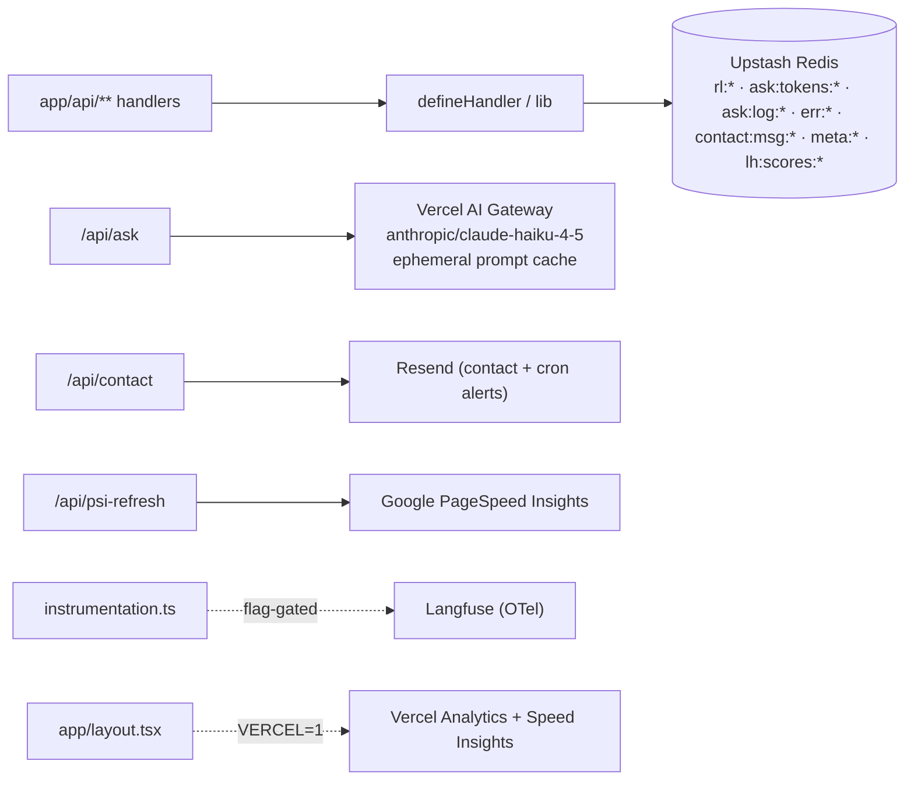

# API & Integrations

> The BFF layer: the `defineHandler` contract, every API route, the external integrations, and the security surface. For the request sequence diagrams see doc 03.

## The `defineHandler` envelope (`lib/server/route.ts`)

The shared API contract. Most routes are built on it; `/api/ask` (streaming) and `/api/erik.json` (a document, not an operation) are the deliberate exceptions.

```ts
export function defineHandler<TSchema extends ZodTypeAny>(
  opts: DefineHandlerOpts<TSchema>,
): (req: NextRequest) => Promise<Response>
// opts: { schema, rateLimit, rateLimitErrorMessage?, handler }
// ctx passed to handler: { body, ip, ipHash, requestId, req }
```

**Enforced pipeline order (this ordering is the security property):**

1. `requestId = crypto.randomUUID()`, `ip = getClientIp(req)`.
2. **Rate-limit BEFORE body parse** - `rateLimit().limit(ip)`. On Redis throw: log and **fail-open** (allow). On `!success`: `429 rate_limited`.
3. **Parse** `req.json()` → `400 invalid_json` on throw.
4. **Validate** `schema.safeParse(raw)` → `400 validation_failed` (with `issues`).
5. **Hash IP** only now (saves a SHA-256 + KV round-trip on rejected requests) → call `handler(ctx)`.

**Envelope:** success `{ ok: true, requestId, data? }`; error `{ ok: false, requestId, error: { code, message, issues? } }`. Every response carries `X-Request-Id`. `ApiErrorCode ∈ { rate_limited, invalid_json, validation_failed, storage_unavailable }`.

## API route table

| Route | Method | Built on | What it does | Auth/secret | Failure mode |
|---|---|---|---|---|---|
| `/api/ask` | POST | bespoke (streaming) | LLM "ask Erik", `text/plain` stream | AI Gateway key/OIDC; Upstash | fail-open Redis; mid-stream errors → `STREAM_ERR_SENTINEL`; 30s/15s/1s timeouts; budget fail-closed |
| `/api/contact` | POST | `defineHandler` | contact form → KV (durable) → Resend | `RESEND_API_KEY` | honeypot → fake-200; KV fail → 502; Resend fail → still 200 |
| `/api/healthz` | GET | bespoke | health probe: SHA + PSI freshness | none | 200 fresh, **503 degraded** if `meta:psi-last-run` missing/stale(>25h); `no-store` |
| `/api/psi-refresh` | GET (cron) | bespoke | daily PSI refresh, writes freshness key | **`CRON_SECRET`** Bearer | 401 on bad secret; partial-fail still writes key; no auto-retry (`0 3 * * *`) |
| `/api/csp-report` | POST | none | CSP violation sink | none | returns 204, body unread |
| `/api/erik.json` | GET | exempt | machine-readable hiring profile | none | static-cached `public, max-age=86400` |
| `/api/lighthouse` | GET | bespoke | stored PSI metrics | `PSI_API_KEY` (in lib) | falls back to all-zero `LIGHTHOUSE_FALLBACK` |
| `/api/log` | POST | `defineHandler` | client error capture → KV (30d TTL) | none | KV fail → 503; **no IP stored** (forget-exempt) |
| `/api/log/forget` | POST | `defineHandler` | GDPR/LGPD erasure of ask logs by `requestId` | none | deletes across 90 days; **never returns count** (existence-oracle prevention) |
| `/api/[transport]` | GET+POST | `mcp-handler` | read-only MCP server | none | `→ /api/mcp` (streamable-HTTP), `/api/sse`; `maxDuration=60`, Node runtime |

## Rate limits & token budget (`lib/rate-limit.ts`)

Upstash sliding-window factories (lazy singletons over `Redis.fromEnv()`):

| Key | Limit | Used by |
|---|---|---|
| `rl:ask` | 8 / 1h | `/api/ask` |
| `rl:contact` | 3 / 10m | `/api/contact` |
| `rl:healthz` | 120 / 1m | `/api/healthz` |
| `rl:errlog` | 10 / 1m | `/api/log` |
| `rl:forget` | 5 / 1h | `/api/log/forget` |

`getClientIp` precedence: `x-forwarded-for[0]` → `x-real-ip` → `'unknown'` (local dev keys everything to `'unknown'`).

**Token budget (the `/api/ask` cost cap):** `MONTHLY_TOKEN_BUDGET = 3,000,000` (≈$5 of Haiku), key `ask:tokens:{yyyy-mm}` (32-day window). `reserveBudget(maxOutput)` reserves `~2700` tokens up front (`INCRBY` + `EXPIRE NX`); rejects if over budget, warns at ≥80%, fail-open on Redis. `settleBudget(...)` refunds the unused reservation in `finally`. `checkIdenticalQuestion(ipHash, q)` is a 60s `SET NX EX` dedup. All fail-open.

## Integrations



| Service | Env vars | Role | Failure mode |
|---|---|---|---|
| **Vercel AI Gateway** (`ai` SDK v6 `streamText`) | `AI_GATEWAY_API_KEY` or Vercel OIDC | `/api/ask` LLM; model string `anthropic/claude-haiku-4-5`; ephemeral cache via `providerOptions.anthropic.cacheControl`; `maxOutputTokens=512`; telemetry with `recordInputs/Outputs:false` | errors throw from `textStream` → sentinel; layered timeouts |
| **Upstash Redis** | `UPSTASH_REDIS_REST_URL/TOKEN` (`Redis.fromEnv()`) | all stateful keys (rate-limit, budget, logs, dedup, salt, PSI freshness, LH cache) | **fail-open** everywhere; KV writes fail-quiet or 502/503 |
| **Resend** | `RESEND_API_KEY` (lazy throw) | contact email; PSI cron failure alerts | 10s race; contact still 200 on send failure |
| **Google PSI** | `PSI_API_KEY` | live Lighthouse scores for the perf section | 8s req timeout → fallback; 45s cron timeout |
| **Langfuse** | `LANGFUSE_ENABLED` (exact `'true'`) + keys | flag-gated AI trace exporter (no message bodies) | inert unless `==='true'` (fail-closed); heavy imports behind dynamic `import()` |
| **Vercel Cron** | `CRON_SECRET` Bearer | daily PSI refresh trigger | 401 on bad secret; no auto-retry |
| **Vercel Analytics/Speed Insights** | none | web vitals | client SDK; gated on `VERCEL=1` |

## The AI subsystem (`lib/ask/**`)

| File | Purpose |
|---|---|
| `model.ts` | `ASK_MODEL` single source of truth (route + eval import it) |
| `system-prompt.ts` | composes `SYSTEM_TEXT` from a hand-written narrative + **live `content/*` data**, so the persona can't drift from the page; exports `PROMPT_VERSION = sha256(SYSTEM_TEXT)[:12]` (auto drift-proof) |
| `prompt-version.ts` | sync `sha256Hex` (works in both the Node route and the tsx eval) |
| `injection.ts` | `INJECTION_RE` input reject (role tokens, ChatML delimiters, "ignore instructions"); ReDoS-safe |
| `output-guard.ts` | **Layer 1** streaming guard (per-chunk leak/runaway scan, abort→sentinel, cross-chunk-seam safe) + **Layer 2** post-hoc audit; both **fail-open** |

The defense model for `/api/ask`: input `INJECTION_RE` + a per-request unguessable 128-bit sentinel wrapping the user text ("data only") + an in-prompt non-disclosure instruction; output Layer-1 stream guard + Layer-2 audit. Egress guards catch verbatim/whitespace-reflowed prompt echoes; paraphrase leakage is owned by the prompt-side controls.

## Security surface

- **Per-request CSP + reporting → `proxy.ts`** (Next middleware). `script-src 'self' 'unsafe-inline'` (deliberately **nonce-less**: `/` is static-generated, so a nonce would break all inline RSC flight scripts per CSP-3); `frame-ancestors 'none'`, `object-src 'none'`, `form-action 'self'`; `report-to`/`report-uri /api/csp-report`; `connect-src` allows Vercel vitals but **excludes `api.anthropic.com`** (AI calls are server-side only). The dynamic `Reporting-Endpoints` header uses an absolute origin (Chrome ignores relative).
- **Static headers → `next.config.ts`** `headers()`: COOP `same-origin`, `X-Frame-Options: DENY`, `X-Content-Type-Options: nosniff`, `Referrer-Policy: strict-origin-when-cross-origin`, `Permissions-Policy` (camera/mic/geo off), HSTS preload. The split (per-request in proxy, static at config) is intentional.
- **Kill switch `ASK_ENABLED`:** off-keywords (`false｜0｜off｜no｜disabled`) → 503 with an email fallback. **Fails OFF** by design (a typo during a billing emergency must still disable). This is the inverse of Langfuse, which fails OFF on *enabling*.
- **IP hashing (`lib/ip-hash.ts`):** `SHA-256(ip + salt)[:16]`; salt auto-generated 32-byte base64 in prod (`meta:deploy-salt`, SETNX), `'portfolio'` literal only in non-prod.
- **Hook-enforced edit gate (matters when you touch this layer):** editing `app/api/**`, `lib/rate-limit.ts`, or `proxy.ts` records `.claude/.api-edit-pending` and **blocks the next `git push`** until a `security-auditor` agent runs. See `.claude/rules/api-boundary.md` and doc 06.
