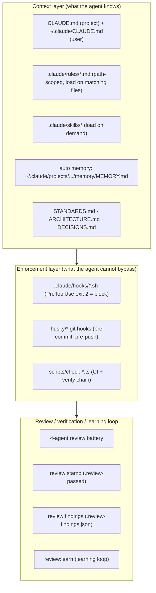
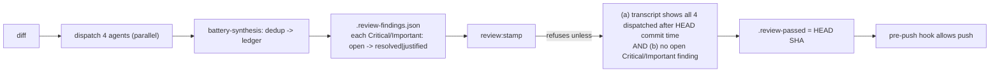
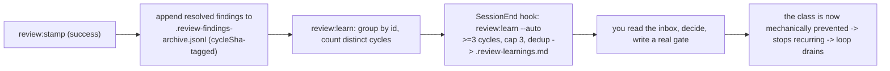

# AI-Assisted Development

> How AI participates in development. This repo treats Claude Code as a core engineering teammate, and the platform that governs it is itself engineered: a context layer, a mechanical enforcement layer, a review/verification loop, and a learning loop. This doc is the map.

## The layers

## Context layer

- **`CLAUDE.md` (project root)** - always loaded, kept under the 275-line cap enforced by `check:harness-size` (Anthropic guidance: <200 lines for adherence). It is an **index + always-true facts**, not procedures.
- **`~/.claude/CLAUDE.md` (user, not in repo)** - the operator's global reasoning/skill-dispatch protocol.
- **`.claude/rules/*.md`** - path-scoped rules with `paths:` frontmatter that load **only when the agent reads matching files**. Today: `api-boundary.md` (scopes `app/api/** | lib/rate-limit.ts | lib/server/** | proxy.ts`). This is the mechanism for keeping `CLAUDE.md` small (the "slot-routing" rule: gate > skill > memory > prose).
- **`.claude/skills/*`** - load-on-demand procedures: `review-convergence` (driving a PR's AI review to green), `pr-merge-gate`, `visual-baseline-regen`, `ai-eval-update`, `battery-synthesis`, `fallow-audit`.
- **Auto memory** - `~/.claude/projects/<slug>/memory/MEMORY.md` (first 200 lines loaded each session); holds learned preferences and feedback.

## Enforcement layer (hooks)

The load-bearing principle: **CLAUDE.md is advisory; anything that must hold is a hook.** Hook exit-code contract: `exit 2` blocks, `exit 1` warns, `exit 0` (+ JSON) decides.

| Hook | Event | Effect |
|---|---|---|
| `bash-guard.sh` | PreToolUse(Bash) | blocks broad `git add`, npm/yarn, `gh pr merge`, force-push-to-main, unpinned `fallow` (`exit 2`) |
| `api-security-push-guard.sh` | PreToolUse(Bash) | blocks `git push` while `.claude/.api-edit-pending` is non-empty (unaudited API edit) |
| `architect-gate.sh` | PreToolUse(Skill) | blocks `speckit-plan` unless an `architect-reviewer` returned `GATE_RESULT: PASS` this session |
| `api-edit-marker.sh` | PostToolUse(Edit/Write) | records an API-surface edit into the pending marker |
| `css-token-guard.sh` | PostToolUse(Edit/Write) | runs the css-tokens lint on CSS edits (see note below) |
| `section-order-guard.sh` | PostToolUse(Edit/Write) | warns if a section lacks a mobile flex-order rule |
| `learning-loop.sh` | SessionEnd | runs `review:learn --auto` once per session (see learning loop) |

Git hooks (`.husky/`): `pre-commit` = Biome; `commit-msg` = commitlint; `pre-push` = the heavy gate (main-push guard, branch-name, **review stamp**, API-edit backstop, `pnpm verify`).

> **`gate-health` (`scripts/check-gate-health.ts`, in `verify` + CI)** is a meta-gate: it asserts every `scripts/*` path referenced by a hook and every hook wired in `settings.json` actually exists. It was added after `css-token-guard.sh` was discovered pointing at two scripts deleted in the Tailwind-v4 migration - a "dead hook" that never fired and never false-fired. The hook now points at `scripts/lint-css-tokens.ts` (bans raw hex outside `theme.css`).

## The review / verification loop

Before every push (and whenever coding work stops), the agent runs a **4-agent review battery** in parallel - `pr-review-toolkit:review-pr`, `security-auditor`, `performance-engineer`, `dependency-auditor` - scoped to the actual diff. WCAG 2.1 AA is gated separately and mechanically by axe-core + Lighthouse accessibility = 100, not by a battery agent.

Two enforcement boundaries, both mechanical:

1. **Dispatch** - `scripts/review-stamp.ts` reads the session transcript and refuses to write `.review-passed` unless all four agent roles were dispatched *after* the HEAD commit's timestamp (fail-closed; the boundary is git commit time, so a commit made outside the session can't be stamped by a stale review).
2. **Resolution (the verification loop)** - the stamp *also* refuses while any Critical/Important finding in `.review-findings.json` is `open`. Findings are recorded via `pnpm review:findings` (`add`/`resolve`/`justify`/`check`/`clear`); a `resolve` cites a fix SHA, a `justify` cites a reason. This turns the stamp from "review happened" into "findings were resolved."

The residual honor-system boundary is *recording* findings (the stamp can't know about a finding you never recorded). The `transcript:doctor` (`scripts/transcript-doctor.ts`) diagnoses the fail-closed transcript-resolution path (a shared SPOF) in seconds.

## The learning loop

Closes capture → analyze → surface, and **self-prunes**:

The auto-trigger is deliberately flood-mitigated: SessionEnd (not per-turn), evidence threshold ≥3 distinct cycles, capped at 3, append-only to a gitignored inbox, silent unless there is new signal, and it **never creates a gate** - a recurring finding is evidence, a gate is a human decision. (See `DECISIONS.md` 2026-06-18.)

## MCP servers

| Server | Scope | Role |
|---|---|---|
| GitHub (`github` plugin) | user/plugin | PR/issue/CI access for the convergence loop |
| Vercel (`vercel` plugin) | user/plugin | deployments, logs, doc search |
| Chrome DevTools (Google) | user/plugin | perf tracing / LCP debugging |
| **Context7** (Upstash) | **project `.mcp.json`** | version-correct Next 16 / React 19 / AI SDK docs (read-only) |
| Upstash | project `.mcp.json` | read-only Redis state inspection (scoped read-only key) |

Context7 is the one repo-configured MCP; the GitHub/Vercel/Chrome ones are plugin-provided (the correct scope). The repo also *exposes* a read-only MCP server of its own at `/api/mcp` (a product feature, not a dev tool).

## The CI-side AI reviewer

`.github/workflows/claude.yml` is an **opt-in pilot**: `claude-code-action` (SHA-pinned) runs only when a human writes `@claude` in a PR/issue comment, authenticated via a Max-subscription `CLAUDE_CODE_OAUTH_TOKEN`. It supplements, never replaces, the local 4-agent battery and the automated `/claude-review` (the sole AI PR reviewer as of 2026-06-20; Copilot was dropped).

## Where to read more

- `CLAUDE.md` → "Project agent dispatch", "Skill dispatch", "Working agreement" tables.
- `STANDARDS.md` → each chapter names its enforcement mechanism.
- `DECISIONS.md` 2026-06-17 / 2026-06-18 → the full ADRs for gate-health, the verification loop, the transcript doctor, the rule-hygiene protocol, and the learning loop.
