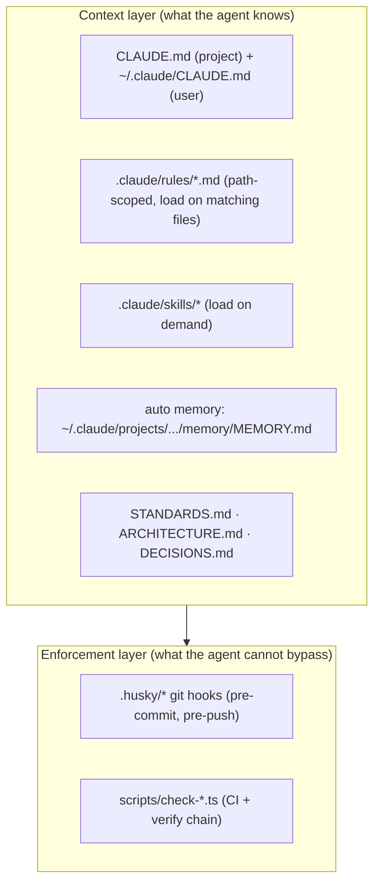

# AI-Assisted Development

> How AI participates in development. This repo treats Claude Code as a core engineering teammate. It used to govern that teammate with a bespoke enforcement layer of its own; as of 2026-07-27 it does not, and this doc is the map of what is left.

## The layers

```mermaid
flowchart TB
    subgraph ctx["Context layer (what the agent knows)"]
        cl["CLAUDE.md (project) + ~/.claude/CLAUDE.md (user)"]
        rules[".claude/rules/*.md (path-scoped, load on matching files)"]
        skills[".claude/skills/* (load on demand)"]
        mem["auto memory: ~/.claude/projects/.../memory/MEMORY.md"]
        docs["STANDARDS.md · ARCHITECTURE.md · DECISIONS.md"]
    end
    subgraph enf["Enforcement layer (what the agent cannot bypass)"]
        husky[".husky/* git hooks (pre-commit, pre-push)"]
        gates["scripts/check-*.ts (CI + verify chain)"]
    end
    ctx --> enf
```

## Context layer

- **`CLAUDE.md` (project root)** - always loaded, kept under the 275-line cap enforced by `check:harness-size` (Anthropic guidance: <200 lines for adherence). It is an **index + always-true facts**, not procedures.
- **`~/.claude/CLAUDE.md` (user, not in repo)** - the operator's global reasoning/skill-dispatch protocol.
- **`.claude/rules/*.md`** - path-scoped rules with `paths:` frontmatter that load **only when the agent reads matching files**. Today: `api-boundary.md` (scopes `app/api/** | lib/rate-limit.ts | lib/server/** | proxy.ts`). This is the mechanism for keeping `CLAUDE.md` small (the "slot-routing" rule: gate > skill > memory > prose).
- **`.claude/skills/*`** - load-on-demand procedures: `visual-baseline-regen`, `ai-eval-update`, `semgrep`, and the `speckit-*` flow.
- **Auto memory** - `~/.claude/projects/<slug>/memory/MEMORY.md` (first 200 lines loaded each session); holds learned preferences and feedback.

## Enforcement layer

The load-bearing principle used to be **CLAUDE.md is advisory; anything that must hold is a hook.** The second half of that is no longer true here: **this repo has no `.claude/hooks/` and no `PreToolUse`/`PostToolUse` wiring in `settings.json`.** Six guards were removed on 2026-07-27 - `bash-guard` (broad `git add`, npm/yarn, `gh pr merge`, force-push-to-main), `api-security-push-guard`, `architect-gate`, `api-edit-marker`, `biome-format` and `session-context` - together with the meta-gate that checked they were wired.

What survives is everything that does not depend on the agent runtime:

- **`.husky/`**: `pre-commit` = Biome + `gitleaks --staged` + commitlint; `pre-push` = main-push guard, branch-name check, and the full `pnpm verify` chain.
- **`scripts/check-*`**: the `verify` chain and CI - client-naming, dep-pinning, harness-size, section-order, doc-drift, detect-changes-paths, css-tokens, contrast, bundle-size, route-JS.
- **CI**: Lighthouse, axe-core, Playwright, semgrep, gitleaks, CodeQL.

The trade this makes is explicit and worth naming: a git hook and a CI job constrain *the repository*, while a `PreToolUse` hook constrained *the agent mid-turn*. Nothing now blocks an agent from running a destructive command; the guard rails are at commit, push and CI time only.

## Review

There is no AI reviewer on pull requests and no local review battery. Both were removed on 2026-07-27: the 4-agent battery, its findings ledger (`review:findings`), the dispatch stamp (`review:stamp`) and the pre-push stamp check, plus `.github/workflows/claude-review.yml` and the `claude-gate` approval check.

Pre-PR review is now a discipline rather than a gate: read the diff, invoke `pr-review-toolkit:code-reviewer` against it, fix what it finds. `pnpm pr:gate` still checks that every review thread on the PR is resolved and flags `suspicious_self_resolve`.

## MCP servers

| Server | Scope | Role |
|---|---|---|
| GitHub (`github` plugin) | user/plugin | PR/issue/CI access |
| Vercel (`vercel` plugin) | user/plugin | deployments, logs, doc search |
| Chrome DevTools (Google) | user/plugin | perf tracing / LCP debugging |
| **Context7** (Upstash) | **project `.mcp.json`** | version-correct Next 16 / React 19 / AI SDK docs (read-only) |
| Upstash | project `.mcp.json` | read-only Redis state inspection (scoped read-only key) |

Context7 is the one repo-configured MCP; the GitHub/Vercel/Chrome ones are plugin-provided (the correct scope). The repo also *exposes* a read-only MCP server of its own at `/api/mcp` (a product feature, not a dev tool).

## Where to read more

- `CLAUDE.md` → "Project agent dispatch", "Skill dispatch", "Working agreement" tables.
- `STANDARDS.md` → each chapter names its enforcement mechanism.
- `DECISIONS.md` 2026-07-27 → the ADRs for the harness prune and for removing the AI-review gate chain.
