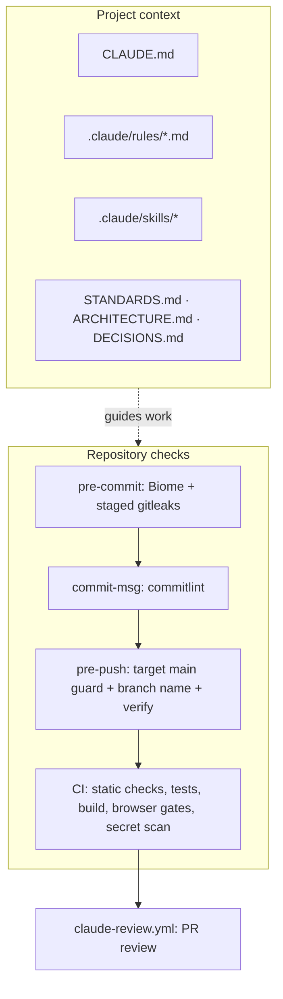

# AI-Assisted Development

> Project context, development checks and pull-request review.

## The layers

```mermaid
flowchart TB
    subgraph ctx["Project context"]
        cl["CLAUDE.md"]
        rules[".claude/rules/*.md"]
        skills[".claude/skills/*"]
        docs["STANDARDS.md · ARCHITECTURE.md · DECISIONS.md"]
    end
    subgraph checks["Repository checks"]
        commit["pre-commit: Biome + staged gitleaks"]
        msg["commit-msg: commitlint"]
        push["pre-push: target main guard + branch name + verify"]
        ci["CI: static checks, tests, build, browser gates, secret scan"]
    end
    ctx -. guides work .-> checks
    commit --> msg
    msg --> push --> ci
    ci --> review["claude-review.yml: PR review"]
```

## Context

`CLAUDE.md` names commands, standards and review conventions. Path-scoped rules live in `.claude/rules/`; `.claude/rules/api-boundary.md` covers the server boundary. On-demand procedures live in `.claude/skills/`, including visual baseline generation, AI eval maintenance, PR review and Semgrep.

`check:harness-size` checks `CLAUDE.md` against a 275-line maximum. This is a size check, not proof that an agent follows the file.

## Repository enforcement

The repository has no `.claude/hooks/` directory or project PreToolUse/PostToolUse wiring. API security review and architect review are conventions in `CLAUDE.md`; they are not project hook gates. User-level runtime policies are configured outside this repository.

Git hooks enforce separate stages:
- `.husky/pre-commit` runs `pnpm check` and `pnpm gitleaks:staged`.
- `.husky/commit-msg` runs commitlint against the message file.
- `.husky/pre-push` rejects pushes targeting `main`, checks the branch name, and runs `pnpm verify`. Deletion-only pushes skip name and verification checks after the main-target guard.

`package.json` defines the static chain. `.github/workflows/ci.yml` adds coverage, dependency review, build and JS budgets, Lighthouse, axe, Playwright, AI eval and secret scanning. Job conditions and the fan-in are described in [07-workflows.md](./07-workflows.md).

## Pull-request review

`.github/workflows/claude-review.yml` configures the automated reviewer with `.github/claude-review-prompt.md`. `pnpm claude-gate` checks its approval against the current head. `pnpm pr:gate` checks review thread resolution and replies. These commands do not prove a local pre-PR review ran.

The pre-PR review procedure and the merge restriction are documented in `CLAUDE.md`. Repository hooks do not prevent an agent from invoking `gh pr merge`.

## Evaluation tools

`pnpm ask:eval` evaluates the `/api/ask` product with calibration, corpus cases and aggregate gates. It writes `ask-eval-result.json`; configured Upstash credentials allow publishing the latest aggregate.

`pnpm eval:agents` evaluates platform prompts separately. It writes `agent-eval-result.json`; the corresponding workflow is advisory. Neither command is a replacement for deterministic unit, type or browser checks.

## Project MCP configuration

| Entry      | Transport                            | Purpose                                           |
| ---------- | ------------------------------------ | ------------------------------------------------- |
| `context7` | HTTP, `https://mcp.context7.com/mcp` | Documentation lookup                              |
| `upstash`  | `npx @upstash/mcp-server@latest`     | Redis inspection using `UPSTASH_READONLY_API_KEY` |

Both entries are in `.mcp.json`. Registration does not establish a connected or working tool. Plugin and user-level server availability depends on the active runtime.

The product also exposes `/api/mcp`, a separate read-only hiring-profile and question interface. See [05-api-and-integrations.md](./05-api-and-integrations.md).
