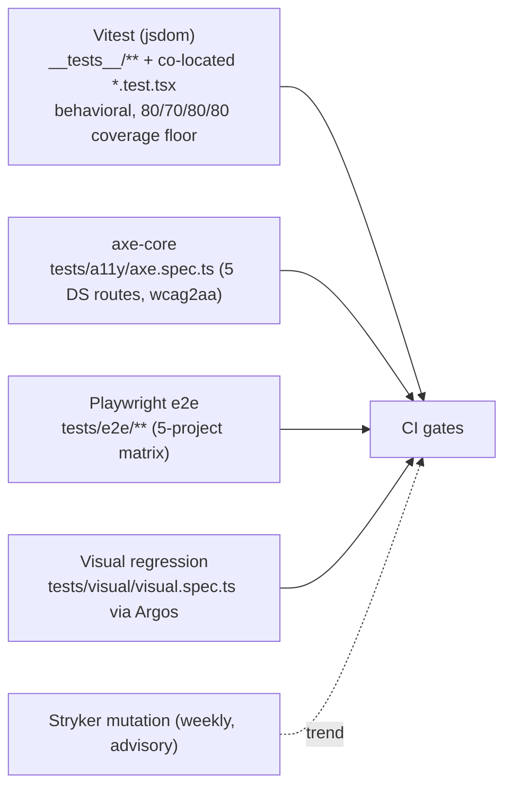
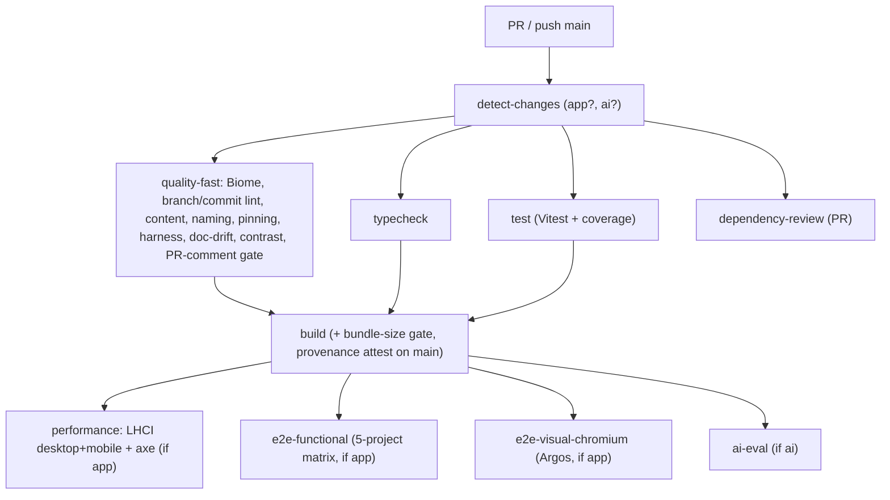

# Workflows

> Local development, build, testing, CI/CD, releases, and debugging - from scratch.

## Prerequisites

- **Node 22+**, **pnpm 10+** (the repo is pnpm-only; `bash-guard.sh` blocks npm/yarn).
- Install: `pnpm install` (CI uses `--frozen-lockfile`).
- For full local runs you'll want the env vars in `.env.example` (Upstash, AI Gateway, Resend, PSI). Everything is **optional** and fails open, so the site runs without them - you just get fallbacks (no rate-limiting, a dash placeholder for Lighthouse scores, `/api/ask` needs the Gateway key).

## Local development

| Command | Purpose |
|---|---|
| `pnpm dev` | Turbopack dev server |
| `pnpm build` | production build (PPR) |
| `pnpm start` | serve the production build |
| `pnpm check` / `pnpm check:fix` | Biome lint + format |
| `pnpm typecheck` | `tsc --noEmit` (strict) |

> **Gotcha:** `pnpm build` rewrites `next-env.d.ts`'s route-types import to the prod path; `pnpm dev` rewrites it back. A stray `M next-env.d.ts` after a local prod build is expected - `git checkout next-env.d.ts` reverts it.

## The verify chain (the local CI mirror)

`pnpm verify` runs the full static gate chain (also the heart of pre-push):

```
check (Biome) -> typecheck -> validate-content -> check:client-naming -> check:dep-pinning
  -> check:harness-size -> check:section-order -> check:doc-drift -> check:gate-health
  -> lint:css-tokens -> test (Vitest)
```

`pnpm ci:local` == `pnpm verify`. `pnpm ci` == `verify + build + bundle-check`. `pnpm ready-for-pr` adds `pr-size` + `gates:runtime`.

### The gate scripts (what each protects)

| Script | Enforces |
|---|---|
| `validate-content` | every `content/*.ts` Zod schema parses (build gate) |
| `check:client-naming` | `'use client'` files are `*.client.tsx` |
| `check:dep-pinning` | no `latest`/`*`/tag deps |
| `check:harness-size` | `CLAUDE.md` ≤ 275 lines |
| `check:section-order` | every `sec-*` has a mobile flex-order rule |
| `check:doc-drift` | `ARCHITECTURE.md` directory-tree paths exist on disk |
| `check:gate-health` | every hook/settings-referenced script exists (meta-gate) |
| `lint:css-tokens` | no raw hex outside `app/css/theme.css` |
| `lint:contrast` | documented text/surface pairs meet WCAG AA |
| `check:component-docs` | each DS component is documented |
| `check:pkg-age` | supply-chain: flags <7-day-old package versions |
| `bundle-check` | gzipped client chunks ≤ 220KB |

## Testing



- **Unit (Vitest):** behavioral assertions only; a `no-source-grep` test bans `readFileSync`-style source-grep tests. Run `pnpm test` / `pnpm test:coverage` / `pnpm test:watch`.
- **a11y (axe-core):** zero-violation gate over the design-system routes, tags `wcag2a/2aa/21aa`.
- **e2e (Playwright):** 5-project matrix (`chromium`, `chromium-mobile`, `webkit-desktop`, `webkit-mobile`, `chromium-components`). The DS component visual spec is darwin-only (CI ignores it on Ubuntu).
- **Visual regression:** Argos-backed snapshots of page sections; a color/layout/typography change requires regenerated baselines (see the `visual-baseline-regen` skill).
- **AI eval (`pnpm ask:eval`):** calibration → corpus → gate for `/api/ask` (doc 02). Gated in CI when `ai`-paths change.

## CI/CD

`.github/workflows/ci.yml` (the authoritative gate). A `detect-changes` job emits `app`/`ai` booleans so heavy jobs skip on docs-only PRs (GitHub treats skipped required checks as satisfied).



Other workflows: `codeql.yml` (SAST, weekly + PR), `mutation.yml` (Stryker, weekly), `smoke.yml` (post-deploy: healthz + 7 security headers + apex→www + `/api/ask`,`/api/contact` liveness), `claude.yml` (the `@claude` AI-reviewer pilot, doc 06).

**Lighthouse budgets (LHCI, hard gates):** desktop perf ≥95 / a11y =100 / BP ≥95 / SEO =100, LCP ≤1800ms, CLS ≤0.05, TBT ≤200ms; mobile perf ≥90, LCP ≤3500ms. Never disable a gate to merge - fix the property (doc 08).

## The PR lifecycle

```
commit (scope blocks) -> pnpm pr-size -> (battery + review:findings + review:stamp before push)
  -> pnpm ready-for-pr (ci:local + pr-size + gates:runtime) -> gh pr create (fill the template)
  -> Copilot convergence loop (rebase, push, re-request, resolve threads) -> pnpm ready-to-merge
  -> repo owner runs gh pr merge (AI agents are blocked from merging)
```

Large features use an **integration branch + sub-PRs** (`feat/<feature>` ← `feat/<feature>-<part>`) to avoid the bloated-PR failure mode. See `CLAUDE.md` "Working agreement" and the `copilot-convergence` / `pr-merge-gate` skills.

## Releases & deployment

- **Platform:** Vercel Edge end-to-end. Push to `main` (via PR) deploys.
- **Cron:** `vercel.json` runs `/api/psi-refresh` daily at `0 3 * * *` (Hobby = 1×/day).
- **Post-deploy:** `smoke.yml` verifies the production deployment (healthz, headers, liveness) and emails on a 503.
- **Emergency rollback:** fast = `vercel promote <previous-url>` (30s, no code); slow = `git revert HEAD && git push --no-verify` (the `--no-verify` is the documented escape hatch for the main-push guard). Verify with `curl https://erikunha.dev/api/healthz | jq .sha`.

## Debugging

| Symptom | Where to look |
|---|---|
| `/api/healthz` 503 | `meta:psi-last-run` missing/stale (>25h) - the PSI cron failed; check `/api/psi-refresh` |
| `/api/ask` returns 503 | `ASK_ENABLED` off, or monthly token budget exhausted (`ask:tokens:{month}`) |
| `/api/ask` stream cuts off | mid-stream 15s watchdog, or Layer-1 egress guard fired (`STREAM_ERR_SENTINEL`) |
| Push blocked, "no review stamp" | run the 5-agent battery + `review:findings` + `review:stamp` |
| Push blocked, "unaudited API edit" | you edited `app/api/**`/`rate-limit.ts`/`proxy.ts`; dispatch `security-auditor` |
| A hook seems dead | `pnpm check:gate-health` |
| Transcript-gate jammed | `pnpm transcript:doctor` |
| CLS / visual regression | regenerate Argos baselines via the `visual-baseline-regen` skill |
| Client error in prod | it was POSTed to `/api/log` (`err:{date}:{id}`, 30-day TTL) by `error-bridge.client.ts` |
