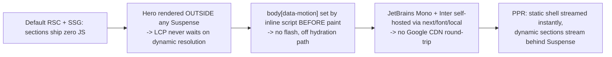

# Performance & Accessibility

> Both are treated as **implicit on every change**, not separate phases, and both are hard CI gates. This doc explains the budgets and the techniques that meet them.

## Performance budgets (non-negotiable, CI-enforced)

| Metric | Desktop | Mobile |
|---|---|---|
| LCP | < 1.8s | < 3.5s |
| INP | < 200ms | < 200ms |
| CLS | < 0.05 | < 0.05 |
| TBT | < 200ms | < 400ms |
| JS gzipped / route | < 120KB | < 120KB |
| Client JS total (all islands) | < 43KB | < 43KB |
| Lighthouse Perf | ≥ 95 | ≥ 90 |
| Lighthouse A11y | = 100 | = 100 |
| Lighthouse Best Practices | ≥ 95 | ≥ 95 |
| Lighthouse SEO | = 100 | = 100 |

Enforced by LHCI (`lighthouserc.json` + `.mobile.json`) and `bundle-check` (≤220KB gzipped client chunks). **Never disable a gate to merge** - the only acceptable response to a red gate is to reduce the measured property or fix a genuinely-miswritten assertion.

## How LCP < 1.8s is achieved

Key levers (all verifiable in code):

- **Static-first.** `app/page.tsx` composes RSC sections; their code/data never ship. Only `AppShell` chrome + named islands hydrate.
- **Hero outside Suspense.** The LCP element is in the prerendered shell, never gated on a dynamic boundary.
- **Pre-paint motion bootstrap.** An inline `<script>` in `layout.tsx` sets `body[data-motion]` from `localStorage`/OS pref before first paint, so CRT effects and the LCP element don't flash.
- **Self-hosted fonts** via `next/font/local` (no Google CDN), with the font `--font-*-src` bound into `@theme`.
- **INP discipline (the big one).** Per-keystroke/per-pixel/per-frame updates must not re-render React: the Hero boot loop and `RoleTyper` mutate `textContent`; the DAW islands mutate `style`/`setAttribute`/`className`; the `/api/ask` stream is rAF-coalesced into a single isolated ``. Asserted by `InteractiveShell.test.tsx`.
- **Deferred render cost.** Below-the-fold sections pass `defer` → `Module` applies `content-visibility`.
- **Lazy JS only where interactive** (`next/dynamic`): `ContactFormLazy`, `InteractiveShellLazy`, `FooterLazy` (IntersectionObserver-gated), `DawMixerSection`.
- **MatrixRain** caps at 22fps, pauses via `IntersectionObserver` + `visibilitychange`, and starts via `requestIdleCallback`.

## How CLS < 0.05 is achieved

The dynamic (per-request) sections are the CLS risk, because their `<Suspense>` fallback is what's prerendered. Mitigations:

- **Per-section fallback choice.** Most dynamic sections prerender their *desktop* variant as the fallback; **Guitar prerenders `null`** specifically because its variant heights differed enough to shift (`DECISIONS.md` 2026-06-13).
- **Reserved height.** `AiMetricsSection`'s fallback is a single-line stub with an explicit `min-height` so the streamed content doesn't push layout.
- **Mobile section ordering** is done with CSS flex `order` (the `#sec-*` map in `base.css`), and `check:section-order` fails the build if a section lacks an order rule - a section defaulting to `order:0` would float to the top and cause a visible jump (this actually happened, 2026-05-28).
- **Both nav variants in the DOM**, toggled by CSS at 768px, to avoid a hydration-driven reflow.

## Live performance, self-reported

The site eats its own dog food: `LivePerfSection` and `AiMetricsSection` display **real** numbers. `lib/lighthouse-scores.ts` fetches Google PageSpeed Insights for the live URL (cached 25h in Redis), and the daily `/api/psi-refresh` cron keeps it fresh; `/api/healthz` flips to 503 if that data goes stale. The AI eval aggregate (`ask:eval:latest`) is read at build time for the "measured" metrics panel.

## Accessibility architecture

Target: **WCAG 2.1 AA, Lighthouse a11y = 100, zero axe violations** (all hard gates).

| Concern | How it's handled |
|---|---|
| Color contrast | Two-token text discipline: `--color-signal` only for headings/large text; `--color-text-body` (~13:1) for body. `lint:contrast` parses `theme.css` and checks documented pairs against AA |
| Motion | `prefers-reduced-motion: reduce` **and** a user `MOTION` toggle (`body[data-motion]`) both disable all CRT/JS animation; the toggle is an `aria-pressed` button in `DesktopTopbar` |
| Semantics | sections are `<section>` with an `<h2>`, named via `aria-labelledby` (`Module`); stat tiles are `<dl>`; the Hero headline is a real heading |
| Keyboard | a skip-to-content link; `:focus-visible` rings in `base.css`; the DAW faders/knobs/VU meters are keyboard-operable (`aria-valuenow` updated on arrow keys) |
| Live regions | `RoleTyper` announces only the *completed* role via an `sr-only` live region (not each keystroke); `ContactForm` errors use `role="alert"` |
| Forms | `Field` synthesizes `aria-describedby` for errors; native validation (`required`, `type=email`, `minLength`) plus server re-validation |
| Reduced-motion sync | `CRTOverlay` listens for OS `prefers-reduced-motion` changes and keeps `body[data-motion]` in sync |

Per-component behavioral a11y tests live alongside components; the axe gate covers the design-system routes. The CRT effects are all `aria-hidden` + `pointer-events:none`, so the decorative layer is invisible to assistive tech.

## The performance/accessibility invariant

From `CLAUDE.md`: *"Perf, a11y (WCAG 2.1 AA), and security are implicit on every change - not separate phases."* In practice this means a visual-affecting change must regenerate visual baselines before a PR, a new interactive element must pass the a11y tester, and any change that could move LCP/INP/CLS gets a `performance-engineer` pass. The gates make these non-optional.
