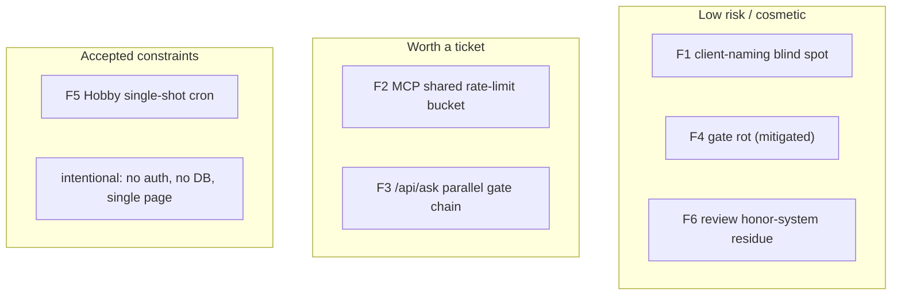

# Architecture Findings & Technical Debt

> An evaluation, not a description. Where the architecture is strong, where it has drifted, and the concrete debt a maintainer should know about. Severity is the maintainer's risk lens, not a value judgment of the author.

## What's genuinely strong (keep these)

- **Default-RSC + content-as-typed-data.** The single highest-leverage decision: sections ship no JS, and copy can't drift from its schema. This is why the perf budgets are even attainable.
- **The `defineHandler` ordering contract.** Rate-limit→parse→validate→handle as a *security property*, uniformly applied, with a fail-open posture and `X-Request-Id` on every response. Textbook BFF discipline.
- **Eval-gated AI.** `/api/ask` is held to a calibrated LLM-judge bar with the corpus grounded in live content. Most teams don't eval their AI features at all.
- **Mechanical enforcement over convention.** Hooks that `exit 2`, the transcript-verified review battery, the findings ledger, and `gate-health` (a meta-gate that detects dead gates). The platform measures real properties.
- **Failure-mode literacy.** Almost every integration has a documented, intentional failure mode (fail-open Redis, budget fail-closed, kill-switch fails-off). This is rare and worth preserving.

## Findings (ranked by maintainer risk)

### F1 - `*.client.tsx` naming convention is partially unenforced (Low, real today)
Eight interactive files under `components/client/**` (`ContactForm.tsx`, `InteractiveShell.tsx`, `HeroBootAnimation.tsx`, `HeroSystemFailure.tsx`, `RoleTyper.tsx`, `ToTopButton.tsx`, plus the two `*Lazy.tsx` wrappers) carry `'use client'` but are not named `*.client.tsx`, yet the RSC-drift convention claims that naming is the signal. So `check:client-naming` either doesn't scan `components/client/**` or treats the directory as an allowlist.
- **Risk:** the "name tells you the boundary" invariant has a blind spot; a reviewer scanning by filename could miss a client component.
- **Fix options:** (a) rename to `*.client.tsx` (and update imports/tests), or (b) document `components/client/**` as an explicit directory-based exception in `STANDARDS.md` Ch.1 and assert it in the gate. Pick one; right now it's ambiguous.

### F2 - MCP `ask_erik` shares one global rate-limit bucket (Low–Medium, documented)
`lib/agent/mcp-tools.ts` re-invokes `/api/ask` with a synthetic `Request` that has no IP, so all MCP callers worldwide share the single `'unknown'` `rl:ask` bucket (8/h total).
- **Risk:** one heavy MCP client can starve the AI tool for everyone; it's also a shared token-budget surface.
- **Fix options:** pass a synthetic per-caller identifier (MCP session id) into the rate-limit key, or give the MCP path its own dedicated, more generous limiter.

### F3 - `/api/ask` is the one route outside `defineHandler` (Low, intentional but watch it)
Streaming forced a bespoke handler, so the ask route hand-rolls the same gate chain (rate-limit, parse, validate, IP-hash). It's correct today, but it's a parallel implementation of the security ordering that `defineHandler` centralizes.
- **Risk:** the two pipelines can drift; a fix to the envelope won't reach `/api/ask`.
- **Fix option:** extract the shared gate sequence into a helper both `defineHandler` and the ask route call, so the ordering lives in one place.

### F4 - Dead-hook class of rot (Mitigated, keep watching)
`css-token-guard.sh` once pointed at two scripts deleted in the Tailwind-v4 migration and silently no-opped for weeks. This is now caught by `check:gate-health`, but the underlying lesson generalizes: any gate that references a path can rot.
- **Status:** mitigated by the meta-gate. Keep `gate-health` in `verify` and CI; don't let it be skipped.

### F5 - PSI cron is single-shot on Vercel Hobby (Low, accepted)
`/api/psi-refresh` runs once daily and Vercel Cron doesn't auto-retry, so a single transient PSI timeout degrades `/api/healthz` for up to a day. The freshness key was decoupled to write on partial success (`DECISIONS.md` 2026-06-16), which softens but doesn't remove this.
- **Risk:** healthz can show `degraded` for a day on a transient upstream blip.
- **Fix option (if it ever matters):** a Pro-plan twice-daily schedule, or an in-handler bounded retry within the 60s budget.

### F6 - Honor-system residue in the review loop (Low, by design)
The verification loop makes *resolution* mechanical, but *recording* a finding is still honor-system (the stamp can't know about a finding nobody recorded). Same for the "skip an agent" justification.
- **Status:** acknowledged in `DECISIONS.md`; the boundary is intentionally small and visible. Not debt to "fix," but to be aware of.

## Technical-debt map

## Complexity / scalability honest take

- **Complexity is deliberately high for the artifact's size**, and that's the stated thesis (architecture-is-the-product). Judge it as a *reference system*, not a portfolio. By that lens the complexity is justified; by a "ship a portfolio" lens it would be over-built. A new maintainer must know which lens applies (it's the former).
- **Scalability is a non-goal in the traditional sense** - single page, single user, no DB. The scaling surface that *does* exist (the AI endpoint's cost) is well-bounded by the token budget and rate limits. The thing that would actually break first under load is the shared MCP bucket (F2).
- **Testability is strong** (behavioral tests, mutation testing, eval harness). The one area with thinner direct coverage is the streaming/rAF client path, which is asserted behaviorally but is inherently timing-sensitive.

## Red-team gaps this knowledge base should still close (see doc 11 + the roadmap)

A new engineer onboarding today would still be missing: a written **per-section feature guide** (each section's content shape + variants in one place), a **troubleshooting runbook** beyond the table in doc 07, and **decision-record cross-links** from code to the relevant `DECISIONS.md` entry. These are enumerated in the future-documentation roadmap (doc 11 appendix).
