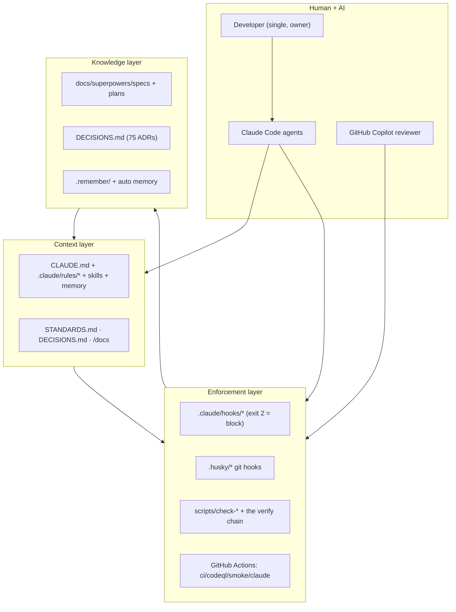

# Engineering Handbook

> How engineering happens in this repository: the lifecycle, the AI-assisted development platform, the workflows, the gates, and the knowledge system. This is the *process* layer. For the *codebase* layer (architecture, components, API), see the sibling architecture docs in [`/docs`](../README.md).

## Two doc sets, one knowledge base

| Layer | Where | Answers |
|---|---|---|
| **Architecture** (the code) | [`/docs/01`–`/docs/11`](../README.md) | What the system is, how it renders, how the API works |
| **Handbook** (the process) | this folder, `/docs/handbook/*` | How work flows from idea to production, how AI participates, how we review/test/release |
| **Canonical intent** (root) | `ARCHITECTURE.md`, `STANDARDS.md`, `DECISIONS.md`, `CLAUDE.md` | The original design narrative, the engineering bar, the ADR log, the agent instructions |

The handbook routes to the other two rather than duplicating them.

## Handbook contents

| Doc | Covers |
|---|---|
| [development-lifecycle.md](./development-lifecycle.md) | The SDLC end to end: idea -> spec -> plan -> implement -> review -> merge -> release, with diagrams |
| [ai-assisted-development.md](./ai-assisted-development.md) | How AI participates in the SDLC: context engineering, the review battery, sequence diagrams |
| [agents-skills-hooks-mcp.md](./agents-skills-hooks-mcp.md) | Reference for every agent, skill, hook, rule, and MCP server, with the hook lifecycle and orchestration diagrams |
| [workflow-playbook.md](./workflow-playbook.md) | Step-by-step runbooks: feature, bug fix, refactor, perf, a11y, ADR, PR, review |
| [review-merge-release.md](./review-merge-release.md) | The gate chain from commit to production, the convergence loop, release and rollback |
| [knowledge-architecture.md](./knowledge-architecture.md) | How engineering knowledge is organized (specs, plans, ADRs, memory) and the documentation standards |
| [engineering-standards.md](./engineering-standards.md) | The explicit standards index and the gate that enforces each |
| [engineering-audit.md](./engineering-audit.md) | An evaluation of the platform's maturity, with a technical-debt register |
| [onboarding.md](./onboarding.md) | Process onboarding: how to do the work, not just read the code |
| [roadmap.md](./roadmap.md) | Future-state engineering platform, ranked by ROI |
| [diagrams.md](./diagrams.md) | The complete Mermaid diagram collection |

## The platform in one picture

## What makes this platform distinctive

- **Spec-driven and gate-heavy.** Work flows spec -> architect-review gate -> plan -> implement, and passes ~18 gates between "code written" and "merged" (see [review-merge-release](./review-merge-release.md)).
- **AI is a first-class participant, but bounded.** Claude Code writes, tests, and reviews; mechanical hooks (exit 2) and a transcript-verified review battery keep it honest. AI agents are explicitly blocked from merging.
- **Every decision is reversible and recorded.** 75 ADRs in `DECISIONS.md`, each with a "Reversible: ..." note. Failed attempts are recorded, not deleted.
- **The development platform itself is engineered and self-healing.** A meta-gate detects dead gates; a verification loop proves findings are resolved; a learning loop proposes new gates from recurring findings. See [engineering-audit](./engineering-audit.md).

## How to read this if you're new

Start with [onboarding.md](./onboarding.md). It sequences the architecture docs and this handbook into a "productive in days" path.
