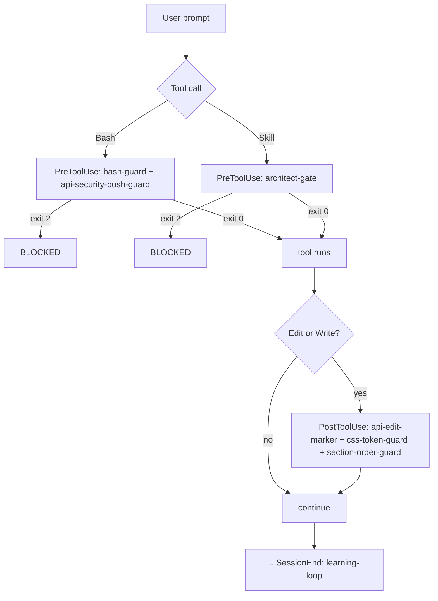
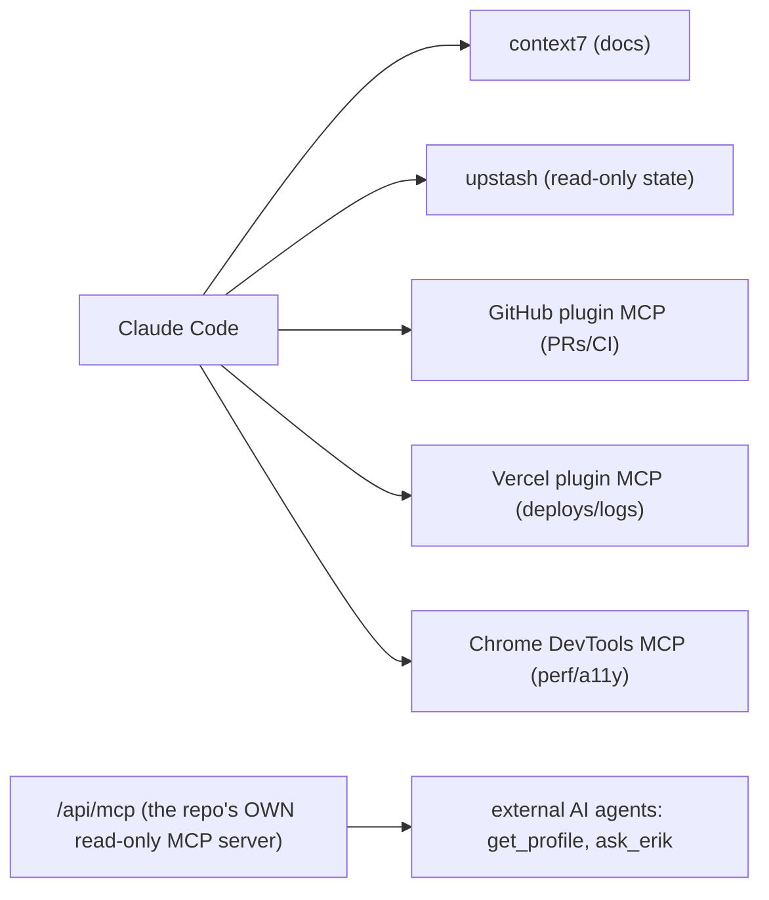
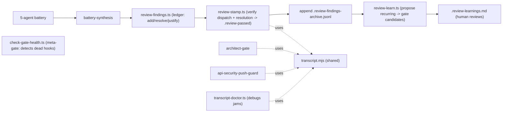

# Agents, Skills, Hooks & MCP Reference

> The complete reference for the `.claude` platform: every project skill, command, hook, rule, and MCP server, with the hook lifecycle and the review-toolchain chain. For how these fit the SDLC, see [ai-assisted-development](./ai-assisted-development.md).

## Project skills (`.claude/skills/`)

Skills are load-on-demand procedures. They activate by their `description` frontmatter (the trigger) or by explicit invocation.

| Skill | Trigger | What it does |
|---|---|---|
| **battery-synthesis** | After the 5-agent battery returns, before `review:stamp` | Dedups + severity-ranks the five reports into one action table and records each Critical/Important into the findings ledger. A DX aid, not a gate. |
| **review-convergence** | Converging an open PR's AI review to green | The loop: rebase before every push, verify the pushed SHA, re-request the reviewer (`/claude-review`, claude[bot]) after each push, reply-before-resolve, the automatic post-merge transition. Not for the final merge. |
| **pr-merge-gate** | About to merge a PR | The 9-point pre-merge gate (claude-review Approve, resolve-thread ground truth, branch-protection, `ready-to-merge`, the local Playwright visual check, the rebase rule). The owner runs the final merge; agents are blocked. |
| **visual-baseline-regen** | A change may touch a Playwright screenshot baseline (CSS/layout/typography) | The baseline regen procedure: darwin `--update-snapshots`, the linux CI-dispatch artifact path, inspect-before-commit, batch-to-one-push. Distinguishes the CI-gated page-section spec from the darwin-only DS-component spec. |
| **ai-eval-update** | Editing the `/api/ask` eval corpus/calibration/runner or the ask system prompt | Drives `pnpm ask:eval` (judge self-calibration first, then corpus). Gates correctness + jailbreak-resistance; writes `ask-eval-result.json` and Upstash `ask:eval:latest`. Feature model Haiku, judge model Sonnet. |
| **fallow-audit** | Only on explicit request ("run a fallow audit") | Read-only architecture/dead-code audit via the pinned `npx fallow@2.95.0`. Will not auto-activate on generic "clean up the code". |

## Custom commands (`.claude/commands/`)

| Command | Invokes | When |
|---|---|---|
| **/commit** | `commit-commands:commit` | Conventional commit with a mandatory feature-area scope |
| **/ready-for-pr** | `pnpm ready-for-pr` -> `review-pr` -> fix -> `gh pr create` | Pre-PR gate sequence |
| **/merge** `[pr]` | `pnpm ready-to-merge`, then owner merges externally | Pre-merge gate chain |
| **/pr-metrics** `[pr]` | `pnpm pr-metrics` | `/claude-review` cycle count, size, days open |

## Hooks (`.claude/hooks/` + `settings.json` wiring)

**Exit-code contract:** `exit 0` = allow, `exit 2` = block the tool, `exit 1` = non-blocking warning.

| Hook | Event | Matcher | Effect | Blocks? |
|---|---|---|---|---|
| **bash-guard.sh** | PreToolUse | Bash | blocks broad `git add`, npm/yarn, `gh pr merge`, force-push-to-main, unpinned `fallow` | `exit 2` |
| **api-security-push-guard.sh** | PreToolUse | Bash | blocks `git push` while an unaudited API edit marker is pending (fail-closed on unreadable transcript) | `exit 2` |
| **architect-gate.sh** | PreToolUse | Skill | blocks `superpowers:writing-plans` unless an `architect-reviewer` emitted `GATE_RESULT: PASS` this session | `exit 2` |
| **api-edit-marker.sh** | PostToolUse | Edit\|Write | records an edit to `app/api/**`/`rate-limit.ts`/`proxy.ts` into the pending marker | never (`exit 0`) |
| **css-token-guard.sh** | PostToolUse | Edit\|Write | runs the css-tokens lint on CSS edits (catches raw hex at edit time) | advisory (`exit 0`) |
| **section-order-guard.sh** | PostToolUse | Edit\|Write | warns if a section lacks a mobile flex-order rule | advisory (`exit 0`) |
| **learning-loop.sh** | SessionEnd | (none) | runs `review:learn --auto`; appends recurring-finding proposals to the inbox | never (`exit 0`) |

### Hook lifecycle (when each fires)

Note: only four hook *events* are used (PreToolUse on Bash and Skill, PostToolUse on Edit|Write, SessionEnd). No `PreCompact` or `Notification` hooks.

## Git hooks (`.husky/`)

| Hook | Runs |
|---|---|
| `pre-commit` | Biome lint + format |
| `commit-msg` | commitlint (conventional, mandatory scope) |
| `pre-push` | main-push guard, branch-name guard, review-stamp gate, API-edit backstop, `pnpm verify` |

## Path-scoped rules (`.claude/rules/`)

| File | Loads when editing | Governs |
|---|---|---|
| **api-boundary.md** | `app/api/**`, `lib/rate-limit.ts`, `lib/server/**`, `proxy.ts` | API handler contract, the hook-enforced security gate, CSP placement, the `/api/ask` rules. Guidance only; the hard gates are enforced by hooks regardless of whether this loads. |

## Permissions (`.claude/settings.json`)

- **Allowed skills** (no prompt): the `superpowers:*` set (brainstorming, writing-plans, TDD, verification, debugging, worktrees, finishing-a-branch), `commit-commands:*`, `code-review:code-review`, `pr-review-toolkit:review-pr`, `security-review`, `react-best-practices`, `vercel:{nextjs,vercel-functions}`, `web-design-guidelines`, `thinking-*` (wildcard).
- **Denied Bash**: every `fallow fix` form (belt-and-suspenders over `bash-guard.sh`).
- **defaultMode**: `acceptEdits`.

## MCP servers

| Server | Scope | Transport | Role |
|---|---|---|---|
| **context7** | project `.mcp.json` | http (`mcp.context7.com/mcp`) | current library/framework docs (Next 16, React 19, AI SDK), read-only |
| **upstash** | project `.mcp.json` | npx stdio | read-only Redis state (`${UPSTASH_READONLY_API_KEY}`): rate-limit/KV, `ask:eval:latest` |
| GitHub / Vercel / Chrome DevTools | plugin (user scope) | varies | PR/CI access, deployments/logs, perf+a11y debugging |

Note the asymmetry: the repo *consumes* MCP servers as a dev tool, and also *exposes* its own MCP server at `/api/mcp` as a product feature (machine-readable hiring profile + ask).

## The review / verification / learning toolchain

The scripts that implement the loop, in dispatch -> resolution -> archive -> learn order:

| Script | Purpose |
|---|---|
| `lib/transcript.mjs` | shared JSONL primitives; the load-bearing signal is the structured `subagent_type` key |
| `review-findings.ts` | the findings ledger CLI (verification loop) |
| `review-stamp.ts` | transcript-verified stamp (dispatch + resolution), fail-closed |
| `review-learn.ts` | propose-only learning step (recurring findings -> gate candidates) |
| `transcript-doctor.ts` | diagnostic for the fail-closed transcript SPOF |
| `check-gate-health.ts` | meta-gate: every hook/settings-referenced script must exist |
| `lint-css-tokens.ts` | bans raw hex outside `theme.css` (invoked by css-token-guard) |
