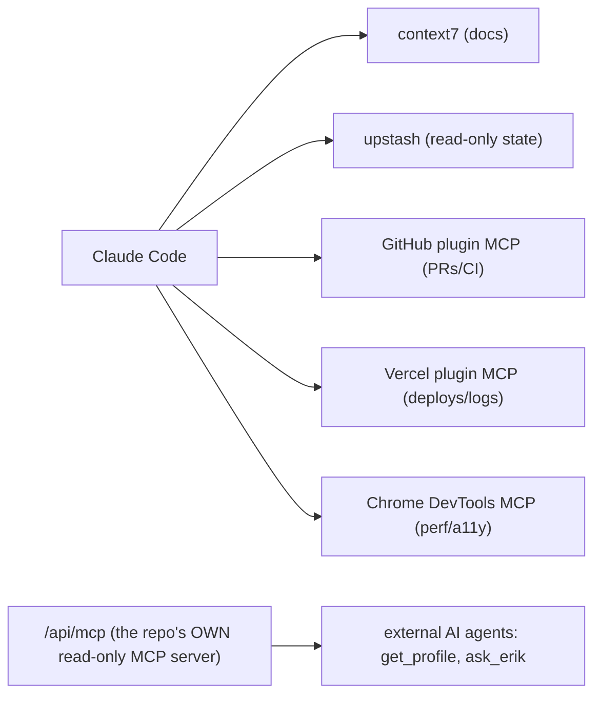

# Agents, Skills, Hooks & MCP Reference

> The complete reference for the `.claude` platform: every project skill, command, rule, and MCP server. This repo has no agent-runtime hooks; the section below records that and why. For how these fit the SDLC, see [ai-assisted-development](./ai-assisted-development.md).

## Project skills (`.claude/skills/`)

Skills are load-on-demand procedures. They activate by their `description` frontmatter (the trigger) or by explicit invocation.

| Skill | Trigger | What it does |
|---|---|---|
| **visual-baseline-regen** | A change may touch a Playwright screenshot baseline (CSS/layout/typography) | The baseline regen procedure: darwin `--update-snapshots`, the linux CI-dispatch artifact path, inspect-before-commit, batch-to-one-push. Distinguishes the CI-gated page-section spec from the darwin-only DS-component spec. |
| **ai-eval-update** | Editing the `/api/ask` eval corpus/calibration/runner or the ask system prompt | Drives `pnpm ask:eval` (judge self-calibration first, then corpus). Gates correctness + jailbreak-resistance; writes `ask-eval-result.json` and Upstash `ask:eval:latest`. Feature model Haiku, judge model Sonnet. |

## Custom commands (`.claude/commands/`)

| Command | Invokes | When |
|---|---|---|
| **/commit** | `commit-commands:commit` | Conventional commit with a mandatory feature-area scope |

## Hooks (`.claude/hooks/`) — none

**This repo has no agent-runtime hooks.** `.claude/settings.json` carries no `hooks` block, so no `PreToolUse`, `PostToolUse` or `SessionStart` command runs.

Six were removed on 2026-07-27, with the meta-gate (`check:gate-health`) and fixture suite (`test:hooks`) that verified them:

| Removed hook | Event | What it did |
|---|---|---|
| `bash-guard.sh` | PreToolUse(Bash) | blocked broad `git add`, npm/yarn, `gh pr merge`, force-push-to-main, unpinned `fallow` |
| `api-security-push-guard.sh` | PreToolUse(Bash) | blocked `git push` while an unaudited API edit was pending |
| `architect-gate.sh` | PreToolUse(Skill) | blocked `speckit-plan` without an `architect-reviewer` PASS |
| `api-edit-marker.sh` | PostToolUse(Edit\|Write) | recorded API-surface edits into the pending marker |
| `biome-format.sh` | PostToolUse(Edit\|Write) | formatted the edited file |
| `session-context.sh` | SessionStart | printed branch/uncommitted/last-commit context |

The properties they enforced are now either held elsewhere or held by nobody, and the distinction matters:

- **Still held:** formatting (`pre-commit` Biome, `pnpm check` in `verify`), the main-push block and branch-name check (`.husky/pre-push`).
- **No longer held:** blocking a broad `git add` or a force-push mid-turn, requiring a `security-auditor` dispatch after an API edit, and requiring an architect PASS before planning. All three are conventions in `CLAUDE.md` now, and `CLAUDE.md` says so in those words rather than claiming enforcement.

## Git hooks (`.husky/`)

| Hook | Runs |
|---|---|
| `pre-commit` | Biome lint + format |
| `commit-msg` | commitlint (conventional, mandatory scope) |
| `pre-push` | main-push guard, branch-name guard, `pnpm verify` |

## Path-scoped rules (`.claude/rules/`)

| File | Loads when editing | Governs |
|---|---|---|
| **api-boundary.md** | `app/api/**`, `lib/rate-limit.ts`, `lib/server/**`, `proxy.ts` | API handler contract, the security-review convention, CSP placement, the `/api/ask` rules. Guidance only; the hard gates are the API behavioural tests and CI. |

## Permissions (`.claude/settings.json`)

- **Allowed skills** (no prompt): enumerated in `permissions.allow` in `.claude/settings.json` as `Skill(...)` entries. Read them there rather than from a copy here — a second list is the one that drifts, and this one had.
- **Denied Bash**: every `fallow fix` form (belt-and-suspenders over `bash-guard.sh`).
- **defaultMode**: `acceptEdits`.

## MCP servers

| Server | Scope | Transport | Role |
|---|---|---|---|
| **context7** | project `.mcp.json` | http (`mcp.context7.com/mcp`) | current library/framework docs (Next 16, React 19, AI SDK), read-only |
| **upstash** | project `.mcp.json` | npx stdio | read-only Redis state (`${UPSTASH_READONLY_API_KEY}`): rate-limit/KV, `ask:eval:latest` |
| GitHub / Vercel / Chrome DevTools | plugin (user scope) | varies | PR/CI access, deployments/logs, perf+a11y debugging |

```mermaid
flowchart LR
    agent["Claude Code"] --> ctx7["context7 (docs)"]
    agent --> up["upstash (read-only state)"]
    agent --> gh["GitHub plugin MCP (PRs/CI)"]
    agent --> vc["Vercel plugin MCP (deploys/logs)"]
    agent --> cd["Chrome DevTools MCP (perf/a11y)"]
    repo["/api/mcp (the repo's OWN read-only MCP server)"] --> consumers["external AI agents: get_profile, ask_erik"]
```

Note the asymmetry: the repo *consumes* MCP servers as a dev tool, and also *exposes* its own MCP server at `/api/mcp` as a product feature (machine-readable hiring profile + ask).

## The review toolchain — removed

The dispatch -> resolution -> archive chain (`review-battery` -> `battery-synthesis` -> `review-findings.ts` -> `review-stamp.ts` -> `.review-passed`), the shared `lib/transcript.mjs` primitives it rode on, `transcript-doctor.ts`, `check-claude-approval.ts` (`pnpm claude-gate`), `check-gate-health.ts` and `.github/workflows/claude-review.yml` were all removed on 2026-07-27.

Pre-PR review is now a discipline, not a gate. What remains mechanical on a PR:

| Script | Purpose |
|---|---|
| `check-pr-comments.ts` | `pnpm pr:gate`: every review thread resolved; flags `suspicious_self_resolve` |
| `lint-css-tokens.ts` | bans raw hex outside `theme.css` (CI gate `pnpm lint:css-tokens`) |
