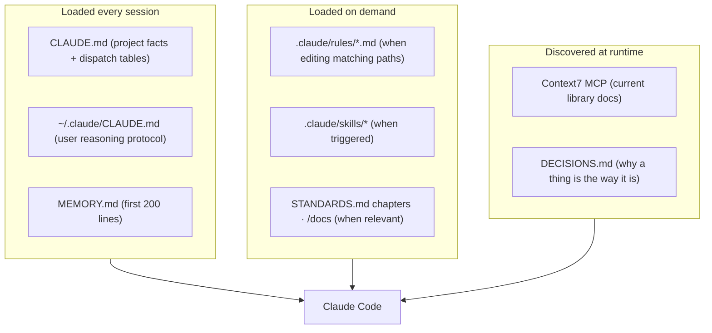
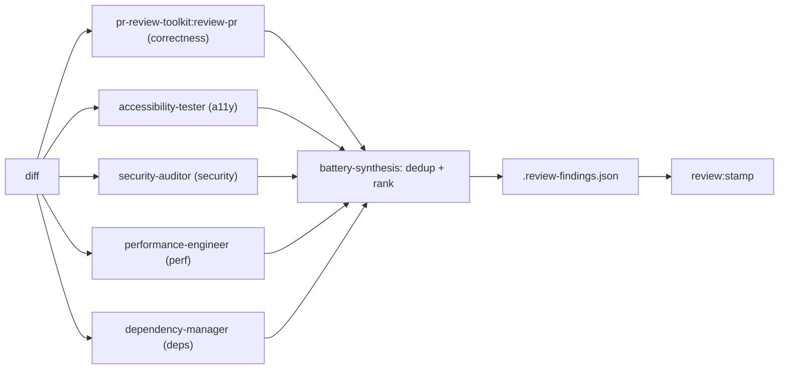

# AI-Assisted Development

> How AI participates across the SDLC. Claude Code is treated as a core engineering teammate, not an autocomplete. This doc explains the context it works from, the loop it runs, and how it is kept honest. For the per-artifact reference (every hook, skill, agent), see [agents-skills-hooks-mcp](./agents-skills-hooks-mcp.md).

## Where AI shows up in the lifecycle

```mermaid
sequenceDiagram
    participant H as Human (owner)
    participant C as Claude Code (main loop)
    participant A as Subagents (battery, architect)
    participant G as Mechanical gates (hooks/scripts)
    participant CI as CI + claude-review

    H->>C: intent ("build X" / "fix Y")
    C->>C: superpowers:brainstorming (intent + approach)
    C->>A: architect-reviewer (spec gate)
    A-->>G: GATE_RESULT: PASS (unblocks writing-plans)
    C->>C: writing-plans + thinking-inversion (failure modes -> tasks)
    C->>C: TDD implement (tests first)
    C->>G: edits trigger PostToolUse hooks (markers, lints)
    C->>A: 5-agent review battery (parallel)
    A-->>C: findings
    C->>C: battery-synthesis -> record in ledger -> resolve/justify
    C->>G: review:stamp (refuses unless dispatched + resolved)
    C->>G: git push (pre-push gate chain blocks if not stamped)
    C->>CI: open PR; claude-review reviews
    CI-->>C: review threads
    C->>C: review-convergence loop -> green
    H->>CI: owner squash-merges (AI is blocked from merge)
    C->>G: SessionEnd -> learning-loop proposes new gates
```

## 1. Context engineering (what the agent knows)

The agent's behavior is governed by a layered, deliberately-curated context. The guiding principle (`CLAUDE.md` rule-hygiene): pick the cheapest slot that still fires when needed. **gate > skill > path-scoped rule > memory > prose in CLAUDE.md.** Prose in `CLAUDE.md` is the most expensive slot (it taxes every session), so it is reserved for always-true facts and kept under 275 lines by `check:harness-size`.



- **`CLAUDE.md`** is an index plus dispatch tables (which skill/agent fires on which trigger), not a procedure manual.
- **`.claude/rules/api-boundary.md`** loads only when the agent reads `app/api/**`, `lib/rate-limit.ts`, `lib/server/**`, or `proxy.ts` (path-scoped via `paths:` frontmatter). This keeps API-specific guidance out of always-loaded context.
- **Memory** (`MEMORY.md` + `feedback_*.md`) carries learned preferences across sessions; `.remember/` carries in-flight session handoff.

## 2. The agent's working loop

Every substantive change runs the same disciplined loop, enforced by mandated skills and mechanical gates:

| Step | Mechanism | Enforced by |
|---|---|---|
| Explore + plan | brainstorming, writing-plans | architect-gate hook (blocks plans without PASS) |
| Anticipate failure | thinking-inversion, pre-mortem | convention + plan tasks |
| Implement | test-driven-development | convention |
| Self-verify | verification-before-completion | convention + `pnpm verify` |
| Review | 5-agent battery | `review:stamp` (transcript-verified) |
| Resolve | findings ledger | stamp refuses while findings open |
| Record | DECISIONS.md ADR | PR template checklist |

## 3. The review battery (how AI reviews AI)

Before every push, five specialized agents review the diff in parallel, each a fresh-context reviewer that sees the change but not the reasoning that produced it:



The stamp is **transcript-verified**: `scripts/review-stamp.ts` reads the session JSONL and refuses to write `.review-passed` unless all five `subagent_type` roles were dispatched strictly after the HEAD commit timestamp, and the findings ledger has no open Critical/Important finding. This converts "I reviewed it" from an honor-system claim into a mechanical fact. The residual honor-system boundary is small and visible: *recording* a finding (the stamp cannot know about a finding nobody recorded).

## 4. How AI is kept honest (the enforcement contract)

The load-bearing principle: **`CLAUDE.md` is advisory; anything that must hold is a hook.** Hooks use exit codes as a contract (`exit 2` blocks the tool, `exit 1` warns, `exit 0` allows):

- `bash-guard.sh` blocks dangerous Bash (broad `git add`, npm/yarn, `gh pr merge`, force-push-to-main).
- `architect-gate.sh` blocks `writing-plans` without an architect PASS.
- `api-security-push-guard.sh` blocks a push that carries an unaudited API edit.
- `review-stamp` + `.husky/pre-push` block a push without a verified review.

Three of these gates **fail closed** on transcript resolution (review-stamp, api-security-push-guard, architect-gate), all sharing `scripts/lib/transcript.mjs`; `transcript-doctor.ts` is their shared debugger.

## 5. The learning loop (AI improves the platform)

At session end, `learning-loop.sh` runs `review:learn --auto`, which reads the archive of resolved findings and proposes finding-classes that recur across multiple cycles as candidates for a permanent gate. It only proposes (capped, evidence-thresholded, append-only to a gitignored inbox); a human decides whether to codify each into a real gate. This closes the loop: recurring manual findings become permanent prevention, and the loop self-prunes. See [engineering-audit](./engineering-audit.md).

## 6. The CI-side AI reviewer

`.github/workflows/claude.yml` adds a second AI reviewer in CI: `claude-code-action` (SHA-pinned) runs only when a human writes `@claude` on a PR/issue, authenticated by a Max-subscription token. It supplements the local battery and the automated `/claude-review` (claude[bot]) PR reviewer, never replaces them. (`/claude-review` is the sole automated AI PR reviewer and its Approve verdict is the merge reviewer-gate; GitHub Copilot review was dropped as of 2026-06-20.)

## Prompt architecture (the shapes of AI work)

The repo encodes distinct prompt patterns for distinct SDLC stages:

| Stage | Prompt shape | Where it lives |
|---|---|---|
| Specification | brainstorm -> spec with Context/Gaps/Changes | `superpowers:brainstorming`, the spec template |
| Architecture review | four-gate spec-gate -> `GATE_RESULT: PASS/FAIL` | `architect-reviewer` agent |
| Implementation | TDD: failing test first, smallest change | `superpowers:test-driven-development` |
| Review | scoped-by-commit-type battery prompts | `CLAUDE.md` working agreement |
| Documentation | reverse-engineer from code, route don't duplicate | this `/docs` set's provenance |

The scoping rule for the battery is itself a prompt-engineering decision: a docs-only commit gets prompts that skip the test suite, because the stamp counts *dispatch*, not depth. This is how a heavy review process stays cheap on trivial changes.
