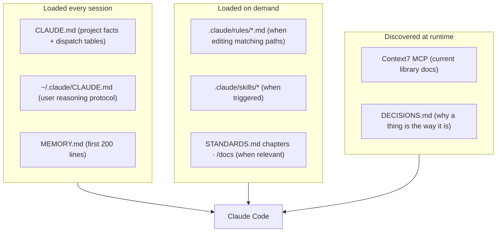

# AI-Assisted Development

> How AI participates across the SDLC. Claude Code is treated as a core engineering teammate, not an autocomplete. This doc explains the context it works from, the loop it runs, and how it is kept honest. For the per-artifact reference (every hook, skill, agent), see [agents-skills-hooks-mcp](./agents-skills-hooks-mcp.md).

## Where AI shows up in the lifecycle

```mermaid
sequenceDiagram
    participant H as Human (owner)
    participant C as Claude Code (main loop)
    participant A as Subagents (battery, architect)
    participant G as Mechanical gates (hooks/scripts)
    participant CI as CI

    H->>C: intent ("build X" / "fix Y")
    C->>C: /speckit.specify (intent + approach)
    C->>A: architect-reviewer (spec gate)
    A-->>G: GATE_RESULT: PASS (unblocks writing-plans)
    C->>C: writing-plans + thinking-risk-premortem (failure modes -> tasks)
    C->>C: TDD implement (tests first)
    C->>G: edits trigger PostToolUse hooks (markers, lints)
    C->>C: self-review the diff (pr-review-toolkit:code-reviewer)
    A-->>C: findings
    C->>G: git push (pre-push gate chain blocks if not stamped)
    C->>CI: open PR; CI runs lint/type/test/build/perf/a11y/security
    CI->>C: claude-review posts inline findings + Verdict
    CI-->>C: review threads
    C->>C: drive threads to resolved -> green
    H->>CI: owner squash-merges (AI is blocked from merge)
```

## 1. Context engineering (what the agent knows)

The agent's behavior is governed by a layered, deliberately-curated context. The guiding principle (`CLAUDE.md` rule-hygiene): pick the cheapest slot that still fires when needed. **gate > skill > path-scoped rule > memory > prose in CLAUDE.md.** Prose in `CLAUDE.md` is the most expensive slot (it taxes every session), so it is reserved for always-true facts and kept under 275 lines by `check:harness-size`.

```mermaid
flowchart TD
    subgraph always["Loaded every session"]
        cl["CLAUDE.md (project facts + dispatch tables)"]
        ucl["~/.claude/CLAUDE.md (user reasoning protocol)"]
        mem["MEMORY.md (first 200 lines)"]
    end
    subgraph ondemand["Loaded on demand"]
        rules[".claude/rules/*.md (when editing matching paths)"]
        skills[".claude/skills/* (when triggered)"]
        topic["STANDARDS.md chapters · /docs (when relevant)"]
    end
    subgraph runtime["Discovered at runtime"]
        ctx7["Context7 MCP (current library docs)"]
        history["DECISIONS.md (why a thing is the way it is)"]
    end
    always --> agent["Claude Code"]
    ondemand --> agent
    runtime --> agent
```

- **`CLAUDE.md`** is an index plus dispatch tables (which skill/agent fires on which trigger), not a procedure manual.
- **`.claude/rules/api-boundary.md`** loads only when the agent reads `app/api/**`, `lib/rate-limit.ts`, `lib/server/**`, or `proxy.ts` (path-scoped via `paths:` frontmatter). This keeps API-specific guidance out of always-loaded context.
- **Memory** (`MEMORY.md` + `feedback_*.md`) carries learned preferences across sessions; `.remember/` carries in-flight session handoff.

## 2. The agent's working loop

Every substantive change runs the same disciplined loop, enforced by mandated skills and mechanical gates:

| Step | Mechanism | Enforced by |
|---|---|---|
| Explore + plan | brainstorming, writing-plans | architect-reviewer PASS (convention since 2026-07-27) |
| Anticipate failure | thinking-risk-premortem, pre-mortem | convention + plan tasks |
| Implement | test-driven-development | convention |
| Self-verify | verification-before-completion | convention + `pnpm verify` |
| Review | pre-PR self-review, then claude-review on the PR | `pnpm claude-gate` (fail-closed on a stale or SHA-less Approve) |
| Resolve | findings ledger | stamp refuses while findings open |
| Record | DECISIONS.md ADR | PR template checklist |

## 3. Review — claude-review on the PR, self-review before it

**claude-review (claude[bot]) runs automatically** on every PR open and push, posting findings as inline review comments anchored to changed lines and closing with a `Verdict:` line that `pnpm claude-gate` reads fail-closed.

**The local battery is not restored.** The 4-agent battery, `battery-synthesis`, the findings ledger and the transcript-verified stamp were removed on 2026-07-27 and stay removed. Pre-PR review is discipline: read the diff, run `pr-review-toolkit:code-reviewer` over it. `pnpm pr:gate` checks thread resolution.

## 4. Enforcement — git and CI only

**There are no `.claude/hooks/`.** Six PreToolUse/PostToolUse/SessionStart guards were removed on 2026-07-27, along with `check:gate-health` (the meta-gate that verified their wiring) and `scripts/lib/transcript.mjs` (the shared JSONL resolution all the fail-closed gates rode on).

What enforces anything now runs at commit, push or CI time:

- `.husky/pre-commit`: Biome, `gitleaks --staged`, commitlint.
- `.husky/pre-push`: main-push guard, branch-name guard, `pnpm verify`.
- CI: the `verify` chain plus build, bundle-size, route-JS, Lighthouse, axe-core, Playwright, semgrep, gitleaks, CodeQL.

The honest consequence: nothing constrains an agent *mid-turn* any more. A broad `git add`, a force-push, an npm invocation, or an unaudited API edit are all conventions in `CLAUDE.md` rather than blocked actions.

## 5. The learning loop (AI improves the platform)

The session-end learning loop was removed on 2026-07-27: the hook, `scripts/review-learn.ts` and the `review:learn` script all went. Recurring finding-classes are now noticed by reading `.review-findings-archive.jsonl` directly.

## 6. The CI-side AI reviewer

`.github/workflows/claude.yml` remains an opt-in pilot: `claude-code-action` (SHA-pinned) runs only when a human writes `@claude` on a PR or issue. It is the only AI reviewer wired to this repo, and it is human-triggered.

## Prompt architecture (the shapes of AI work)

The repo encodes distinct prompt patterns for distinct SDLC stages:

| Stage | Prompt shape | Where it lives |
|---|---|---|
| Specification | brainstorm -> spec with Context/Gaps/Changes | `/speckit.specify`, the spec template |
| Architecture review | four-gate spec-gate -> `GATE_RESULT: PASS/FAIL` | `architect-reviewer` agent |
| Implementation | TDD: failing test first, smallest change | `test-first discipline (CLAUDE.md skill dispatch)` |
| Review | scoped-by-commit-type battery prompts | `CLAUDE.md` working agreement |
| Documentation | reverse-engineer from code, route don't duplicate | this `/docs` set's provenance |

The scoping rule for the battery is itself a prompt-engineering decision: a docs-only commit gets prompts that skip the test suite, because the stamp counts *dispatch*, not depth. This is how a heavy review process stays cheap on trivial changes.
