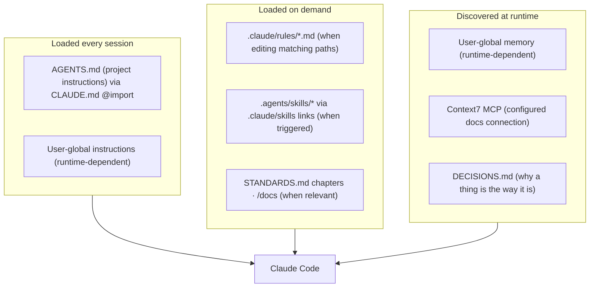

# AI-Assisted Development

> How AI participates across the SDLC. This doc describes the agent context, work loop and repository checks. For the per-artifact reference (every hook, skill, agent), see [agents-skills-hooks-mcp](./agents-skills-hooks-mcp.md).

## Where AI shows up in the lifecycle

```mermaid
sequenceDiagram
    participant H as Engineer
    participant C as Coding agent (any tool)
    participant G as Git hooks and scripts
    participant CI as CI

    H->>C: intent ("build X" / "fix Y")
    C->>C: spec (intent + approach)
    C->>C: plan-review skill (PASS or BLOCK against scope, JS budget, API limits)
    C->>C: plan with a failure-mode checklist (each failure mode -> a task)
    C->>C: TDD implement (tests first)
    C->>G: commit runs Biome, staged gitleaks and commitlint
    C->>G: git push (pre-push: main guard, branch name, pnpm verify)
    C->>CI: open eligible PR; CI runs checks and filtered runtime jobs
    H->>CI: optional: owner, member or collaborator comments /claude-review
    CI->>C: claude-review posts inline findings + Verdict
    CI-->>C: review threads
    C->>C: review the pull request, answer every finding
```

## 1. Context engineering (what the agent knows)

Project instructions divide context between always-loaded guidance and task-specific references. The guiding principle: pick the cheapest slot that still fires when needed. **gate > skill > path-scoped rule > memory > prose in AGENTS.md.** Prose in `AGENTS.md` is the most expensive slot (it taxes every session), so it keeps only what no gate can show and stays under the line budget in `scripts/harness-size.json`, checked by `check:harness-size`. A rule with no exceptions moves out of prose into a permission deny rule, a git hook or a CI gate.

```mermaid
flowchart TD
    subgraph always["Loaded every session"]
        cl["AGENTS.md (project instructions) via CLAUDE.md @import"]
        ucl["User-global instructions (runtime-dependent)"]
    end
    subgraph ondemand["Loaded on demand"]
        rules[".claude/rules/*.md (when editing matching paths)"]
        skills[".agents/skills/* via .claude/skills links (when triggered)"]
        topic["STANDARDS.md chapters · /docs (when relevant)"]
    end
    subgraph runtime["Discovered at runtime"]
        mem["User-global memory (runtime-dependent)"]
        ctx7["Context7 MCP (configured docs connection)"]
        history["DECISIONS.md (why a thing is the way it is)"]
    end
    always --> agent["Claude Code"]
    ondemand --> agent
    runtime --> agent
```

- **`AGENTS.md`** is the single source of project instructions for Codex and Claude Code. `CLAUDE.md` imports it with `@AGENTS.md` and adds only Claude-specific lines.
- **`.claude/rules/*.md`** load only when the agent reads a matching path (`paths:` frontmatter): the API boundary, components and CSS, CI and gate configuration. This keeps path-specific guidance out of always-loaded context.
- **Skills** live in `.agents/skills/` and are linked into `.claude/skills/`; only their name and description are always loaded.
- User-global memory behavior depends on the active runtime. No project file establishes a `.remember/` handoff location; `AGENTS.md` never references one, and its reference list names the current sources.

## 2. The agent's working loop

The project instructions define this loop. The table distinguishes conventions from mechanical checks:

| Step               | Mechanism                                                    | Enforced by                                                                                  |
| ------------------ | ------------------------------------------------------------ | -------------------------------------------------------------------------------------------- |
| Explore + plan     | brainstorming, planning                                      | `plan-review` PASS (convention)                                                              |
| Anticipate failure | pre-mortem                                                   | convention + plan tasks                                                                      |
| Implement          | test-first project rule                                      | convention                                                                                   |
| Self-verify        | project verification rule                                    | convention + `pnpm verify`                                                                   |
| Review             | claude-review only on request                                | `pr-review-orchestrator` (every matching skill applied)                                    |
| Resolve            | answer every blocking finding, then resolve the thread        | the review's own finding list                                                               |
| Record             | DECISIONS.md ADR                                             | PR template checklist (author confirmation)                                                  |

## 3. Review. claude-review on request

**claude-review (claude[bot]) is opt-in.** It runs only when an owner, member or collaborator comments `/claude-review` on a PR, posting findings as inline review comments anchored to changed lines and closing with a `Verdict:` line; a workflow step reds the job when the run posted none. It is not a merge requirement.

The review that runs before the merge is the `pr-review-orchestrator` skill: it discovers the skills this session can load, dispatches one specialist per material domain, and reads the rendered result as images. Its findings are the ones that must be answered.

## 4. Enforcement boundaries

`.claude/settings.json` denies broad `git add`, npm and yarn installs and local env reads, and registers no hooks: workflow hooks are each engineer's own. Git hooks run Biome and staged gitleaks at pre-commit, commitlint at commit-msg, and branch/main-ref checks plus `pnpm verify` at pre-push.

CI runs separate quality, typecheck, unit-test and build jobs. Runtime and AI jobs use change filters. Semgrep findings are report-only; the fixture and report-existence checks can still fail. User-global runtime restrictions require separate inspection.

## 5. CI-side AI workflows

`.github/workflows/claude-review.yml` handles PR review requested by a `/claude-review` comment. `.github/workflows/claude.yml` handles human `@claude` mentions with read-only tools and no `contents: write`. They have different triggers and permissions.

## Prompt architecture (the shapes of AI work)

The repo encodes distinct prompt patterns for distinct SDLC stages:

| Stage               | Prompt shape                                                       | Where it lives                                     |
| ------------------- | ------------------------------------------------------------------ | -------------------------------------------------- |
| Specification       | brainstorm -> spec with Context/Gaps/Changes                       | the engineer's own spec tool (local, untracked)    |
| Architecture review | four-gate plan review -> `GATE_RESULT: PASS \| BLOCK`              | `plan-review` skill                                |
| Implementation      | TDD: failing test first, smallest change                           | `test-first discipline (AGENTS.md)` |
| Review              | `claude-review` on request; `pr-review-orchestrator` is one way to run a review | `AGENTS.md` working agreement, `REVIEW.md`         |
| Documentation       | reverse-engineer from code, route don't duplicate                  | source comparisons and canonical documentation     |

Choose verification from the affected behavior and the project gate requirements. A docs-only change still runs `pnpm ci:local` under `AGENTS.md`.
