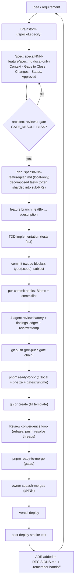
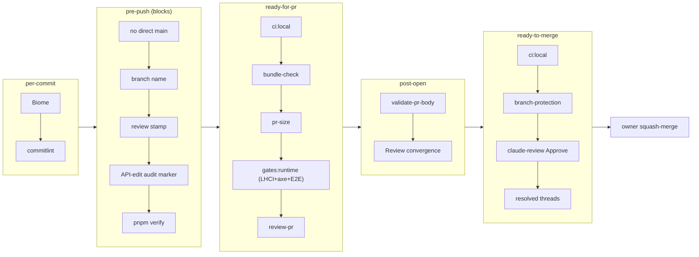

# Development Lifecycle

> How a change flows from idea to production. Reverse-engineered from git history, the spec/plan artifacts, the husky hooks, and the `scripts/` gate chain. This is a single-developer, AI-agent-assisted, spec-driven, gate-heavy lifecycle with reversibility tracked at every decision.

## The lifecycle at a glance

## Phase by phase

### 1. Idea -> Brainstorm
Work starts with `/speckit.specify` (mandated before any feature). The output is a shared understanding of intent, requirements, and the chosen approach, with failure modes considered up front (`thinking-risk-premortem`).

### 2. Spec (the approved "what and why")
A design spec lands in `specs/NNN-feature/` as `YYYY-MM-DD-<topic>-design.md`. Structure: `# Title` -> `**Date** / **Status: Approved**` -> `## Context` -> `## Gaps to Close` (numbered) -> `## Changes` (per file). The spec is the contract; it enumerates the gaps it closes. Specs are local-only workflow artifacts (gitignored), not tracked in the repo.

### 3. The architect gate
Before a plan can be written, `speckit-plan` is **mechanically blocked** by `.claude/hooks/architect-gate.sh` until an `architect-reviewer` agent has emitted `GATE_RESULT: PASS` in the session. This forces a spec to survive architectural scrutiny before any implementation planning. `thinking-risk-premortem` runs here too, turning "what could go wrong" into explicit plan tasks.

### 4. Plan (the decomposed "how")
An implementation plan lands in `specs/NNN-feature/` (local-only, gitignored) paired 1:1 with its spec (same date-topic name). Plans are large and step-by-step (often 10KB to 90KB). Large programs are sharded: into sub-PR plans (`pr-a-...`, `pr-b-...`) and subdirectories, and into workstreams (`ws0`–`ws7`). This is the "integration branch + sub-PRs" pattern for anything too big for one reviewable PR.

### 5. Branch + TDD implementation
A feature branch is created (`<type>/<description>`, enforced by `.husky/pre-push`). Implementation is test-first (`test-first discipline (CLAUDE.md skill dispatch)` is mandated before writing any new file/function/script). The agent works in scope blocks, one logical unit per commit.

### 6. Commit (per-commit gates)
- **`pre-commit`**: Biome lint + format (sub-second).
- **`commit-msg`**: commitlint. Conventional Commits with a **mandatory scope** (`scope-empty: [2, 'never']`) drawn from an **open set** (`scope-enum: [0]`). Scopes are feature-area names (`ci`, `dx`, `observability`, `healthz`, `ppr`, `arch`, ...), not technical categories.

### 7. Pre-push: the review battery + the gate chain
Before every push (and whenever coding work stops), the 4-agent review battery runs, findings are recorded and resolved, and `review:stamp` is written. The `.husky/pre-push` hook then blocks the push unless: it does not target `main`, the branch name is valid, the review stamp matches HEAD, no unaudited API edit is pending, and `pnpm verify` passes. See [review-merge-release](./review-merge-release.md) for the full chain.

### 8. Pre-PR -> open PR
`pnpm ready-for-pr` runs `ci:local` + `pr-size` + `gates:runtime` (build, server, LHCI desktop/mobile, axe, E2E). `pr-size` recommends splitting if the diff is too large. Then `gh pr create` fills the PR template (every section must be non-empty, enforced by `validate-pr-body`).

### 9. Review convergence loop
On the open PR, the `review-convergence` skill drives review to green: rebase before every push, verify the pushed SHA landed, re-request the reviewer (`/claude-review`, claude[bot]) after each push, reply-before-resolve on every thread. See [review-merge-release](./review-merge-release.md).

### 10. Pre-merge gates -> merge
`pnpm ready-to-merge` runs `ci:local` + branch-protection check + claude-review-approval check (`scripts/check-claude-approval.ts` / `pnpm claude-gate`, requiring the latest `/claude-review` overview verdict to be Approve on HEAD) + resolved-threads check + PR metrics. **AI agents are blocked from `gh pr merge`** (bash-guard exit 2); the repo owner runs the final squash-merge. History shows squash-merge exclusively (zero merge commits), each commit tagged `(#NNN)`.

### 11. Deploy -> smoke -> record
Vercel deploys on merge to `main`. The `smoke.yml` workflow verifies the production deployment (healthz, 7 security headers, apex->www redirect, `/api/ask` + `/api/contact` liveness) and emails on a 503. The decision is recorded as an ADR in `DECISIONS.md` (with a reversibility note), and session state is handed off via `.remember/`.

## The gate count: ~18 between "written" and "merged"

## Cadence and shape (from git history)

- **Single developer, bursty.** Working sessions are concentrated (e.g. 12 commits on one day, then quiet), not a steady daily drip.
- **Hardening phase.** Recent commit-type mix skews to `ci`/`docs`/`fix` over `feat`, consistent with a reference system being polished rather than a greenfield being built.
- **18 PRs in the last 100 commits**, all squash-merged. The bottom of history is `feat(chore): init`.

## Why the lifecycle is shaped this way

The thesis (`DECISIONS.md` 2026-05-23) is that the engineering *is* the product. So the lifecycle optimizes for **demonstrable rigor and reversibility** over raw velocity: a spec survives an architect gate, a plan decomposes it, mechanical gates prevent regressions, the review battery is verified by transcript (not honor system), and every decision is undoable. For a solo developer this is unusually heavy, and that is deliberate: the gates are the safety net that lets one person plus AI agents move fast without shipping unreviewable volume.
