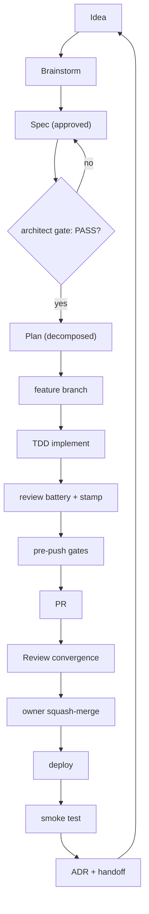
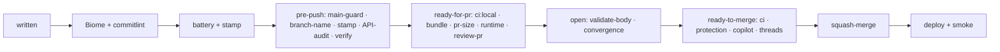
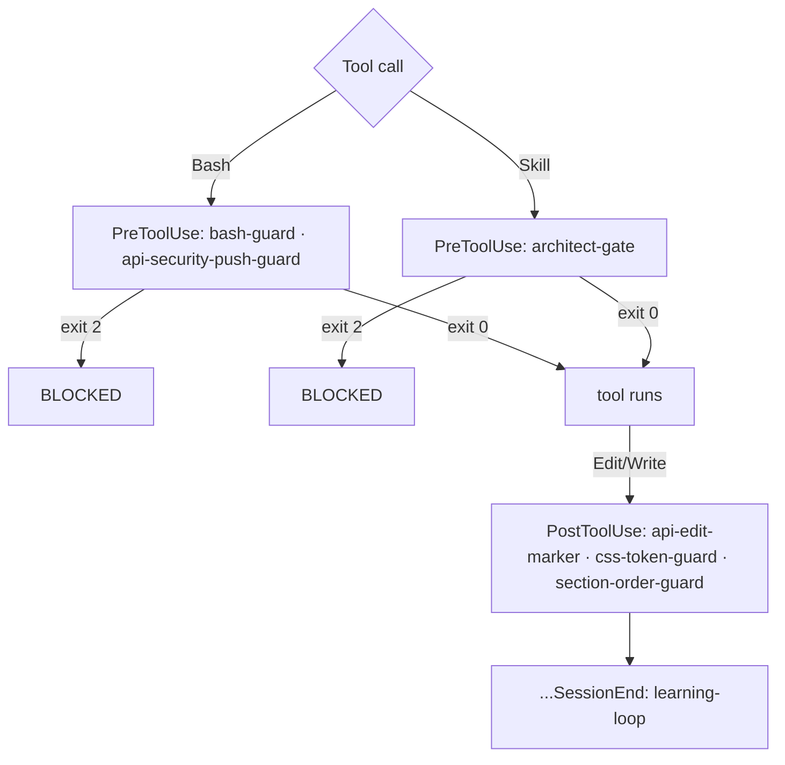
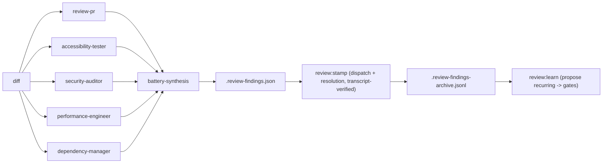
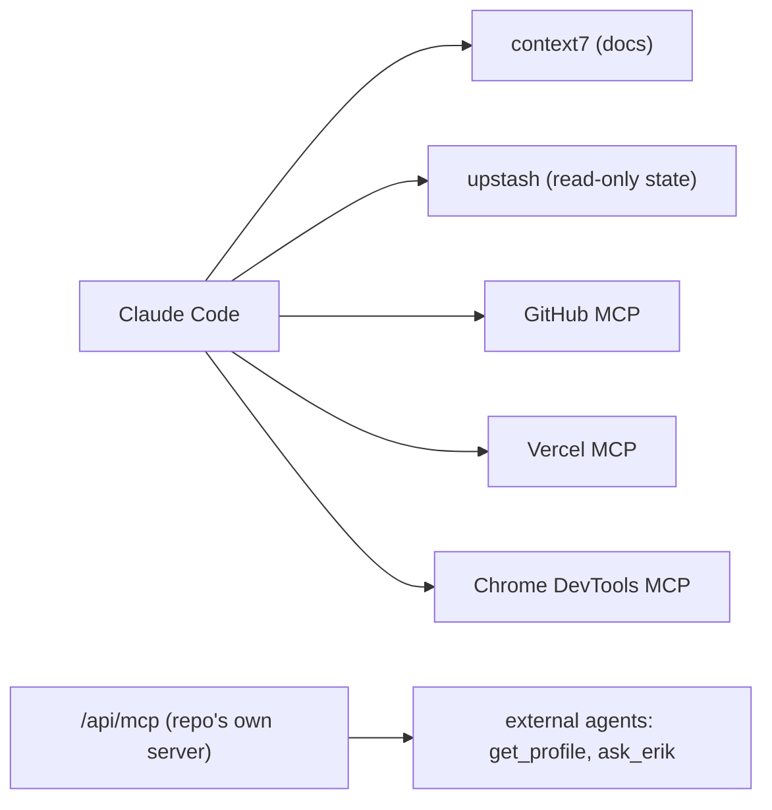
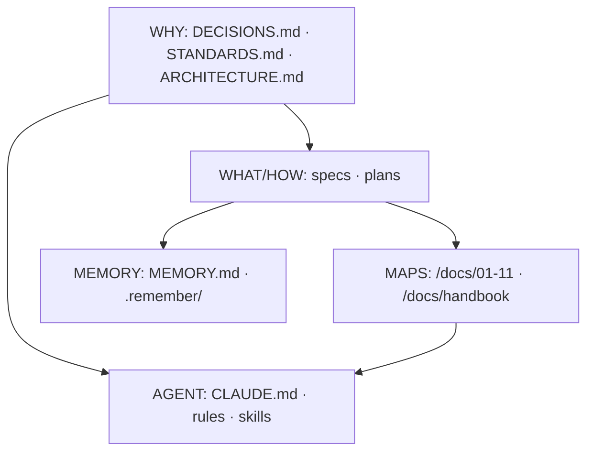
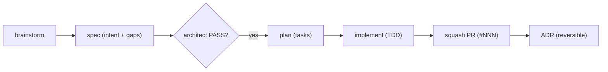
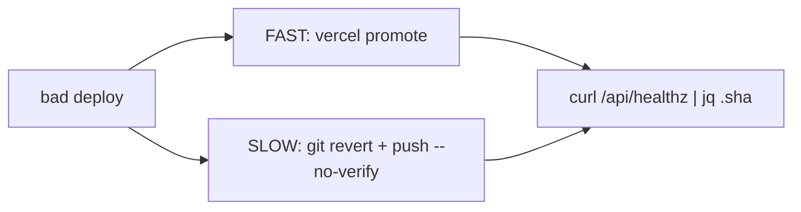
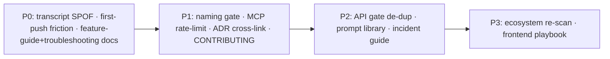

# Diagram Collection

> Every engineering-platform diagram in one browsable place, for architecture reviews and onboarding. Source diagrams also live inline in the docs they belong to (linked per section). Architecture-side diagrams (routing tree, rendering pipeline, request lifecycle, entity model, component hierarchy, state ownership) are in [`/docs/01`–`/docs/05`](../README.md).

## Development lifecycle (from [development-lifecycle](./development-lifecycle.md))



## The gate chain: commit to production (from [review-merge-release](./review-merge-release.md))



## AI in the SDLC (from [ai-assisted-development](./ai-assisted-development.md))

```mermaid
sequenceDiagram
    participant H as Human
    participant C as Claude Code
    participant A as Subagents
    participant G as Gates
    participant CI as CI + Copilot
    H->>C: intent
    C->>A: architect-reviewer (spec gate)
    A-->>G: GATE_RESULT: PASS
    C->>C: plan + TDD implement
    C->>A: 5-agent review battery
    A-->>C: findings -> ledger -> resolve
    C->>G: review:stamp (verify) -> push
    C->>CI: PR; Copilot review
    C->>C: convergence -> green
    H->>CI: owner squash-merges
    C->>G: SessionEnd -> learning-loop
```

## Hook lifecycle (from [agents-skills-hooks-mcp](./agents-skills-hooks-mcp.md))



## Review battery + verification loop



## Agent / MCP orchestration (from [agents-skills-hooks-mcp](./agents-skills-hooks-mcp.md))



## Knowledge hierarchy (from [knowledge-architecture](./knowledge-architecture.md))



## Spec to plan to PR (from [knowledge-architecture](./knowledge-architecture.md))



## Rollback (from [review-merge-release](./review-merge-release.md))



## Roadmap sequencing (from [roadmap](./roadmap.md))



## Index of all diagrams (both doc sets)

| Diagram | Doc |
|---|---|
| Development lifecycle | handbook/development-lifecycle |
| Gate chain (commit -> prod) | handbook/review-merge-release |
| AI-in-SDLC sequence | handbook/ai-assisted-development |
| Context layers | handbook/ai-assisted-development |
| Hook lifecycle | handbook/agents-skills-hooks-mcp |
| Review battery + verification loop | handbook/ai-assisted-development |
| Agent/MCP orchestration | handbook/agents-skills-hooks-mcp |
| Knowledge hierarchy | handbook/knowledge-architecture |
| Rollback | handbook/review-merge-release |
| Platform overview | handbook/README |
| Routing tree · rendering pipeline · request lifecycle | /docs/03 |
| Domain entity model | /docs/02 |
| Component hierarchy · state ownership | /docs/04 |
| Layered architecture · dependency graph | /docs/01 |
| /api/ask + /api/contact sequences | /docs/03 |
| Integration map | /docs/05 |
| CI/CD pipeline | /docs/07 |
