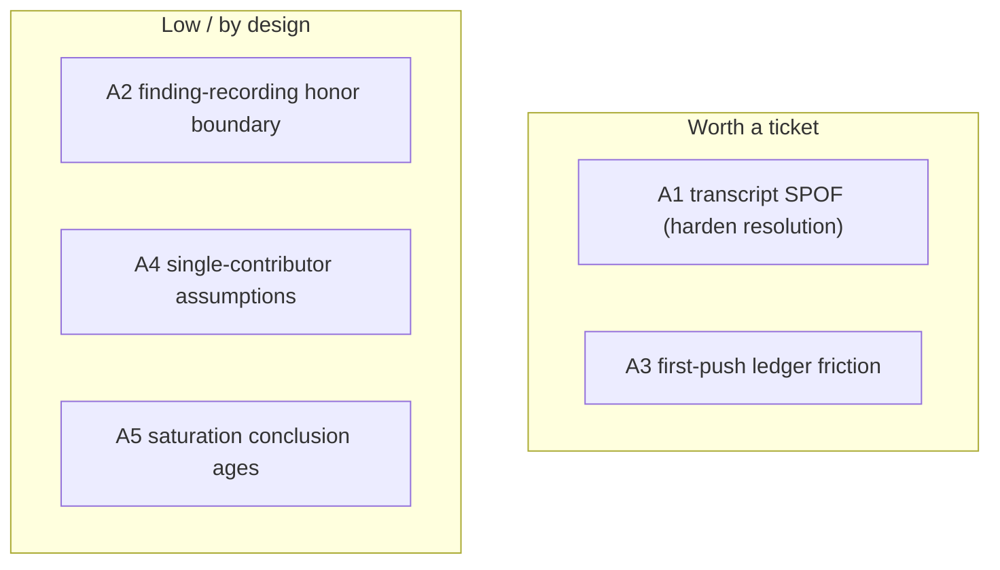

# Engineering Audit

> An evaluation of the engineering *platform* (the process, the AI-assisted development maturity, the developer experience), distinct from the codebase findings in [`/docs/10`](../10-findings-and-debt.md). This evaluates how engineering happens, not what the code looks like. Severity is the maintainer's risk lens.

## Scorecard

| Dimension | Maturity | Evidence |
|---|---|---|
| Process discipline | **High** | spec -> architect gate -> plan -> review battery -> ~18 gates; reversibility-tracked ADRs |
| AI-assisted development | **High** | mechanical enforcement (exit 2 hooks), transcript-verified review, a self-healing meta-gate, a learning loop |
| Verification | **High** | the stamp proves resolution not just dispatch; eval-gated AI feature |
| Knowledge management | **High** | specs/plans/ADRs/memory all explicit; doc-drift gated |
| Developer experience | **Medium-High** | gate-heavy (intentional) but scoped to stay cheap on trivial changes; one real friction point (below) |
| Resilience of the platform itself | **Medium** | a shared transcript SPOF; mitigated by a doctor + fail-closed posture |

## What is genuinely strong (keep)

- **Mechanical enforcement over convention.** The platform does not trust the agent to "remember" the rules; it blocks with `exit 2` and verifies with transcript reads. This is the highest-leverage property of the whole system.
- **The verification loop.** Most teams gate on "review happened"; here the stamp gates on "findings resolved," recorded in a ledger. That is ahead of the field.
- **Self-healing.** `check-gate-health` detects dead gates (a gate that silently stopped working), and the learning loop proposes new gates from recurring findings. The enforcement layer maintains itself.
- **Reversibility as a first-class artifact.** ~190 ADRs each ending in "how to undo." This is what makes a solo + AI workflow safe at speed.
- **Scoped cost.** The heavy review battery is scoped by commit type, so docs/config/deps commits do not pay the full price. The system is heavy where it matters and light where it does not.

## Findings (ranked by platform risk)

### A1 - Transcript resolution is a shared single point of failure (Medium)
Three fail-closed gates (review-stamp, api-security-push-guard, architect-gate) all depend on `scripts/lib/transcript.mjs` resolving the session JSONL. It has jammed before (the documented "transcript misresolve" incident). All three fail closed, which is the correct safety posture, but it means one brittle dependency can block every push and every plan.
- **Mitigation in place:** `transcript-doctor.ts` diagnoses a jam in seconds; an env override (`REVIEW_STAMP_TRANSCRIPT`) exists.
- **Residual risk:** the resolution still relies on slug/mtime heuristics. Hardening it to deterministic session-id pinning would remove the class.

### A2 - The review loop's recording boundary is honor-system (Low, by design)
The stamp proves a recorded finding was resolved, but cannot know about a finding the agent never recorded. `battery-synthesis` is supposed to record every Critical/Important, but that step is not mechanically verified.
- **Status:** acknowledged in `DECISIONS.md`; the boundary is intentionally small and visible. Not "fixable" without a structured agent-output contract.

### A3 - Gate-heavy DX has one real friction point (Low-Medium)
The verification loop now *requires* a findings ledger before the stamp will write, so even a clean branch needs a `pnpm review:findings clear` step before the first push. This is correct (it dogfoods the loop) but is a non-obvious gotcha that will trip a new contributor's first push.
- **Fix option:** a friendlier pre-push message that detects "no ledger" and prints the one-line remedy; or auto-seed an empty ledger when the battery finds nothing.

### A4 - Single-contributor blind spots (Low, structural)
The whole platform is tuned for one developer plus AI agents. Some gates assume that shape: the local branch-protection check exists because the CI token cannot read the endpoint; "ownership" is by subsystem, not person; the memory/`.remember` system is machine-local.
- **Risk if the team grows:** these would need rework (shared memory, CI-side protection checks, real CODEOWNERS). Not debt today, but a known scaling edge.

### A5 - AI-platform saturation is asserted, not continuously re-checked (Low)
`discovery-ledger.md` records a one-time evaluation of ~2,090 tools concluding the harness is saturated. That conclusion ages; new high-value skills/MCPs appear. There is no recurring re-evaluation.
- **Fix option:** a periodic (quarterly) ecosystem re-scan, time-boxed.

## Technical-debt register (platform)

(For codebase debt - the client-naming blind spot, the MCP shared rate-limit bucket, the `/api/ask` parallel gate chain - see [`/docs/10`](../10-findings-and-debt.md).)

## Maturity verdict

This is a **top-decile solo engineering platform**. Judged as a reference system (which is its stated thesis), the process rigor is the point and is well above what the artifact's size would demand. The two things a maintainer should actually act on are A1 (the transcript SPOF, because it can block all work) and A3 (the first-push friction, because it is the first thing a new contributor hits). Everything else is either by-design or a graceful-scaling concern that only matters if the contributor count grows past one.
