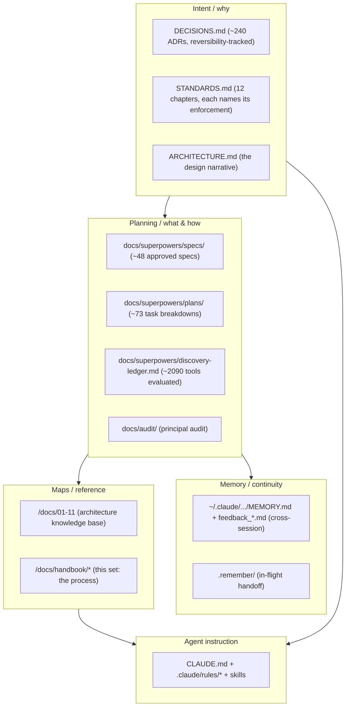
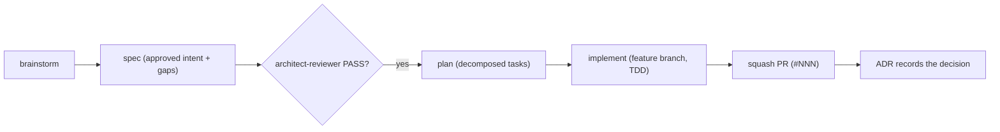

# Knowledge Architecture

> How engineering knowledge is organized, where each kind of knowledge lives, and the documentation standards. The repo treats knowledge as a layered, deliberately-curated system, not an afterthought.

## The knowledge hierarchy



## Where each kind of knowledge lives

| Knowledge | Lives in | Format |
|---|---|---|
| Why a decision was made | `DECISIONS.md` | dated ADR bullet + reversibility note |
| The engineering bar | `STANDARDS.md` | 12 chapters, each naming its enforcement gate |
| The system's design | `ARCHITECTURE.md` | narrative + trade-offs |
| What to build (approved) | `docs/superpowers/specs/` | Context / Gaps / Changes / Status |
| How to build it (decomposed) | `docs/superpowers/plans/` | step-by-step tasks, sharded for sub-PRs |
| The codebase map | `/docs/01-11` | reverse-engineered, diagram-first |
| How engineering happens | `/docs/handbook/` | this set |
| Agent behavior | `CLAUDE.md`, `.claude/rules/*`, skills | instructions + dispatch tables |
| Learned preferences | `MEMORY.md` + `feedback_*.md` | one fact per file, recalled by relevance |
| Session continuity | `.remember/` | timestamped handoff blocks |

## The ADR convention (load-bearing)

Every decision is recorded in `DECISIONS.md` as:

```
**YYYY-MM-DD** · **Decision title.** <mechanism: what changed, the causal why, the
failure mode it addresses> _Reversible: <exactly how to undo this>._
```

Rules that make the log trustworthy:
- **Reversibility is mandatory.** Every entry ends with how to undo it. This is what lets a solo developer move fast: nothing is a one-way door without saying so.
- **Failed attempts are recorded, not deleted.** "Falsified first attempt: ..." entries (e.g. the PSI twice-daily cron rejected by Vercel Hobby) preserve the reasoning so the same dead end is not re-explored.
- **Evidence is cited.** SHAs, PR numbers, and external doc URLs ground each claim.
- **Newest first**, grouped by working session.

## The spec -> plan pipeline

The repo uses a spec-driven (Superpowers/spec-kit-style) workflow:



A spec is the approved "what and why" with explicit gaps to close. A plan is its 1:1 paired "how", decomposed into tasks and (for large work) sharded into sub-PR plans and workstreams. The architect gate sits between them, mechanically.

### The `clarify` convention (spec template)

Every spec carries a `## Clarifications resolved` section: the design questions the
brainstorming interview opened and the resolution each one closed with. This names a
shape several specs already use implicitly. It makes the spec self-contained (a reader
sees what was decided and why, without replaying the interview) and gives the
architect gate an explicit list to check the plan against. The section is a short
list, one line per question, in the form `<open question> -> <resolution>`:

```markdown
## Clarifications resolved

- Should the `tasks` artifact be a separate file? -> No; plans already carry
  stable-ID checkbox tasks, so a separate artifact would duplicate them.
- Where does the convention live? -> The handbook, not a skill or rule (it is a
  passive reference convention, not an action trigger).
```

There is no separate `tasks` artifact: the plans in the plans directory already ARE
discrete, stable-ID checkbox task lists that map one-to-one to commits, so the "how"
decomposition the convention would otherwise add already exists in every plan.

## The memory system

Two complementary mechanisms carry knowledge across the fresh-context boundary of each session:

- **Auto memory** (`~/.claude/projects/<slug>/memory/`): `MEMORY.md` is an index (first 200 lines loaded each session) pointing at one-fact-per-file notes typed `user` / `feedback` / `project` / `reference` (and `dead-end`, established this year). Feedback memories carry a "Why" and a "How to apply".
- **`.remember/`**: in-flight session handoff. `now.md` (current state), `recent.md` (rolling log + reusable "Identity Candidates" patterns), `archive.md`, per-day `today-*.md`, and auto-save logs. It is maintained by a user-global (`~/.claude`) mechanism outside this repo's tracked harness — no in-repo skill, hook, or `settings.json` entry writes it (the `SessionEnd` hook here runs only `learning-loop.sh`), so the repository neither instruments nor gates it.

## Documentation standards

Inferred from how the docs are actually written and maintained:

1. **Reverse-engineer from code; route, do not duplicate.** New docs cite the code and link to canonical docs rather than copying them. Where a doc and the code disagree, the code wins and the doc is a bug.
2. **Diagram-first.** Mermaid for any flow, hierarchy, or sequence (committable directly).
3. **`CLAUDE.md` is capped** at 275 lines (`check:harness-size`). Procedures move to skills or path-scoped rules; the slot-routing rule (gate > skill > rule > memory > prose) decides where any new instruction goes.
4. **`ARCHITECTURE.md` tree must match disk** (`check:doc-drift` fails the build otherwise) - docs cannot silently rot.
5. **Design-system changelog is generated**, not hand-written (`pnpm changelog:sync` from git history).
6. **ADRs are mandatory for architectural change** (the PR template checklist enforces it).

## Undocumented tribal knowledge (now documented)

The biggest implicit-knowledge items are captured in [`/docs/09-hidden-knowledge`](../09-hidden-knowledge.md): the nonce-less CSP rationale, the fail-open-everywhere-except-the-budget posture, the content-grounded AI persona, the Zod-tuple invariants, the `next-env.d.ts` build-flip, and the convention map. The remaining gaps (a per-section feature guide, an ADR-to-code cross-link index) are tracked in [roadmap](./roadmap.md).
