# Onboarding (Process)

> How to *do the work*, not just read the code. This complements the codebase onboarding in [`/docs/11`](../11-onboarding.md): that one gets you reading the architecture; this one gets you shipping through the gates.

## The 30-second model

You are joining a single-developer, AI-agent-assisted, spec-driven, gate-heavy platform. Work flows: brainstorm -> spec -> architect gate -> plan -> implement (test-first) -> 5-agent review -> ~18 gates -> squash-merge -> ADR. The gates are mechanical and will block you; that is the point, and it is how you move fast safely.

## Day 1 - understand the flow before you touch it

1. Read [development-lifecycle.md](./development-lifecycle.md) and [review-merge-release.md](./review-merge-release.md). Now you know the path from idea to production and the gates on it.
2. Read [ai-assisted-development.md](./ai-assisted-development.md). Now you know how AI participates and how it is kept honest.
3. Skim [agents-skills-hooks-mcp.md](./agents-skills-hooks-mcp.md) as a reference; you will return to it.
4. From the architecture side, read [`/docs/02-domain`](../02-domain.md) and [`/docs/01-architecture`](../01-architecture.md) so you know *what* you are building.

## Day 2 - run the gates locally

1. `pnpm install && pnpm dev`. Then `pnpm verify` once. Read what each gate checks ([engineering-standards](./engineering-standards.md)).
2. Read [`/docs/09-hidden-knowledge`](../09-hidden-knowledge.md) (the conventions that will trip you).
3. Understand the **first-push gotcha** before you hit it: the review stamp requires a findings ledger, so your first push flow is: run the 5-agent battery, `pnpm review:findings clear` (then record/resolve any findings), `pnpm review:stamp`, push. Without the `clear`, the pre-push hook blocks with "no findings ledger."

## Day 3 - make a change through the full pipeline

Pick a small change (a content edit or a design-system variant per the [workflow-playbook](./workflow-playbook.md)) and take it all the way:

```mermaid
flowchart LR
    edit["edit"] --> tdd["add/adjust a test"] --> commit["commit (scope!)"]
    commit --> battery["run the 5-agent battery"] --> ledger["review:findings clear; resolve any"]
    ledger --> stamp["review:stamp"] --> push["push (passes pre-push)"]
    push --> pr["ready-for-pr; gh pr create (fill template)"]
    pr --> conv["converge Copilot"] --> ready["ready-to-merge"] --> owner["owner merges"]
    owner --> adr["add an ADR"]
```

You have now exercised every gate. After this you know the platform.

## The five rules that matter most in practice

1. **Scope every commit.** `type(scope): subject`, scope mandatory, scope is the feature area. commitlint will reject you otherwise.
2. **Branch as `<type>/<description>`.** The pre-push hook enforces it; never commit on `main`.
3. **Run the battery before pushing**, and clear/record the findings ledger. The stamp is transcript-verified; you cannot fake it.
4. **A red gate is fixed by fixing the property**, never by disabling the gate.
5. **Record architectural decisions** in `DECISIONS.md` with a reversibility note.

## Who to "ask" (there is no team; ask the artifacts)

| Question | Source |
|---|---|
| Why is this like this? | `DECISIONS.md` (search by date/topic) |
| What is the rule here? | `STANDARDS.md` chapter + the enforcing gate |
| How do I do X workflow? | [workflow-playbook.md](./workflow-playbook.md) |
| What does this gate want? | run it; read its output; or `pnpm transcript:doctor` / `check:gate-health` |
| What is the agent allowed to do? | `CLAUDE.md` + `.claude/rules/*` + [agents-skills-hooks-mcp](./agents-skills-hooks-mcp.md) |
| What was just being worked on? | `.remember/now.md` |

## When you are stuck on a gate

| Symptom | Remedy |
|---|---|
| Push blocked: "no review stamp" | run the battery, clear/resolve the ledger, `review:stamp` |
| Push blocked: "no findings ledger" | `pnpm review:findings clear` (then record/resolve) |
| Push blocked: "unaudited API edit" | dispatch `security-auditor` (you touched the API surface) |
| `writing-plans` blocked | dispatch `architect-reviewer` first (needs `GATE_RESULT: PASS`) |
| A hook seems to do nothing | `pnpm check:gate-health` |
| The stamp/architect/api gate jams | `pnpm transcript:doctor` |
| commit rejected | check the scope is present and the type is conventional |

## When you can independently contribute

You are ready when you can, without help: take a requirement through a spec and the architect gate, implement it test-first, get a clean review battery, pass the gate chain, open and converge a PR, and record the ADR. The [workflow-playbook](./workflow-playbook.md) is your reference until that is muscle memory.
