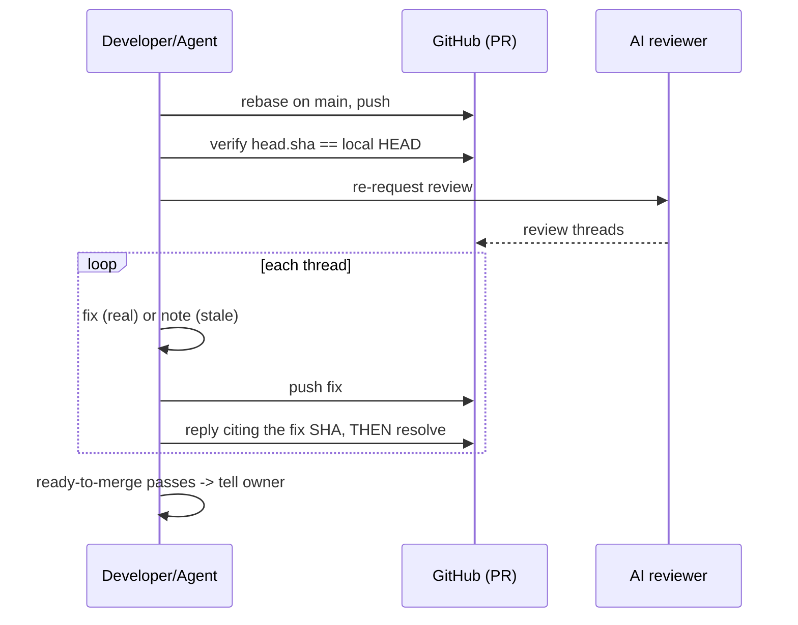
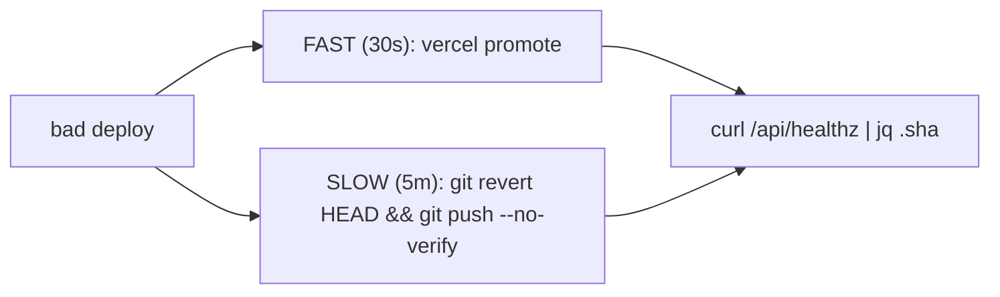

# Review, Merge & Release

> The gate chain from commit to production, the code-review process, the Review convergence loop, and release/rollback. For the CI job graph, see [`/docs/07-workflows`](../07-workflows.md); this doc is the process and the ordering.

## The full gate chain (commit -> production)

```mermaid
flowchart TD
    write["code written"] --> c1["pre-commit: Biome"]
    c1 --> c2["commit-msg: commitlint (scope mandatory)"]
    c2 --> battery["5-agent review battery + findings ledger + review:stamp"]
    battery --> p1["pre-push: no direct main"]
    p1 --> p2["pre-push: branch name <type>/<desc>"]
    p2 --> p3["pre-push: review stamp == HEAD"]
    p3 --> p4["pre-push: no unaudited API edit"]
    p4 --> p5["pre-push: pnpm verify"]
    p5 --> r1["ready-for-pr: ci:local"]
    r1 --> r2["ready-for-pr: bundle-check"]
    r2 --> r3["ready-for-pr: pr-size"]
    r3 --> r4["ready-for-pr: gates:runtime (LHCI+axe+E2E)"]
    r4 --> r5["review-pr against the diff"]
    r5 --> o1["open PR: validate-pr-body"]
    o1 --> o2["Review convergence loop"]
    o2 --> m1["ready-to-merge: ci:local"]
    m1 --> m2["ready-to-merge: branch-protection"]
    m2 --> m3["ready-to-merge: Copilot approval"]
    m3 --> m4["ready-to-merge: resolved threads"]
    m4 --> merge["owner: squash-merge (#NNN)"]
    merge --> deploy["Vercel deploy"]
    deploy --> smoke["smoke.yml: healthz + headers + liveness"]
```

## Code review: the 5-agent battery

Review is **mechanical and multi-perspective**. Five fresh-context agents review every diff in parallel:

| Agent | Lens |
|---|---|
| `pr-review-toolkit:review-pr` | correctness, requirements |
| `accessibility-tester` | WCAG 2.1 AA |
| `security-auditor` | security surface (required on any API edit) |
| `performance-engineer` | LCP/INP/CLS budgets |
| `dependency-manager` | dependency hygiene |

`battery-synthesis` dedups the five reports into one ranked table and records each Critical/Important into the findings ledger (`.review-findings.json`). `review:stamp` then **refuses** to write `.review-passed` unless (a) the transcript shows all five roles dispatched after the HEAD commit time, and (b) no Critical/Important finding is still `open`. The stamp proves dispatch and resolution; it is transcript-verified, not honor-system.

**Two triggers:** before any `git push`, and whenever coding work stops. The battery prompts are scoped to the commit type, so a docs-only commit's agents skip the test suite (the stamp counts dispatch, not depth).

## Review convergence loop

An AI reviewer (claude[bot] via /claude-review and/or GitHub Copilot) reviews the open PR. The `review-convergence` skill drives it to green:

Hard rules (each learned from a real failure): rebase before *every* push; the reply must cite a SHA that is actually on the remote (so reply-after-push-verify); never resolve a thread silently (a thread with one comment is a process failure). Separately, the **PR-comment CI gate** can fail on a timing race (the gate ran before the latest review threads landed); when it does, re-run that workflow rather than pushing a no-op commit. This is a property of the CI gate, not a step the `review-convergence` skill drives.

## Pre-merge gates (`pnpm ready-to-merge`)

In order: `ci:local` -> `check-branch-protection main` (run locally because the CI token cannot read the protection endpoint) -> `check-copilot-approval` (a review from `copilot-pull-request-reviewer[bot]` is required) -> `check-pr-comments` (GraphQL: all threads `isResolved`, flags `suspicious_self_resolve`) -> `pr-metrics` (informational: Copilot cycle count, size, days open).

**AI agents are blocked from `gh pr merge`** by `bash-guard.sh` (exit 2). The repo owner runs the final squash-merge once all gates pass. The branch-protection invariant means all changes go through a PR; direct pushes to `main` are blocked at the pre-push hook.

## PR sizing (avoid the bloated-PR failure mode)

`pnpm pr-size` thresholds: files (yellow >=10, red >=25), lines (yellow >=400, red >=1200), subsystems (yellow >=3, red >=5). Red recommends splitting at the last clean commit. Large programs use an **integration branch + sub-PRs**: `feat/<feature>` off main, then `feat/<feature>-<part>` sub-PRs into it (sized against the integration branch via `PR_BASE`). This is the documented fix for the PR that once bloated past review.

## Release

- **Trigger:** squash-merge to `main` deploys via Vercel.
- **Verification:** `smoke.yml` (on `deployment_status == success && Production`) asserts the artifact and canonical `/api/healthz`, the 7 security headers, the apex->www 308 redirect, and `/api/ask` + `/api/contact` liveness; a 503 sends a Resend alert.
- **Cron:** `vercel.json` runs `/api/psi-refresh` daily (`0 3 * * *`).

## Rollback

Fast rollback is a Vercel promote (no code change). Slow rollback is a revert; the `--no-verify` is the documented escape hatch for the main-push guard (the revert still goes through CI after landing, but has no PR/Copilot review, which is the accepted emergency tradeoff).

## What this buys

The chain turns "a solo developer plus AI agents" into a system that cannot easily ship unreviewed, unmeasured, or irreversible change. The cost is real (many gates), and it is paid down by scoping (cheap gates on trivial changes) and by the gates being mechanical (they run themselves).
