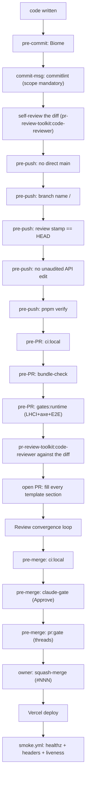
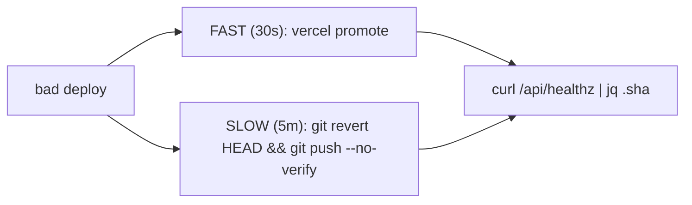

# Review, Merge & Release

> The gate chain from commit to production, the code-review process, the Review convergence loop, and release/rollback. For the CI job graph, see [`/docs/07-workflows`](../07-workflows.md); this doc is the process and the ordering.

## The full gate chain (commit -> production)

```mermaid
flowchart TD
    write["code written"] --> c1["pre-commit: Biome"]
    c1 --> c2["commit-msg: commitlint (scope mandatory)"]
    c2 --> battery["self-review the diff (pr-review-toolkit:code-reviewer)"]
    battery --> p1["pre-push: no direct main"]
    p1 --> p2["pre-push: branch name <type>/<desc>"]
    p2 --> p3["pre-push: review stamp == HEAD"]
    p3 --> p4["pre-push: no unaudited API edit"]
    p4 --> p5["pre-push: pnpm verify"]
    p5 --> r1["pre-PR: ci:local"]
    r1 --> r2["pre-PR: bundle-check"]
    r2 --> r4["pre-PR: gates:runtime (LHCI+axe+E2E)"]
    r4 --> r5["pr-review-toolkit:code-reviewer against the diff"]
    r5 --> o1["open PR: fill every template section"]
    o1 --> o2["Review convergence loop"]
    o2 --> m1["pre-merge: ci:local"]
    m1 --> m3["pre-merge: claude-gate (Approve)"]
    m3 --> m4["pre-merge: pr:gate (threads)"]
    m4 --> merge["owner: squash-merge (#NNN)"]
    merge --> deploy["Vercel deploy"]
    deploy --> smoke["smoke.yml: healthz + headers + liveness"]
```

## Code review

**claude-review (claude[bot]) is the AI reviewer.** It runs automatically on PR open and on every push, posts one inline comment per finding anchored to a changed line, and closes with a `Verdict:` line that `pnpm claude-gate` parses fail-closed.

**The local 4-agent battery is not restored** — it, its findings ledger and `review:stamp` were removed on 2026-07-27 and stay removed. Pre-PR review is a discipline: read `git diff origin/main...HEAD` end to end, invoke `pr-review-toolkit:code-reviewer` against it, and fix every Critical/Important finding before `gh pr create`. Nothing gates that pre-PR pass, so nothing will tell you it was skipped.

On the open PR, the habits that were learned from real failures still apply and are still worth keeping: rebase before *every* push; verify the pushed SHA actually landed on the remote before citing it; reply in a thread citing the fix SHA *before* resolving it; never resolve silently (a thread with one comment is a process gap); and put every comment in a review THREAD rather than an unanchored timeline comment, which `reviewThreads` cannot see.

## Pre-merge gates (`pnpm claude-gate` + `pnpm pr:gate` + `pnpm ci:local`)

In order: `ci:local` -> `check-claude-approval` (`pnpm claude-gate`: the latest claude-review verdict must be Approve, naming a head SHA that matches the current head — an Approve with no SHA, or a stale one, fails closed) -> `check-pr-comments` (`pnpm pr:gate`, also run in CI: GraphQL, all threads `isResolved`, flags `suspicious_self_resolve`). Branch protection is enforced by GitHub itself.

**AI agents must not run `gh pr merge`.** This is a convention now: the `bash-guard.sh` hook that blocked it with `exit 2` was removed on 2026-07-27. The repo owner runs the final squash-merge once all gates pass. The branch-protection invariant means all changes go through a PR; direct pushes to `main` are blocked at the pre-push hook.

## PR sizing (avoid the bloated-PR failure mode)

Large programs use an **integration branch + sub-PRs**: `feat/<feature>` off main, then `feat/<feature>-<part>` sub-PRs into it. This is the documented fix for the PR that once bloated past review.

## Release

- **Trigger:** squash-merge to `main` deploys via Vercel.
- **Verification:** `smoke.yml` (on `deployment_status == success && Production`) asserts the artifact and canonical `/api/healthz`, the 7 security headers, the apex->www 308 redirect, and `/api/ask` + `/api/contact` liveness; a 503 sends a Resend alert.
- **Cron:** `vercel.json` runs `/api/psi-refresh` daily (`0 3 * * *`).

## Rollback

```mermaid
flowchart LR
    incident["bad deploy"] --> fast["FAST (30s): vercel promote <previous-url>"]
    incident --> slow["SLOW (5m): git revert HEAD && git push --no-verify"]
    fast --> verify["curl /api/healthz | jq .sha"]
    slow --> verify
```

Fast rollback is a Vercel promote (no code change). Slow rollback is a revert; the `--no-verify` is the documented escape hatch for the main-push guard (the revert still goes through CI after landing, but has no PR/claude-review, which is the accepted emergency tradeoff).

## What this buys

The chain turns "a solo developer plus AI agents" into a system that cannot easily ship unreviewed, unmeasured, or irreversible change. The cost is real (many gates), and it is paid down by scoping (cheap gates on trivial changes) and by the gates being mechanical (they run themselves).
