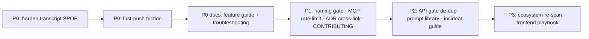

# Future-State Roadmap

> Recommended improvements to the engineering platform and its documentation, ranked by engineering ROI. ROI is `(impact x frequency x leverage) / (cost x risk)`. These are proposals, not commitments; the highest-value ones address a real gap surfaced in [engineering-audit](./engineering-audit.md).

## Platform improvements (the system itself)

| Rank | Improvement | Why | Cost |
|---|---|---|---|
| **P0** | Harden the transcript resolution (deterministic session-id pinning) | Removes the shared SPOF (A1) that can block every push and plan; the three fail-closed gates all depend on it | Medium |
| **P0** | Friendlier first-push experience (auto-detect "no ledger", print the remedy, or auto-seed an empty ledger) | Removes the first friction a new contributor hits (A3); cheap, high frequency | Low |
| **P1** | Extend `check:client-naming` to cover `components/client/**` (or document the directory exception) | Closes the naming-convention blind spot (`/docs/10` F1) so "name tells you the boundary" holds everywhere | Low |
| **P1** | Per-caller rate-limit for the MCP `ask_erik` tool | Removes the shared global bucket (`/docs/10` F2) so one MCP client cannot starve the AI tool | Low-Medium |
| **P2** | Extract the shared API gate sequence so `/api/ask` and `defineHandler` share one implementation | Prevents the two security pipelines from drifting (`/docs/10` F3) | Medium |
| **P3** | Periodic (quarterly) AI-ecosystem re-scan | The "harness saturated" conclusion ages (A5); a time-boxed re-check keeps it honest | Low |

## Documentation that should exist (ranked)

These complete the knowledge base. Several are enumerated in [`/docs/11` appendix](../11-onboarding.md) too.

| Rank | Doc | Why |
|---|---|---|
| **P0** | Per-section feature guide | One page per section (content shape, variants, host islands, `sec-*` id). The single biggest onboarding gap; the sections are the most-edited surface |
| **P0** | Troubleshooting runbook | Expand the symptom tables into per-incident runbooks (the 503 cascade, the stamp/push blocks, the cron) |
| **P1** | ADR-to-code cross-link index | Map code areas to the relevant `DECISIONS.md` entry, so "why is this like this" is one hop from the file |
| **P1** | CONTRIBUTING.md | The commit/scope/PR/review-battery workflow as a standalone front door (currently spread across `CLAUDE.md` and this handbook) |
| **P2** | Prompt library | The reusable prompt shapes (spec, architect review, scoped-battery) as named, copy-pasteable templates |
| **P2** | Incident response guide | What to do when production is degraded (the healthz 503 chain, the rollback playbook) as a standalone on-call doc |
| **P3** | Frontend playbook | The island/RSC decision tree, the INP rules, the CSS-token rules as a how-to |

## Capability ideas (deliberately deferred)

These were considered and are *not* recommended now, with reasons (the via-negativa lens):

- **An auto-merging agent.** No: AI agents are deliberately blocked from merging; a human is the last gate. The cost (an unreviewed merge slipping through) outweighs the convenience.
- **More MCP servers.** No: the platform is at the right tool count; adding tools degrades selection accuracy and adds attack surface. Add only on a demonstrated gap.
- **A heavier spec process for small changes.** No: the spec/architect gate is for non-trivial work; forcing it on a one-line fix is the "improvement that makes things worse" failure mode.
- **Multi-agent swarms for implementation.** No: the evidence favors small, specialized agent sets with a human in the loop, not large autonomous swarms.

## Sequencing

Each item is independently shippable and reversible. None is required for the platform to function today; they are leverage, not fixes for a broken system.
