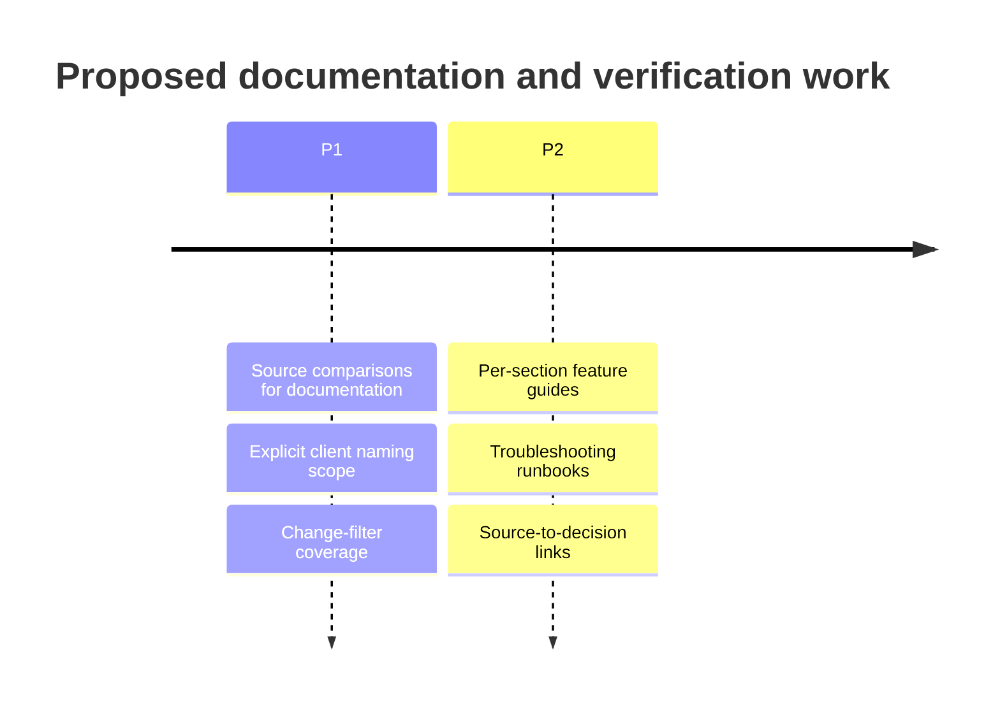

# Engineering Roadmap

These proposals address the boundaries in [engineering-audit](./engineering-audit.md). They are not implemented guarantees.

## Ranked proposals

| Priority | Improvement                                               | Completion criterion                                                                                      |
| -------- | --------------------------------------------------------- | --------------------------------------------------------------------------------------------------------- |
| P1       | Add source comparisons for documentation claims           | Route, component and CI descriptions match current implementations                                        |
| P1       | Make client naming scope explicit                         | The policy states whether `design-system` and `client` directories are exceptions; tests cover the choice |
| P1       | Check change-filter coverage when adding source locations | A representative change triggers each required runtime or AI job                                          |
| P2       | Add per-section feature guides                            | Each guide distinguishes page composition, registry navigation, labels and deferred client islands        |
| P2       | Expand troubleshooting                                    | Each runbook names a current check, failure condition and recovery command                                |
| P2       | Link source areas to architectural decisions              | A maintainer can locate the relevant `DECISIONS.md` entry from a subsystem guide                          |

## Sequencing

```mermaid
timeline
    title Proposed documentation and verification work
    P1 : Source comparisons for documentation
       : Explicit client naming scope
       : Change-filter coverage
    P2 : Per-section feature guides
       : Troubleshooting runbooks
       : Source-to-decision links
```

Prioritize a proposal when a concrete change exposes the gap. Verify the affected source and current checks before starting it.
